# Equipo-AAR-ATDI-BME-DAAV-LMAM

| Integrante                     | Número de Cuenta | Usuario de GitLab   | Usuario de Docker
|:------------------------------:|:----------------:|:-------------------:|:----------:|
| Acosta Arzate Rubén            | 317205776        | `rubenAcostaArzate` | rubencompu
| Alvarado Torres David Ignacio  | 316167613        | `ddalt`             | 
| Bernal Marquez Erick           | 317042522        | `Erickmarquez7`     | erick954
| Deloya Andrade Ana Valeria     | 317277582        | `avdeloya13`        | valeriadeloya13
| López Miranda Angel Mauricio   | 317034808        | `MauricioLMiranda`  | 


## Explicación del proceso de creación de las imagenes de contenedor

Antes de la creación nos aseguramos de que docker se haya instalado correctamente de la siguiente pagina https://www.docker.com/products/docker-desktop/ y probamos con el siguiente comando

```
usuario@laptop:~$ docker run -it hello-world
```
No debería mostrar error alguno

Una vez que nos hayamos asegurado de la correcta instalación iniciamos sesión con 

```
usuario@laptop:~$ docker login docker.io
```

Nos pedirá usuario y contraseña

Ahora sí, para la creación de la imagen hacemos un __dockerfile__ como se muestra en el siguiente archivo

[dockerfile](files/datos/linux-doc/Dockerfile)

La explicación de lo qué hace viene en el mismo archivo

Construimos la imagen con __docker build__.

```
usuario@laptop:~$ TAG=[usuario]/[contenedor]
usuario@laptop:~$ docker build --progress plain -t "${TAG}" ./
```

Utilizamos __--progress plain__ para capturar la salida de __docker build__, la cual viene mostrada en la carpeta de _files_

Verificamos listando las imagenes del contenedor con

```
usuario@laptop:~$ docker images
REPOSITORY           TAG           IMAGE ID       CREATED          SIZE
erick954/linux-doc   latest        98a60d1391f0   54 minutes ago   188MB
```

También podemos utilizar ejecutar la imagen para comprobar que se haya hecho correctamente

```
usuario@laptop:~$ docker run -it -p 8080:80 erick954/linux-doc:latest
```

Veamos que en efecto funciona y corresponde localhost:8080

| 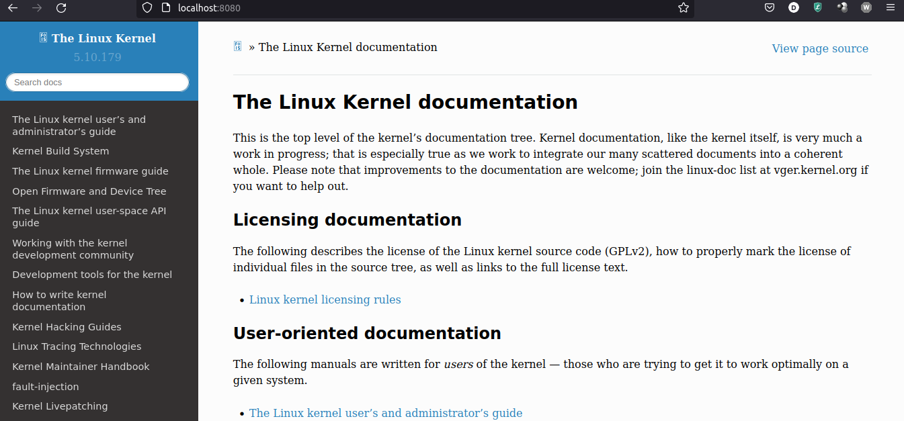
|:-------------------------:|
| Pagina de la documentación de linux


Por ultimo enviamos las imagenes al __registry__

```
usuario@laptop:~$ TAG=[usuario]/[contenedor]
usuario@laptop:~$ docker push "${TAG}"
```

Y notamos que en nuestra sesión de docker se muestran las imagenes

| 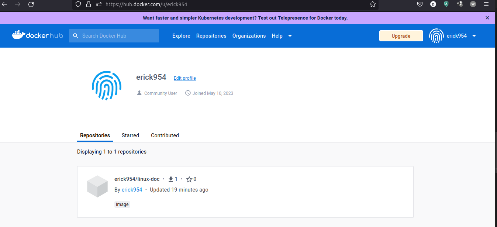
|:-------------------------:|
| Sesión con la imagen correspondiente

## Explicación del proceso de instalación de k3s en Debian 11

Antes de la instalación debemos preparar la maquina liberando memoria RAM, esto puede ser de varias maneras por lo que lo dejaremos a consideración del usuario. Además de deshabilitar los servicios de apache de la entrega anterior.

Establecemos un área de intercambio _swap_ para que los nodos consuman menos memoria RAM

Habilitamos la politica de _swap_ en el archivo de configuración /etc/sysctl.d/local.conf

```
root@example:~# cat >> /etc/sysctl.d/local.conf << EOF
###################################################################
# https://www.kernel.org/doc/html/latest/admin-guide/sysctl/vm.html#swappiness
vm.swappiness = 1
EOF
```

Recargamos la configuración

```
root@example:~# sysctl -p

root@example:~# sysctl -p /etc/sysctl.d/local.conf
vm.swappiness = 1

root@example:~# cat /proc/sys/vm/swappiness
1
```

Creamos el archivo _./swap_ y le damos los permisos necesarios, además del archivo _sparse_ para SWAP

```
root@example:~# touch /.swap

root@example:~# chmod -c 0600 /.swap
mode of '/.swap' changed from 0644 (rw-r--r--) to 0600 (rw-------)

root@example:~# dd if=/dev/zero of=/.swap bs=1M count=1024 status=progress
1051721728 bytes (1.1 GB, 1003 MiB) copied, 17 s, 61.8 MB/s
1024+0 records in
1024+0 records out
1073741824 bytes (1.1 GB, 1.0 GiB) copied, 18.6303 s, 57.6 MB/s

root@example:~# ls -lah /.swap
-rw------- 1 root root 1.0G May 22 12:56 /.swap
```

Creamos el área de intercambio

```
root@example:~# mkswap -L swap /.swap
Setting up swapspace version 1, size = 1024 MiB (1073737728 bytes)
LABEL=swap, UUID=6298196b-9e0e-4440-b41b-367e0b671f91
```

Por último verficamos y habilitamos el montaje swap

```
root@example:~# cat /etc/fstab
# /etc/fstab: static file system information
UUID=c0db73f0-f7cd-43df-b16e-20ae1caca357 / ext4 rw,discard,errors=remount-ro,x-systemd.growfs 0 1
UUID=ECD7-6DBA /boot/efi vfat defaults 0 0
/dev/disk/cloud/azure_resource-part1    /mnt    auto    defaults,nofail,comment=cloudconfig 0   2

# swap
/.swap  none    swap    defaults    0   0   ⬅️

root@example:~# swapon -va
swapon: /.swap: found signature [pagesize=4096, signature=swap]
swapon: /.swap: pagesize=4096, swapsize=1073741824, devsize=1073741824
swapon /.swap
```

Para k3s descargamos y cambiamos permisos del script de instalación

```
root@example:~# wget -c -nv -O ~/get-k3s-io.sh 'https://get.k3s.io/'
2023-05-22 13:04:24 URL:https://get.k3s.io/ [30463/30463] -> "/root/get-k3s-io.sh" [1]

root@example:~# chmod -c +x ./get-k3s-io.sh
mode of './get-k3s-io.sh' changed from 0644 (rw-r--r--) to 0755 (rwxr-xr-x)
```

Definimos variables de entorno para personalización de la instalación de 3ks

```
root@example:~# export INSTALL_K3S_SKIP_START="true"
root@example:~# export INSTALL_K3S_EXEC="--tls-san='k3s.[dominio.com]' --tls-san='[mi.ip.publica.x]' --disable-cloud-controller --disable=metrics-server --disable=servicelb --disable=traefik"
root@example:~# ~/get-k3s-io.sh
[INFO]  Finding release for channel stable
[INFO]  Using v1.26.4+k3s1 as release
[INFO]  Downloading hash https://github.com/k3s-io/k3s/releases/download/v1.26.4+k3s1/sha256sum-amd64.txt
[INFO]  Downloading binary https://github.com/k3s-io/k3s/releases/download/v1.26.4+k3s1/k3s
[INFO]  Verifying binary download
[INFO]  Installing k3s to /usr/local/bin/k3s
[INFO]  Finding available k3s-selinux versions
/root/get-k3s-io.sh: 407: [: k3s-selinux-1.2-2.el8.noarch.rpm: unexpected operator
[INFO]  Creating /usr/local/bin/kubectl symlink to k3s
[INFO]  Creating /usr/local/bin/crictl symlink to k3s
[INFO]  Creating /usr/local/bin/ctr symlink to k3s
[INFO]  Creating killall script /usr/local/bin/k3s-killall.sh
[INFO]  Creating uninstall script /usr/local/bin/k3s-uninstall.sh
[INFO]  env: Creating environment file /etc/systemd/system/k3s.service.env
[INFO]  systemd: Creating service file /etc/systemd/system/k3s.service
[INFO]  systemd: Enabling k3s unit
Created symlink /etc/systemd/system/multi-user.target.wants/k3s.service → /etc/systemd/system/k3s.service.
```

Reiniciamos el equipo y verificamos que k3s se haya iniciado de manera correcta

```
root@waningnew:~# PAGER=cat systemctl status --full k3s
root@waningnew:~# PAGER=cat systemctl status --full k3s
● k3s.service - Lightweight Kubernetes
     Loaded: loaded (/etc/systemd/system/k3s.service; enabled; vendor preset: enabled)
     Active: active (running) since Wed 2023-05-31 13:27:01 CST; 5min ago
       Docs: https://k3s.io
   Main PID: 642 (k3s-server)
      Tasks: 47
     Memory: 276.3M
        CPU: 30.550s
     CGroup: /system.slice/k3s.service
             ├─ 642 /usr/local/bin/k3s server
             ├─ 742 containerd
             ├─1323 /var/lib/rancher/k3s/data/163665c44bcc8e97514aeb518069c3c55e5ad6226d4ebf3c6d89cbd4057b6809/bin/containerd-shim-runc-v2 -namespace k8s.io -id f325fb4e869d0cee422c83a8a1ee66dd72678ad6c24d2d14475f0ad1b9627e17 -address /run/k3s/containerd/containerd.sock
             └─1324 /var/lib/rancher/k3s/data/163665c44bcc8e97514aeb518069c3c55e5ad6226d4ebf3c6d89cbd4057b6809/bin/containerd-shim-runc-v2 -namespace k8s.io -id ec94db935d60321e21cc36c3721f00ffe83aa49b723fe7daf900f7dc7ea15b65 -address /run/k3s/containerd/containerd.sock
```

Revisamos que el puerto 6443 correspondiente a la API de Kubernetes se escucha

```
root@example:~# netstat -ntulp | grep 6443
tcp6       0      0 :::6443           :::*            LISTEN      642/k3s server
```

Preparamos el archivo _~/.kube/config_ y le cambiamos los permisos necesarios

```
root@example:~# adduser redes staff
Añadiendo al usuario `redes' al grupo `staff' ...
Añadiendo al usuario redes al grupo staff
Hecho.

root@example:~# chown -c root:staff /etc/rancher/k3s/k3s.yaml
cambiado el propietario de '/etc/rancher/k3s/k3s.yaml' de root:root a root:staff

root@example:~# chmod -c 0440 /etc/rancher/k3s/k3s.yaml
el modo de '/etc/rancher/k3s/k3s.yaml' cambia de 0600 (rw-------) a 0440 (r--r-----)
```

Hacemos liga simbólica a _3ks.yaml_

```
root@example:~# mkdir -vp ~/.kube
mkdir: se ha creado el directorio '/root/.kube'

root@example:~# ln -vsf /etc/rancher/k3s/k3s.yaml ~/.kube/config
'/root/.kube/config' -> '/etc/rancher/k3s/k3s.yaml'

root@example:~# ls -la ~/.kube
total 8
drwxr-xr-x  2 root root 4096 may 31 13:40 .
drwx------ 10 root root 4096 may 31 13:40 ..
lrwxrwxrwx  1 root root   25 may 31 13:40 config -> /etc/rancher/k3s/k3s.yaml
```

Copimos el archivo _k3s.yaml_ en la ruta _~/.kube/config_ con el usuario redes y ajustamos los permisos

```
root@example:~# su - redes

redes@example:~$ mkdir -vp ~/.kube
mkdir: se ha creado el directorio '/home/redes/.kube'

redes@example:~$ sudo cp -v /etc/rancher/k3s/k3s.yaml ~/.kube/config
'/etc/rancher/k3s/k3s.yaml' -> '/home/redes/.kube/config'

redes@example:~$ sudo chown -cR redes:staff ~/.kube
cambiado el propietario de '/home/redes/.kube/config' de root:root a redes:staff
cambiado el propietario de '/home/redes/.kube' de redes:redes a redes:staff

redes@example:~$ chmod -c 0640 ~/.kube/config
el modo de '/home/redes/.kube/config' cambia de 0440 (r--r-----) a 0640 (rw-r-----)

redes@example:~$ ls -la ~/.kube
total 12
drwxr-xr-x 2 redes staff 4096 may 31 13:41 .
drwxr-xr-x 8 redes redes 4096 may 31 13:41 ..
-rw-r----- 1 redes staff 2961 may 31 13:41 config
```

Nos conectamos al cluster de Kubernetes

```
redes@example:~$ kubectl version --short
Flag --short has been deprecated, and will be removed in the future. The --short output will become the default.
Client Version: v1.26.5+k3s1
Kustomize Version: v4.5.7
Server Version: v1.26.5+k3s1
redes@example:~$ kubectl get nodes -o wide
NAME           STATUS   ROLES                  AGE   VERSION        INTERNAL-IP   EXTERNAL-IP   OS-IMAGE                         KERNEL-VERSION          CONTAINER-RUNTIME
waningnew.me   Ready    control-plane,master   15m   v1.26.5+k3s1   10.0.0.4      <none>        Debian GNU/Linux 11 (bullseye)   5.10.0-23-cloud-amd64   containerd://1.7.1-k3s1
```

Abrimos el puerto 6443 en azure en el grupo de seguridad con el nombre de _kube-api-server_

| 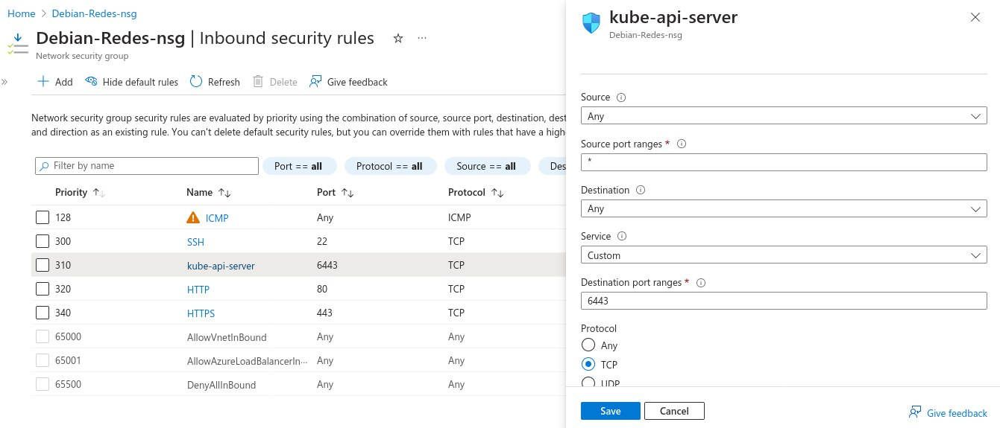
|:-------------------------:|
| Portal de Azure

Instalamos __kubectl__ en la maquina local para crear los recursos en el cluster de kubernetes, descargamos el binario.

```
usuario@laptop:~$ KUBECTL_VERSION=v1.26.4
usuario@laptop:~$ curl -fsSLO https://dl.k8s.io/release/${KUBECTL_VERSION}/bin/linux/amd64/kubectl

usuario@laptop:~$ chmod -c +x kubectl
mode of 'kubectl' changed from 0644 (rw-r--r--) to 0755 (rwxr-xr-x)
```

Lo instalamos

```
usuario@laptop:~$ sudo install --verbose -o root -g root -m 0755 kubectl /usr/local/bin/kubectl
'kubectl' -> '/usr/local/bin/kubectl'

usuario@laptop:~$ rm -v ~/kubectl
removed '/home/usuario/kubectl'

usuario@laptop:~$ ls -la /usr/local/bin/kubectl
-rwxr-xr-x 1 root root 48037888 May 22 13:18 /usr/local/bin/kubectl
```

Instalamos __krew__ tanto en el equipo local como en la remota para manejar los _plugins_ de __kubectl__, para esto crearemos un directorio temporal

```
redes@example:~$ KREW_VERSION=v0.4.3
redes@example:~$ KREW_TMP_DIR=/tmp/krew

redes@example:~$ mkdir -vp ${KREW_TMP_DIR}
mkdir: created directory '/tmp/krew'

redes@example:~$ wget -c -nv -O "${KREW_TMP_DIR}/krew-${KREW_VERSION}.tar.gz" \
  "https://github.com/kubernetes-sigs/krew/releases/download/${KREW_VERSION}/krew-linux_amd64.tar.gz"

redes@example:~$ ls -la "${KREW_TMP_DIR}/krew-${KREW_VERSION}.tar.gz"
-rw-r--r-- 1 redes users 4128657 Feb  4  2022 /tmp/krew/krew-v0.4.3.tar.gz
```

Extraemos el archivo _tar.gz_ de _krew_ en el directorio temporal e instalamos 

```
redes@example:~$ tar -xvvzf ${KREW_TMP_DIR}/krew-${KREW_VERSION}.tar.gz -C ${KREW_TMP_DIR}
-rw-r--r-- runner/docker    11358 1999-12-31 18:00 ./LICENSE
-rwxr-xr-x runner/docker 11836580 1999-12-31 18:00 ./krew-linux_amd64

redes@example:~$ ls -la ${KREW_TMP_DIR}/krew-linux_amd64
-rwxr-xr-x 1 redes users 11836580 Dec 31  1999 /tmp/krew/krew-linux_amd64

redes@example:~$ ${KREW_TMP_DIR}/krew-linux_amd64 install krew
WARNING: To be able to run kubectl plugins, you need to add
the following to your ~/.bash_profile or ~/.bashrc:

    export PATH="${PATH}:${HOME}/.krew/bin"

and restart your shell.

Adding "default" plugin index from https://github.com/kubernetes-sigs/krew-index.git.
Updated the local copy of plugin index.
Installing plugin: krew
Installed plugin: krew
\
 | Use this plugin:
 |  kubectl krew
 | Documentation:
 |  https://krew.sigs.k8s.io/
 | Caveats:
 | \
 |  | krew is now installed! To start using kubectl plugins, you need to add
 |  | krew's installation directory to your PATH:
 |  |
 |  |   * macOS/Linux:
 |  |     - Add the following to your ~/.bashrc or ~/.zshrc:
 |  |         export PATH="${KREW_ROOT:-$HOME/.krew}/bin:$PATH"
 |  |     - Restart your shell.
 |  |
 |  |   * Windows: Add %USERPROFILE%\.krew\bin to your PATH environment variable
 |  |
 |  | To list krew commands and to get help, run:
 |  |   $ kubectl krew
 |  | For a full list of available plugins, run:
 |  |   $ kubectl krew search
 |  |
 |  | You can find documentation at
 |  |   https://krew.sigs.k8s.io/docs/user-guide/quickstart/.
 | /
/
```

Borramos el directorio temporal

```
redes@example:~$ rm -vrf ${KREW_TMP_DIR}
removed '/tmp/krew/krew-v0.4.3.tar.gz'
removed '/tmp/krew/krew-linux_amd64'
removed '/tmp/krew/LICENSE'
removed directory '/tmp/krew'
```

Añadimos la siguiente linea al final del archivo _~/.bashrc_

```
export PATH="${PATH}:${HOME}/.krew/bin"
```

Cerramos y volvemos a iniciar sesión para que shell guarde los cambios, verificamos que __~/.krew/bin__ aparezca en el __path__

```
redes@example:~$ echo ${PATH}
/usr/local/bin:/usr/bin:/bin:/usr/local/games:/usr/games:/home/redes/.krew/bin
```

Una vez hayamos inciado sesión verificamos que _shell_ puede ubicar el programa y entonces lo ejecutamos

```
redes@example:~$ which kubectl-krew
/home/redes/.krew/bin/kubectl-krew

redes@example:~$ kubectl krew version
OPTION            VALUE
GitTag            v0.4.3
GitCommit         dbfefa5
IndexURI          https://github.com/kubernetes-sigs/krew-index.git
BasePath          /home/redes/.krew
IndexPath         /home/redes/.krew/index/default
InstallPath       /home/redes/.krew/store
BinPath           /home/redes/.krew/bin
DetectedPlatform  linux/amd64
```

Actualizamos la lista de _plugins_ de __krew__ e instalamos _neat_

```
redes@example:~$ kubectl krew update
Updated the local copy of plugin index.

redes@example:~$ kubectl krew install neat
Updated the local copy of plugin index.
Installing plugin: neat
Installed plugin: neat
\
 | Use this plugin:
 |  kubectl neat
 | Documentation:
 |  https://github.com/itaysk/kubectl-neat
/
WARNING: You installed plugin "neat" from the krew-index plugin repository.
   These plugins are not audited for security by the Krew maintainers.
   Run them at your own risk.
```

Por último configuramos el archivo _~/.kube/config_ en el equipo local

Para esto "sacamos" el archivo hacia la maquina física (puede ser por medio de scp). El archivo debe llamarse _redes-kube-config.yaml_  lo editamos poniendo el nombre DNS de la maquina virtual

```
usuario@laptop:~# sed -i'' -e 's/127.0.0.1/k3s.[example.com]/g' ~/Downloads/redes-kube-config.yaml
```

Creamos el directorio _~/.kube_ y copiamos el archivo _.yaml_

```
usuario@laptop:~# mkdir -vp --mode 0700 ~/.kube
mkdir: created directory '/home/usuario/.kube'

usuario@laptop:~# install --verbose --owner "$(id -u)" --group "$(id -g)" --mode 0640 ~/Downloads/redes-kube-config.yaml ~/.kube/config
'/home/usuario/Downloads/redes-kube-config.yaml' -> '/home/usuario/.kube/config'
```

Nos conectamos al cluster desde el equipo local

```
usuario@laptop:~# nc -vz k3s.[dominio.me] 6443
Connection to k3s.waningnew.me (68.218.33.216) 6443 port [tcp/*] succeeded!
```

Para verificar y listar los nodos

```
usuario@lapotop:~$ kubectl version --short --insecure-skip-tls-verify=false
Flag --short has been deprecated, and will be removed in the future. The --short output will become the default.
Client Version: v1.26.4
Kustomize Version: v4.5.7
Server Version: v1.26.5+k3s1

usuario@lapotop:~$ kubectl get nodes
NAME           STATUS   ROLES                  AGE     VERSION
waningnew.me   Ready    control-plane,master   3h15m   v1.26.5+k3s1
```

## Explicación del proceso de instalación del ingress controller en el cluster

Descargamos el archivo YAML que contiene la definición de los recursos de Kubernetes para instalar el ingress controller en el cluster y lo instalamos

```
usuario@lapotop:~$ INGRESS_NGINX_VERSION=v1.6.4

usuario@lapotop:~$ wget -c -nv -O ingress-nginx-${INGRESS_NGINX_VERSION}.yaml  https://github.com/kubernetes/ingress-nginx/raw/controller-${INGRESS_NGINX_VERSION}/deploy/static/provider/cloud/deploy.yaml

usuario@lapotop:~$ file ingress-nginx-${INGRESS_NGINX_VERSION}.yaml

usuario@lapotop:~$ kubectl apply -f ingress-nginx-${INGRESS_NGINX_VERSION}.yaml
```

Espereamos a que el _pod_ de _ingress controller_ esté listo

```
usuario@lapotop:~$ kubectl get pods --selector=app.kubernetes.io/component=controller --namespace ingress-nginx
NAME                                       READY   STATUS    RESTARTS   AGE
ingress-nginx-controller-c69664497-cwp5b   1/1     Running   0          97s
```

Como el _ingress controller_ no abre de manera predeterminada los puertos 80 y 443 aplicamos un parche al recurso deployment del _ingress controller_

```
usuario@laptop:~$  kubectl patch deployment/ingress-nginx-controller -n ingress-nginx --patch '{"spec":{"template":{"spec":{"hostNetwork":true}}}}'
deployment.apps/ingress-nginx-controller patched
```

Ejecutamos el siguiente comando para esperar a que el pod del ingress controller esté listo para recibir conexiones

```
usuario@laptop:~$ kubectl wait --for=condition=ready pod -n ingress-nginx  -l=app.kubernetes.io/component=controller  --timeout=180s
pod/ingress-nginx-controller-c69664497-cwp5b condition met
pod/ingress-nginx-controller-6b557cfc48-4frvv condition met
```

Revisamos que el nuevo pod esté en ejecución

```
usuario@laptop:~$ kubectl get pods -l=app.kubernetes.io/component=controller -n ingress-nginx
NAME                                        READY   STATUS        RESTARTS   AGE
ingress-nginx-controller-6b557cfc48-4frvv   1/1     Running       0          48s
ingress-nginx-controller-c69664497-cwp5b    1/1     Terminating   0          2m50s
```

Nos vamos al equipo remoto y verificamos que _ingress-nginx_ esté activo

```
root@waningnew:~# netstat -ntulp | egrep -w '80|443'
tcp     0      0 0.0.0.0:443       0.0.0.0:*           LISTEN      6810/nginx: master  
tcp     0      0 0.0.0.0:80        0.0.0.0:*           LISTEN      6810/nginx: master  
tcp6    0      0 :::443            :::*                LISTEN      6810/nginx: master  
tcp6    0      0 :::80             :::*                LISTEN      6810/nginx: master  
```

Revisamos que el deployment se encuentre con estado _READY 1/1_

```
usuario@laptop:~$ kubectl get deployments -n ingress-nginx
NAME                       READY   UP-TO-DATE   AVAILABLE   AGE
ingress-nginx-controller   1/1     1            1           4m3s
```

Revisamos que el estado del pod sea _Running_

```
usuario@laptop:~$ kubectl get pods -n ingress-nginx --field-selector=status.phase==Running
NAME                                        READY   STATUS    RESTARTS   AGE
ingress-nginx-controller-6b557cfc48-4frvv   1/1     Running   0          2m18s
```

Revisamos que el servicio _ingress-nginx-controller_ se encuentre activo

```
usuario@laptop:~$ kubectl get service ingress-nginx-controller -n ingress-nginx
NAME                     TYPE         CLUSTER-IP   EXTERNAL-IP PORT(S)                      AGE
ingress-nginx-controller LoadBalancer 10.43.123.93 <pending>   80:30016/TCP,443:32441/TCP   4m31s
```

Revisamos que mos podamos conectar a los puertos 80 y 443 del servidor con netcat

```
usuario@laptop:~$ nc -vz waningnew.me 80
Connection to waningnew.me (68.218.33.216) 80 port [tcp/http] succeeded!

usuario@laptop:~$ nc -vz waningnew.me 443 
Connection to waningnew.me (68.218.33.216) 443 port [tcp/https] succeeded!
```

Revisamos nuestra pagina para verificar la petición

| 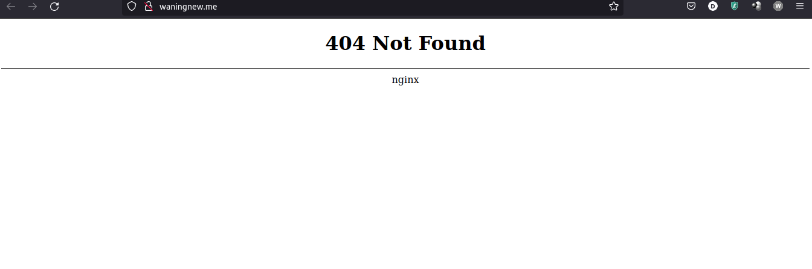
|:-------------------------:|
| Pagina waningnew.me


## Explicación del proceso de despliegue de los sitios web en el cluster de Kubernetes

Craremos un sitio web por default para manejar todo el trafico, para esto crearemos un archivo _index.html_ con el nombre de nuestro equipo y dominio

Posteriormente creamos un _configmap_ para guardar el archivo _index.html_

```
usuario@laptop:~$ kubectl create configmap index-equipo-aar-atdi-bme-daav-lmam --from-file=index.html
configmap/index-equipo-aar-atdi-bme-daav-lmam created
```

(Sí, con minúsculas)

Editamos el deployment __root-nginx__ para agregar las líneas donde se monta el _configmap_ que contiene el archivo __index.html__

```
---
apiVersion: apps/v1
kind: Deployment
...
spec:
...
  template:
...
    spec:  # Agregamos la sección "volumes" entre "spec" y "containers"
      volumes:
      - name: index-equipo-aar-atdi-bme-daav-lmam
        configMap:
          name: index-equipo-aar-atdi-bme-daav-lmam
      containers:  # Esta línea es donde empieza la sección "containers"
      - name: nginx
...
        terminationMessagePolicy: File  # Agrega la sección "volumeMounts" después de esta línea
        volumeMounts:
        - name: index-equipo-aar-atdi-bme-daav-lmam
          mountPath: /usr/share/nginx/html/index.html
          subPath: index.html
```

Esperamos mientras se lanza el _pod_ de la configuración
```
usuario@laptop:~$  kubectl get pods -l app=root-nginx
NAME                          READY   STATUS    RESTARTS   AGE
root-nginx-5cdf4b58db-nxg96   1/1     Running   0          2m34s
```

Hacemos una redirreción de puertos de kubernetes para visualizar la pagina recién creada

```
usuario@laptop:~$ kubectl port-forward deployment/root-nginx 8080:80
Forwarding from 127.0.0.1:8080 -> 80
Forwarding from [::1]:8080 -> 80
```

Dejamos este comando corriendo y en otra terminal revisamos que el puerto este abierto

```
usuario@laptop:~$ nc -vz localhost 8080
Connection to localhost (127.0.0.1) 8080 port [tcp/http-alt] succeeded!
```

Revisamos que el puerto responda con __curl__

```
usuario@laptop:~$ curl -vk# 'http://localhost:8080/'
*   Trying 127.0.0.1:8080...
* Connected to localhost (127.0.0.1) port 8080 (#0)
> GET / HTTP/1.1
> Host: localhost:8080
> User-Agent: curl/7.81.0
> Accept: */*
```

Revisamos la pagina

| 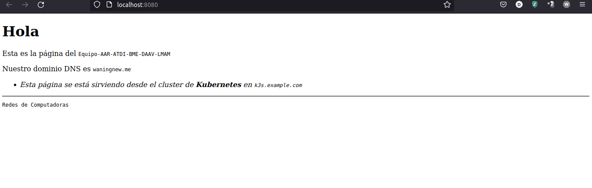
|:-------------------------:|
| Pagina default en localhost

Para las página de la documentación de linux haremos lo siguiente

Creamos un deployment donde se ejecute la imágen de contenedor que contiene el sitio web de la documentación del _kernel Linux_

```
usuario@laptop:~$ CONTAINER_IMAGE="docker.io/erick954/linux-doc:latest"

usuario@laptop:~$ kubectl create deployment linux-doc --image="${CONTAINER_IMAGE}" --port=80
deployment.apps/linux-doc created
```

Verificamos que el pod asociado al deployment linux-doc se está ejecutando

```
usuario@laptop:~$ kubectl get pods -l app=linux-doc
NAME                         READY   STATUS    RESTARTS   AGE
linux-doc-55845bc798-jhrw6   1/1     Running   0          19s
```

Verificamos que podamos acceder al sitio web con _kubectl_ port-forward en el puerto 8081:80

```
usuario@laptop:~$ kubectl port-forward deployment/linux-doc 8081:80
Forwarding from 127.0.0.1:8081 -> 80
Forwarding from [::1]:8081 -> 80
```

En otra terminal comprobamos que el puerto esté abierto y que responda con curl

```
usuario@laptop:~$ nc -vz localhost 8081
Connection to localhost (127.0.0.1) 8081 port [tcp/tproxy] succeeded!

usuario@laptop:~$ curl -vk# 'http://localhost:8081/' | egrep '</?title>'
*   Trying 127.0.0.1:8081...
* Connected to localhost (127.0.0.1) port 8081 (#0)
> GET / HTTP/1.1
> Host: localhost:8081
> User-Agent: curl/7.81.0
> Accept: */*
> 
```

Además de visitar _localhost:8081_

| 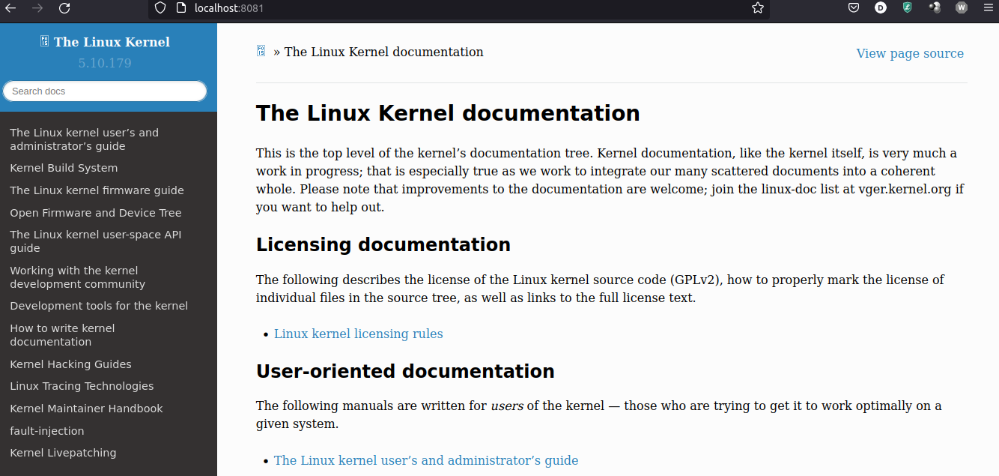
|:-------------------------:|
| Pagina de la documentación de linux en localhost

Análogo para las tareas, solo que en esta ocasión pondremos el puerto 8082:80

| 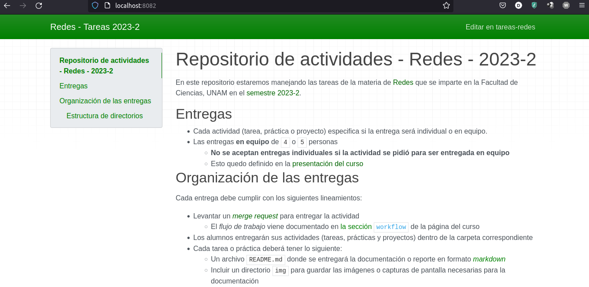
|:-------------------------:|
| Pagina de tareas-redes en localhost

Verificamos la configuración

```
usuario@laptop:~$ kubectl get deployments,pods
NAME                           READY   UP-TO-DATE   AVAILABLE   AGE
deployment.apps/root-nginx     1/1     1            1           73m
deployment.apps/linux-doc      1/1     1            1           16m
deployment.apps/tareas-redes   1/1     1            1           3m46s

NAME                                READY   STATUS    RESTARTS   AGE
pod/root-nginx-5cdf4b58db-nxg96     1/1     Running   0          44m
pod/linux-doc-55845bc798-jhrw6      1/1     Running   0          16m
pod/tareas-redes-54856f9d4c-r69nt   1/1     Running   0          3m46s
```

## Explicación de la configuración de SSL/TLS en el ingress controller

La configuración _SSL_, entre otras cosas, nos permite hacer un redireccionamiento seguro hacia _HTTPS_, mostraremos que las paginas funcionan antes de hacer su configuración.

| 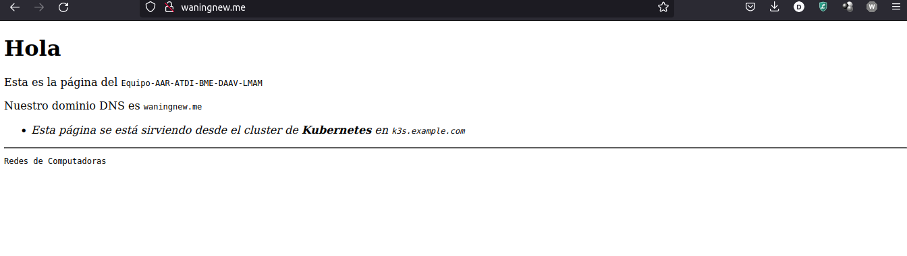
|:-------------------------:|
| Pagina default

| 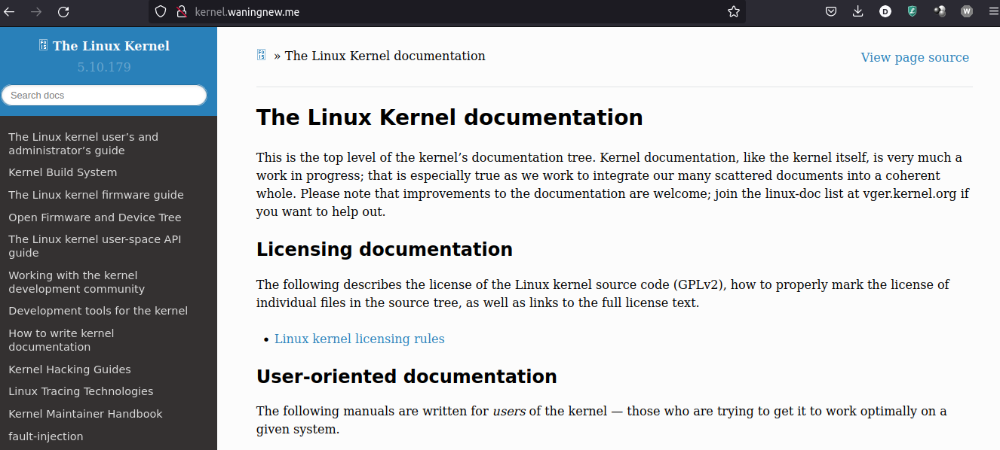
|:-------------------------:|
| Pagina del kernel

| 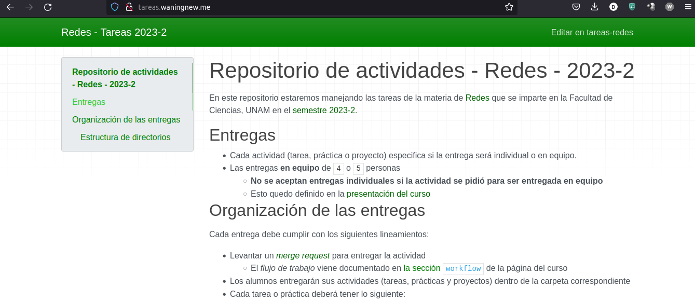
|:-------------------------:|
| Pagina de tareas

Para la configuración creamos un archivo _index.html_ en la MV de azure, este será el mismo de la practica 9

```
root@example:~# echo "Move along" > /var/www/html/.well-known/acme-challenge/index.html
```

Editamos el __deployment__ del _host default_ de nuestra maquina local

```
usuario@laptop ~ % kubectl edit deployment root-nginx

---
apiVersion: apps/v1
kind: Deployment
  name: root-nginx
  namespace: default
...
spec:
...
  template:
...
    spec:
...
      containers:
      - name: nginx
...
        volumeMounts:  # Agrega el punto de montaje "acme-challenge"
        - name: acme-challenge
          mountPath: /usr/share/nginx/html/.well-known
        - name: index-equipo-aar-atdi-bme-daav-lmam  # el nombre de nuestro equipo en minusculas
          mountPath: /usr/share/nginx/html/index.html
          subPath: index.html
...
      volumes:  # Agrega el volumen hostPath "acme-challenge"
      - name: acme-challenge
        hostPath:
          path: /var/www/html/.well-known
      - name: index-equipo-aar-atdi-bme-daav-lmam
        configMap:
          name: index-equipo-aar-atdi-bme-daav-lmam
          defaultMode: 420
...
```

Revisamos que haya un _pod_ que pertenece al _deployment_ de __root-nginx__ con estado __Runnin__

```
usuario@laptop ~ % kubectl get pods -l app=root-nginx
NAME                         READY   STATUS    RESTARTS    AGE
root-nginx-f66db75b4-7pl8z   1/1     Running   0           50s
```

Veamos que la pagina funcione

| 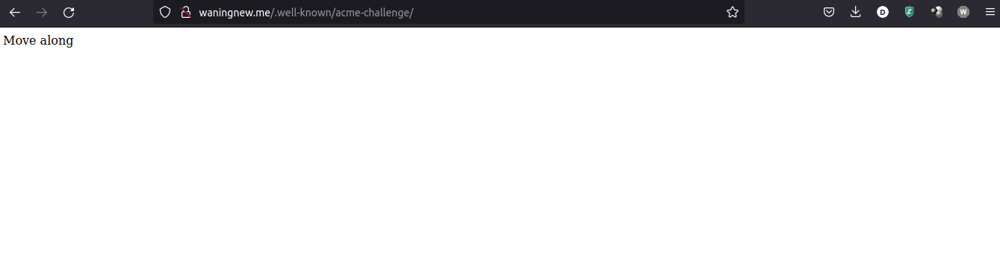
|:-------------------------:|
| Pagina con extensión /.well-know

Revisamos la validez de nuestro certificado emitido por __Let's Encrypt__ de la práctica 9, dicha validez las tenemos en nuestras bitácoras

- [openssl x509 -in waningnew.me/cert.pem -noout -text](files/bitacoras/cert.txt)
- [openssl x509 -in waningnew.me/cert.pem -noout -issuer -subject -dates -ext subjectAltName](files/bitacoras/opensslx509.txt)
- [ openssl verify -show_chain -CApath /etc/ssl/certs -untrusted waningnew.me/chain.pem waningnew.me/cert.pem](files/bitacoras/opensslverify.txt)

Copiamos el directorio _/etc/letsencrypt/live_ de nuestra maquina virtual a nuestra maquina física, esto puede ser a varias maneras así que lo dejaremos a elección del usuario.

Agregamos el certificado SSL y la llave privada en un recurso __secret tls__

```
usuario@laptop ~ % cd ~/Downloads/letsencrypt
usuario@laptop letsencrypt % kubectl create secret tls nginx-ingress-tls --cert fullchain.pem --key privkey.pem
secret/nginx-ingress-tls created
```

Verificamos los recursos __secret__ creados

```
usuario@laptop ~ % kubectl get secret nginx-ingress-tls
NAME                TYPE                DATA   AGE
nginx-ingress-tls   kubernetes.io/tls   2      40s

usuario@laptop ~ % kubectl describe secret nginx-ingress-tls
Name:         nginx-ingress-tls
Namespace:    default
Labels:       <none>
Annotations:  <none>

Type:  kubernetes.io/tls

Data
====
tls.crt:  5599 bytes
tls.key:  1704 bytes
```

Editamos el archivo _recursos-ingress-yaml_ que define el tipo __ingress__ para agregar el recurso de tipo __secret__ y los __DNS__

```
---
#Archivo _recursos-ingress-yaml_
apiVersion: networking.k8s.io/v1
kind: Ingress
metadata:
  name: ingress-nginx
  namespace: default
...
spec:  # Agrega la sección "tls" después de "spec"
  tls:
  - secretName: nginx-ingress-tls
    hosts:
    - '*.waningnew.me'
    - kernel.waningnew.me
    - tareas.waningnew.me
  ingressClassName: nginx  # Ya deberías tener esta parte
  rules:
...
```

Aplicamos los cambios

```
usuario@laptop ~ % kubectl apply -f recurso-ingress.yaml
ingress.networking.k8s.io/ingress-nginx configured
```

Cambiamos el certificado __SSL__ en el _ingress controller_, para esto editamos el deployment

```
usuario@laptop ~ % kubectl edit deployment/ingress-nginx-controller -n ingress-nginx

---
apiVersion: apps/v1
kind: Deployment
metadata:
  name: ingress-nginx-controller
  namespace: ingress-nginx
...
spec:
...
  template:
...
    spec:
      containers:
      - args:
        - /nginx-ingress-controller
        - --publish-service=$(POD_NAMESPACE)/ingress-nginx-controller
        - --election-id=ingress-nginx-leader
        - --controller-class=k8s.io/ingress-nginx
        - --ingress-class=nginx
        - --configmap=$(POD_NAMESPACE)/ingress-nginx-controller
        - --validating-webhook=:8443
        - --validating-webhook-certificate=/usr/local/certificates/cert
        - --validating-webhook-key=/usr/local/certificates/key
        # Especificamos que utilizamos el certificado SSL importado de Let's Encrypt
        - --default-ssl-certificate=default/nginx-ingress-tls
```

Reiniciamos el controlador de _ingress_

```
usuario@laptop:~$ kubectl get deployments,pods -n ingress-nginx -l app.kubernetes.io/component=controller
NAME                                       READY   UP-TO-DATE   AVAILABLE   AGE
deployment.apps/ingress-nginx-controller   1/1     1            1           19h

NAME                                            READY   STATUS    RESTARTS   AGE
pod/ingress-nginx-controller-6b557cfc48-4frvv   1/1     Running   0          19h
pod/ingress-nginx-controller-5b54c7d8c-27wsz    0/1     Pending   0          69s
```

Forzamos la detención y reinicio del proceso al hacer un escalamiento a __cero pods__ y después a __un pod__ para el _deployment_ __ingress-nginx-controller__ en el _namespace_ __ingress-nginx__

```
usuario@laptop:~$ kubectl scale deployment ingress-nginx-controller -n ingress-nginx --replicas 0
```

Esperamos un momento para que el pod anterior termine de ejecutarse

```
usuario@laptop:~$ kubectl scale deployment ingress-nginx-controller -n ingress-nginx --replicas 1
deployment.apps/ingress-nginx-controller scaled
```

Listamos de nuevo el _deployment_ y pod del _ingress controller_ instalado en el cluster en el _namespace_ __ingress-nginx__

```
usuario@laptop:~$ kubectl get deployments,pods -n ingress-nginx -l app.kubernetes.io/component=controller
NAME                                       READY   UP-TO-DATE   AVAILABLE   AGE
deployment.apps/ingress-nginx-controller   1/1     1            1           19h

NAME                                           READY   STATUS    RESTARTS   AGE
pod/ingress-nginx-controller-5b54c7d8c-kng6h   1/1     Running   0          16s
```

Verificamos la conectividad a los sitios web

```
usuario@laptop:~$ nc -vz waningnew.me 80
Connection to waningnew.me (68.218.33.216) 80 port [tcp/http] succeeded!
usuario@laptop:~$ nc -vz waningnew.me 443
Connection to waningnew.me (68.218.33.216) 443 port [tcp/https] succeeded!
```

Revisamos la conectividad al servidor ejecutando __open s_client__ en el equipo local, dicha revisión se encuentra en la bitácora de [open s_client](files/bitacoras/open-ssl.txt)

Del mismo modo en el siguiente archivo se muestran capturas que comprueban la [validez del certificado SSl](bitacora-ssl.md)

Bitácoras utilizando [HTTP y HTTPS](http-https.txt)
## Archivos

* Archivos de configuración
  - [Archivo tar.gz del contenido del directorio /etc/letsencrypt](files/configuracion/letsencrypt.tar)
  - [Archivo tar.gz del contenido del directorio /etc/rancher](files/configuracion/rancher.tar)

* Archivos de bitácora
  - [Preparación de la máqina virtual de Azure (reducción de uso de CPU y RAM)](files/bitacoras/preparacion.txt)
  - [Instalación de __3ks__ en Debian 11](files/bitacoras/instalacion-3ks.txt)
  - [Instalación de __kubectl__ y __krew__ en el equipo local](files/bitacoras/instalacion-kubectl-krew-local.txt)
  - [Instalación de __krew__ en el equipo remoto](files/bitacoras/instalacion-krew-remoto.txt)
  - [Bitácora de conexión a los puertos __80__ y __443__ del cluster de Kubernetes](files/bitacoras/conexion-80-443.txt)
  - [Bitácora de conexión al puerto 443 utilizando __openssl s_client__](files/bitacoras/open-ssl.txt)
  - [Bitácora de comprobación de la validez del certificado SSL emitido por Let's Encrypt](bitacora-ssl.md)
  - [Bitácira de conexión a los sitios web hospedados utilizando HTTP y HTTPS](http-https.txt)

* Archivos de datos

  - [linux-doc/docker](files/datos/linux-doc/Dockerfile)
  - [tareas-redes/docker](files/datos/tareas-redes/Dockerfile)
  - [Archivo tar.gz el contenido del directorio /var/www/html de la máquina virual de Azure](files/datos/html.tar.gz)
  - [Archivo cert.txt](files/bitacoras/cert.txt)

* Recursos kubernetes
  - [recursos-ingress](files/kubernetes/recurso-ingress.yaml)
  - [archivo.neat campos incesesarios](files/kubernetes/archivo.neat.yaml)