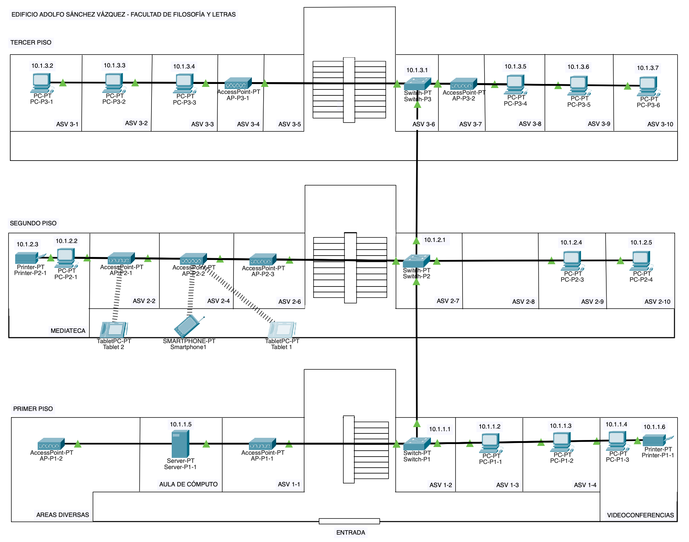
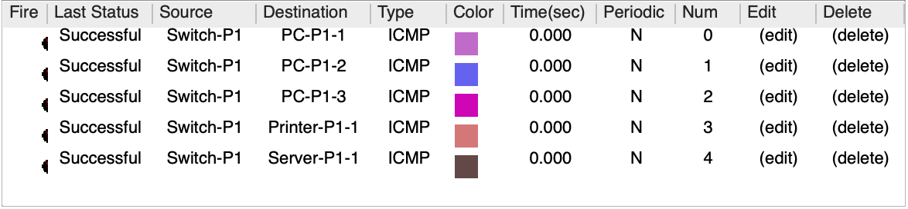
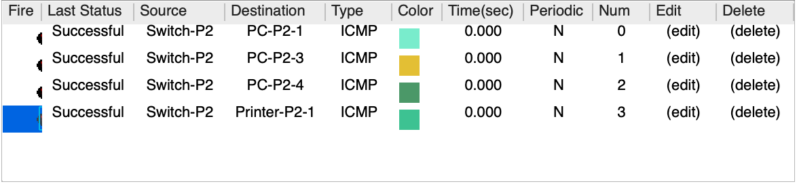
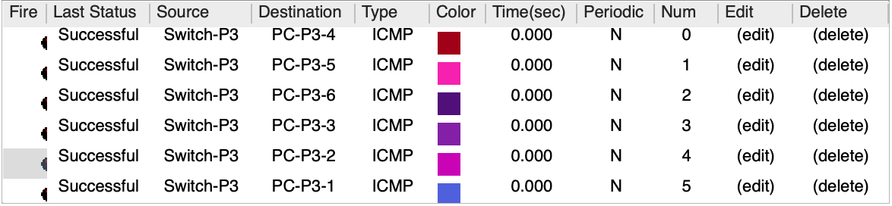

# Equipo-AAR-ATDI-BME-DAAV-LMAM

| Integrantes                    | Número de Cuenta | Usuario de GitLab   |
|:------------------------------:|:----------------:|:-------------------:|
| Acosta Arzate Rubén            | 317205776        | `rubenAcostaArzate` |
| Alvarado Torres David Ignacio  | 316167613        | `ddalt`             |
| Bernal Marquez Erick           | 317042522        | `Erickmarquez7`     |
| Deloya Andrade Ana Valeria     | 317277582        | `avdeloya13`        |
| López Miranda Angel Mauricio   | 317034808        | `MauricioLMiranda`  |

[Practica-2](https://redes-ciencias-unam.gitlab.io/2023-2/laboratorio/practica-2/)

En este enlace se encuentra el archivo `.pkz` de la práctica: [practica2.pkz](files/practica\ 2.pkz)

## Topología de red: 

La topología utilizada es Estrella como podemos ver en la siguiente imagen

| 
|:-------------------------:|
| Topología estrella de la red

En la siguiente imágen podemos ver la totalidad de nuestra red, y podemos ver que tenemos un switch
en cada piso del edificio que estamos modelando. Los clientes están acomodados de tal forma que 
sus cableados forman lo que parece ser una sola linea recta, pero en realidad todos están conectados
por separado al switch, con su propio cable, formando una topología estrella como la de la imagen de arriba.

| 
|:-------------------------:|
| Red completa en el plano del edificio

## Tabla de los equipos:

### Primer Piso

|    Equipo     | Hostname  |   Dirección IP de la administración | Conexión con otros switches
|:-------------:|:---------:|:-----------------------------------:|:----------------------------:|
|    AP-P1-2    |  Filos    |		    10.1.1.1              |
|  Server-P1-1	|  Filos    |		    10.1.1.1              |
|    AP-P1-1	|  Filos    |		    10.1.1.1              |
|   Switch-P1	|  Filos    |		    10.1.1.1              | Switch-P2
|   PC-P1-1	|  Filos    |		    10.1.1.1              |
|   PC-P1-2     |  Filos    |		    10.1.1.1              |
|  Printer-P1-1 |  Filos    |		    10.1.1.1              |

### Segundo Piso

|    Equipo     | Hostname  |   Dirección IP de la administración | Conexión con otros switches
|:-------------:|:---------:|:-----------------------------------:|:----------------------------:|
|  Printer-P2-1 |  Filos    |		    10.1.2.1              |
|    PC-P2-1    |  Filos    |		    10.1.2.1              |
|    AP-P2-1	|  Filos    |		    10.1.2.1              |
|    AP-P2-2	|  Filos    |		    10.1.2.1              |
|    AP-P2-3	|  Filos    |		    10.1.2.1              |
|   Tablet 1	|  Filos    |		    10.1.2.1              |
|   Tablet 2    |  Filos    |		    10.1.2.1              |
|  Smartphone1  |  Filos    |		    10.1.2.1              | 
|   Switch-P2   |  Filos    |		    10.1.2.1              | Swicth-P1, Switch-P3
|    PC-P2-3    |  Filos    |		    10.1.2.1              |
|    PC-P2-4    |  Filos    |		    10.1.2.1              |

### Tercer Piso

|    Equipo     | Hostname  |   Dirección IP de la administración | Conexión con otros switches
|:-------------:|:---------:|:-----------------------------------:|:----------------------------:|
|    PC-P3-1    |  Filos    |		    10.1.3.1              |
|    PC-P3-2	|  Filos    |		    10.1.3.1              |
|    PC-P3-3	|  Filos    |		    10.1.3.1              |
|    AP-P3-1	|  Filos    |		    10.1.3.1              |
|   Switch-P3	|  Filos    |		    10.1.3.1              | Switch-P2
|    AP-P3-2    |  Filos    |		    10.1.3.1              |
|    PC-P3-4	|  Filos    |		    10.1.3.1              |
|    PC-P3-5    |  Filos    |		    10.1.3.1              |
|    PC-P3-6    |  Filos    |		    10.1.3.1              |

## Imagenes

El edificio de la dependencia UNAM asignada que elegimos para modelar fue el siguiente:

| 
|:-------------------------:|
|   Plano del Edificio Adolfo Sánchez Vázquez de la Facultad de Filosofía y Letras

| 
|:-----------------------------:|
| Vista a la entrada principal

| 
|:----------------------------------:|
| Vista a los fachada de los salones

| 
|:-----------------------------------------------:|
| Vista desde otro ángulo a la entrada principal

[Referencia de las fotos](https://es.foursquare.com/v/ffyl-anexo-adolfo-s%C3%A1nchez-v%C3%A1zquez/4e40577faeb73139a19e473f)

## Pruebas de conexión de la red

Para las pruebas de conexiones, enviamos PDU desde los switches a los clientes conectados a ellos en cada piso.
Podemos ver en las siguientes tablas que la conexión está correctamente establecida, pues el envio de los PDU
fue exitoso en cada instancia:

| 
|:----------------------------------:|
| Pruebas de conexión para equipos en el primer piso.

| 
|:----------------------------------:|
| Pruebas de conexión para equipos en el segundo piso.

| 
|:----------------------------------:|
| Pruebas de conexión para equipos en el tercer piso.
