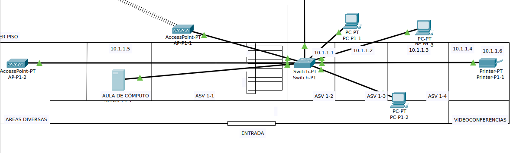
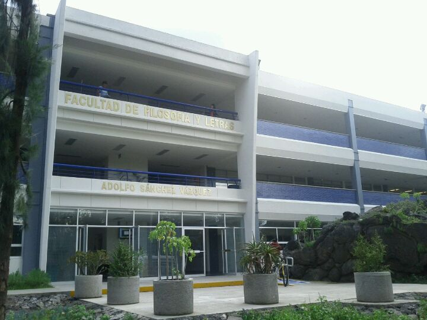
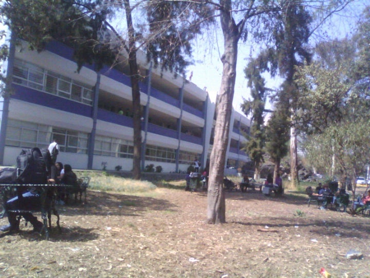
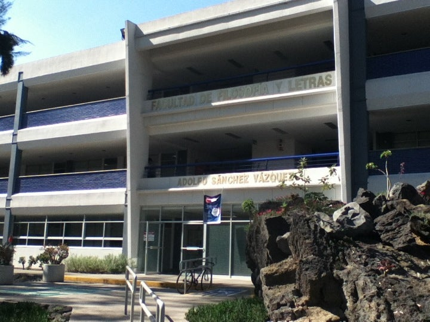

```
 Integrantes:
 Acosta Arzate Rubén
 Alvarado Torres David Ignacio
 Bernal Marquez Erick
 Deloya Andrade Ana Valeria
 López Miranda Angel Mauricio
```

- [Practica-2][liga-practica-2]


En el siguiente archivo se encuentra la [práctica](files/practica 2.pkz)


```
* Topología de red: 
  La topología utilizada es Estrella como podemos ver en la siguiente imagen
```

| 
|:-------------------------:|
|   Estrella

```
* Tabla de los equipos:
Primer Piso
```

|    Equipo     | Hostname  |   Dirección IP de la administración | Conexión con otros switches
|:-------------:|:---------:|:-----------------------------------:|:----------------------------:|
|    AP-P1-2    |  Filos    |		    10.1.1.1              |
|  Server-P1-1	|  Filos    |		    10.1.1.1              |
|    AP-P1-1	|  Filos    |		    10.1.1.1              |
|   Switch-P1	|  Filos    |		    10.1.1.1              |
|   PC-P1-1	|  Filos    |		    10.1.1.1              |
|   PC-P1-2     |  Filos    |		    10.1.1.1              |
|  Printer-P1-1 |  Filos    |		    10.1.1.1              |

```
Segundo Piso
```

|    Equipo     | Hostname  |   Dirección IP de la administración | Conexión con otros switches
|:-------------:|:---------:|:-----------------------------------:|:----------------------------:|
|  Printer-P2-1 |  Filos    |		    10.1.2.1              |
|    PC-P2-1    |  Filos    |		    10.1.2.1              |
|    AP-P2-1	|  Filos    |		    10.1.2.1              |
|    AP-P2-2	|  Filos    |		    10.1.2.1              |
|    AP-P2-3	|  Filos    |		    10.1.2.1              |
|   Tablet 1	|  Filos    |		    10.1.2.1              |
|   Tablet 2    |  Filos    |		    10.1.2.1              |
|  Smartphone1  |  Filos    |		    10.1.2.1              |
|   Switch-P2   |  Filos    |		    10.1.2.1              |
|    PC-P2-3    |  Filos    |		    10.1.2.1              |
|    PC-P2-4    |  Filos    |		    10.1.2.1              |

```
Tercer Piso
```

|    Equipo     | Hostname  |   Dirección IP de la administración | Conexión con otros switches
|:-------------:|:---------:|:-----------------------------------:|:----------------------------:|
|    PC-P3-1    |  Filos    |		    10.1.3.1              |
|    PC-P3-2	|  Filos    |		    10.1.3.1              |
|    PC-P3-3	|  Filos    |		    10.1.3.1              |
|    AP-P3-1	|  Filos    |		    10.1.3.1              |
|   Switch-P3	|  Filos    |		    10.1.3.1              |	
|    AP-P3-2    |  Filos    |		    10.1.3.1              |
|    PC-P3-4	|  Filos    |		    10.1.3.1              |
|    PC-P3-5    |  Filos    |		    10.1.3.1              |
|    PC-P3-6    |  Filos    |		    10.1.3.1              |

```
* Edificio Adolfo Sánchez Vázquez:
```

| 
|:-------------------------:|
|   Plano del Edificio

| 
|:-----------------------------:|
| Vista a la entrada principal

| 
|:----------------------------------:|
| Vista a los fachada de los salones

| 
|:-----------------------------------------------:|
| Vista desde otro ángulo a la entrada principal

[Referencia de las fotos](https://es.foursquare.com/v/ffyl-anexo-adolfo-s%C3%A1nchez-v%C3%A1zquez/4e40577faeb73139a19e473f)


[liga-practica-2]: https://redes-ciencias-unam.gitlab.io/2023-2/laboratorio/practica-2/ 
