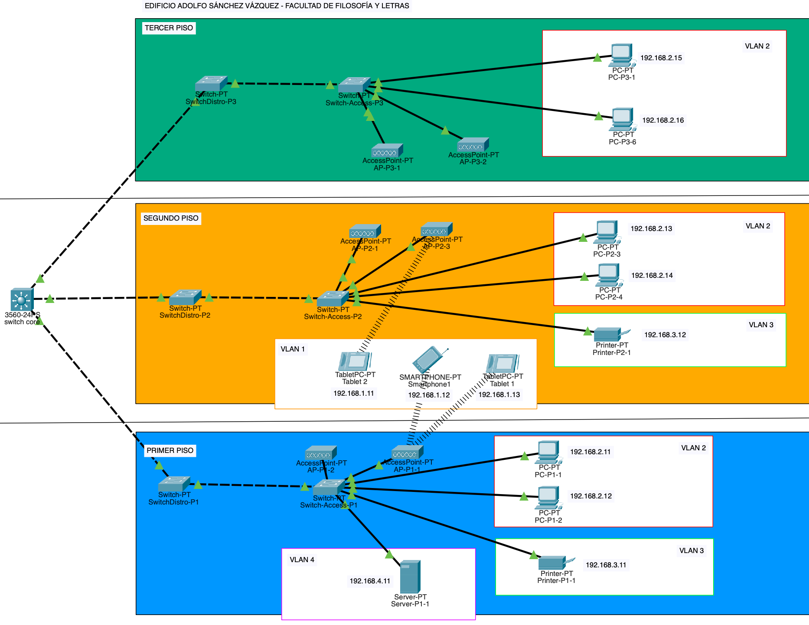

# Equipo-AAR-ATDI-BME-DAAV-LMAM

| Integrante                     | Número de Cuenta | Usuario de GitLab   |
|:------------------------------:|:----------------:|:-------------------:|
| Acosta Arzate Rubén            | 317205776        | `rubenAcostaArzate` |
| Alvarado Torres David Ignacio  | 316167613        | `ddalt`             |
| Bernal Marquez Erick           | 317042522        | `Erickmarquez7`     |
| Deloya Andrade Ana Valeria     | 317277582        | `avdeloya13`        |
| López Miranda Angel Mauricio   | 317034808        | `MauricioLMiranda`  |

# [Practica-3](https://redes-ciencias-unam.gitlab.io/2023-2/laboratorio/practica-3/)

En este enlace se encuentra el archivo `.pkt` de la práctica: [practica3.pkt](files/practica3.pkt)

## Topología de red:

La topología de nuestra red es de tipo <b>árbol</b>. Es claro ver que la red cumple con las características de un árbol como los conocemos en teoría de gráficas: una gráfica conexa y acíclica. En la raíz tenemos al Switch Core (nivel 0); después, en el nivel 1 tenemos a los switches de distribución, conectados a su vez a los switches de administración (nivel 2), que se conectan a los clientes de la red, que serían las hojas del árbol.

En la siguiente imagen podemos apreciar también las diferentes vLAN configuradas en la red:

| 
|:-------------------------:|
| Topología tipo árbol de la red


## Tabla de los equipos en cada vLAN:

Cada vLAN definida en la práctica está asociada a un grupo diferente de equipos, que pueden ser computadoras, impresoras, servidores o clientes inalámbricos.

<table>
    <thead style="text-align: center;">
        <tr>
            <th>vLAN</th>
            <th>Grupo de equipos</th>
            <th>Equipo</th>
        </tr>
    </thead>
    <tbody style="text-align: center;">
        <tr>
            <td rowspan=6>vLAN 2</td>
            <td rowspan=6>Computadoras</td>
            <td>PC-P1-1</td>
        </tr>
       <tr>
            <td>PC-P1-2</td>
        </tr>
        <tr>
            <td>PC-P2-3</td>
        </tr>
        <tr>
            <td>PC-P2-4</td>
        </tr>
        <tr>
            <td>PC-P3-1</td>
        </tr>
        <tr>
            <td>PC-P3-6</td>
        </tr>
        <tr>
            <td rowspan=2>vLAN 3</td>
            <td rowspan=2>Impresoras</td>
            <td>Printer-P1-1</td>
        </tr>
       <tr>
            <td>Printer-P2-1</td>
        </tr>
        <tr>
            <td>vLAN 4</td>
            <td>Servidores</td>
            <td>Server-P1-1</td>
        </tr>
       <tr>
            <td rowspan=3>vLAN 100</td>
            <td rowspan=3>Clientes Inalámbricos</td>
            <td>Smartphone 1</td>
        </tr>
       <tr>
            <td>Tablet 1</td>
        </tr>
        <tr>
            <td>Tablet 2</td>
        </tr>    
    </tbody>
</table>


## Tabla de conexiones de cada switch

Por cada switch utilizado, mostramos a qué switches se conecta directamente a través de cables. <b>Hostname</b> es el nombre del switch descrito. <b>Local Interface</b> y <b>Neighbor Port ID</b> son los puertos del switch descrito y el switch vecino (respectivamente) donde se conectan los dos extremos del cable.

<table>
    <thead style="text-align: center;">
        <tr>
            <th>Hostname</th>
            <th>Conexión con otros switches</th>
            <th>Local Interface</th>
            <th>Neighbor Port ID</th>
        </tr>
    </thead>
    <tbody style="text-align: center;">
        <tr>
            <td>Switch-Access-P1</td>
            <td>SwitchDistro-P1</td>
            <td>Gig 0/1</td>
            <td>Gig 1/1</td>
        </tr>
       <tr>
            <td rowspan=2>SwitchDistro-P1</td>
            <td>Switch-Access-P1</td>
            <td>Gig 1/1</td>
            <td>Gig 0/1</td>
        </tr>
        <tr>
	        <td>Filos-Switch-Core</td>
	        <td>Gig 0/1</td>
	        <td>Fas 0/2</td>
        </tr>
	    <tr>
            <td>Switch-Access-P2</td>
            <td>SwitchDistro-P2</td>
            <td>Gig 0/1</td>
            <td>Gig 1/1</td>
        </tr>
       <tr>
            <td rowspan=2>SwitchDistro-P2</td>
            <td>Switch-Access-P2</td>
            <td>Gig 1/1</td>
            <td>Gig 0/1</td>
        </tr>
        <tr>
	        <td>Filos-Switch-Core</td>
	        <td>Gig 0/1</td>
	        <td>Fas 0/1</td>
        </tr>
        <tr>
            <td>Switch-Access-P3</td>
            <td>SwitchDistro-P3</td>
            <td>Gig 0/1</td>
            <td>Gig 1/1</td>
        </tr>
       <tr>
            <td rowspan=2>SwitchDistro-P3</td>
            <td>Switch-Access-P3</td>
            <td>Gig 1/1</td>
            <td>Gig 0/1</td>
        </tr>
        <tr>
	        <td>Filos-Switch-Core</td>
	        <td>Gig 0/1</td>
	        <td>Fas 0/3</td>
        </tr>
	    <tr>
            <td rowspan=3>Filos-Switch-Core</td>
            <td>SwitchDistro-P3</td>
            <td>Fas 0/3</td>
            <td>Gig 0/1</td>
        </tr>
        <tr>
            <td>SwitchDistro-P2</td>
            <td>Fas 0/1</td>
            <td>Gig 0/1</td>
        </tr>
         <tr>
            <td>SwitchDistro-P1</td>
            <td>Fas 0/2</td>
            <td>Gig 0/1</td>
        </tr>
    </tbody>
</table>


## Tabla de direcciones IP de clientes por piso

<table>
    <thead style="text-align: center;">
        <tr>
            <th>Piso</th>
            <th>Equipo</th>
            <th>Dirección IP</th>
        </tr>
    </thead>
    <tbody style="text-align: center;">
        <tr>
            <td rowspan=5>Piso 1</td>
            <td>PC-P1-1</td>
            <td>192.168.2.11</td>
        </tr>
        <tr>
            <td>PC-P1-2</td>
            <td>192.168.2.12</td>
        </tr>
        <tr>
            <td>Printer-P1-1</td>
            <td>192.168.3.11</td>
        </tr>
        <tr>
	        <td>Server-P1-1</td>
            <td>192.168.4.11</td>
        </tr>
        <tr>
	        <td>Switch-Acceso-P1</td>
            <td>192.168.100.1</td>
        </tr>
        <tr>
            <td rowspan=7>Piso 2</td>
            <td>PC-P2-3</td>
            <td>192.168.2.13</td>
        </tr>
        <tr>
            <td>PC-P2-4</td>
            <td>192.168.2.14</td>
        </tr>
        <tr>
            <td>Printer-P2-1</td>
            <td>192.168.3.12</td>
        </tr>
		<tr>
            <td>Smartphone1</td>
            <td>192.168.1.12</td>
        </tr>
        <tr>
            <td>Tablet1</td>
            <td>192.168.1.13</td>
        </tr>
        <tr>
            <td>Tablet2</td>
            <td>192.168.1.11</td>
        </tr>
        <tr>
	        <td>Switch-Acceso-P2</td>
            <td>192.168.100.2</td>
        </tr>
        <tr>
            <td rowspan=3>Piso 3</td>
            <td>PC-P3-1</td>
            <td>192.168.2.15</td>
        </tr>
        <tr>
            <td>PC-P3-6</td>
            <td>192.168.2.16</td>
        </tr>
        <tr>
	        <td>Switch-Acceso-P3</td>
            <td>192.168.100.3</td>
        </tr>
    </tbody>
</table>

## Ruteo del switch multicapa

Mostramos la salida del comando `show ip route` ejecutado en el Switch Core de la red:

```bash
Gateway of last resort is not set

C    192.168.2.0/24 is directly connected, Vlan2
C    192.168.3.0/24 is directly connected, Vlan3
C    192.168.4.0/24 is directly connected, Vlan4
C    192.168.100.0/24 is directly connected, Vlan100
```

## Pruebas de conexión de los equipos en la red

## Configuración de los switches

Listamos las carpetas para cada tipo de switch que tenemos en la red. Por cada carpeta, listamos los archivos `.txt` que guarda. Cada archivo tiene la salida del comando `show startup-config` para su respectivo switch:

1. [Switch-Core](files/Switch-Core/)  
    * [SwitchCore_startup-config.txt](files/Switch-Core/SwitchCore_startup-config.txt)

2. [Switches-Acceso](files/Switches-Acceso/)
    * [Switch-Access-P1_startup-config.txt](files/Switches-Acceso/Switch-Acceso-P1_startup-config.txt)
    * [Switch-Access-P2_startup-config.txt](files/Switches-Acceso/Switch-Acceso-P2_startup-config.txt)
    * [Switch-Access-P3_startup-config.txt](files/Switches-Acceso/Switch-Acceso-P3_startup-config.txt)

2. [Switches-Distribucion](files/Switches-Distribucion/)
    * [SwitchDistro-P1_startup-config.txt](files/Switches-Distribucion/SwitchDistro-P1_startup-config.txt)
    * [SwitchDistro-P2_startup-config.txt](files/Switches-Distribucion/SwitchDistro-P2_startup-config.txt)
    * [SwitchDistro-P3_startup-config.txt](files/Switches-Distribucion/SwitchDistro-P3_startup-config.txt)


