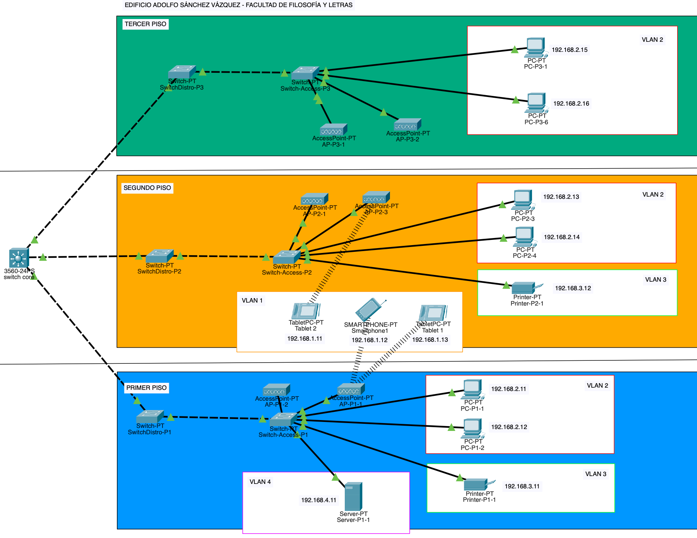

# Equipo-AAR-ATDI-BME-DAAV-LMAM

| Integrante                     | Número de Cuenta | Usuario de GitLab   |
|:------------------------------:|:----------------:|:-------------------:|
| Acosta Arzate Rubén            | 317205776        | `rubenAcostaArzate` |
| Alvarado Torres David Ignacio  | 316167613        | `ddalt`             |
| Bernal Marquez Erick           | 317042522        | `Erickmarquez7`     |
| Deloya Andrade Ana Valeria     | 317277582        | `avdeloya13`        |
| López Miranda Angel Mauricio   | 317034808        | `MauricioLMiranda`  |

# [Practica-4](https://redes-ciencias-unam.gitlab.io/2023-2/laboratorio/practica-4/)

En este enlace se encuentra el archivo `.pkt` de la práctica: [practica4.pkt](files/practica4.pkt)

## Topología de red:

La topología de nuestra red es de tipo <b>árbol</b>. Es claro ver que la red cumple con las características de un árbol como los conocemos en teoría de gráficas: una gráfica conexa y acíclica. En la raíz tenemos al Switch Core (nivel 0); después, en el nivel 1 tenemos a los switches de distribución, conectados a su vez a los switches de administración (nivel 2), que se conectan a los clientes de la red, que serían las hojas del árbol.

En la siguiente imagen podemos apreciar también las diferentes vLAN configuradas en la red:

| 
|:-------------------------:|
| Topología tipo árbol de la red

------- editar esto xd -------------

## Tabla de los equipos en cada vLAN:

## Tabla de conexiones de cada switch

## Tabla de direcciones IP de clientes por piso

## Ruteo del switch multicapa

## Pruebas de conexión de los equipos en la red

## Configuración de los switches (para esta será de redes xd)

Listamos las carpetas para cada tipo de switch que tenemos en la red. Por cada carpeta, listamos los archivos `.txt` que guarda. Cada archivo tiene la salida del comando `show startup-config` para su respectivo switch:

1. [Switch-Core](files/Switch-Core/)  
    * [SwitchCore_startup-config.txt](files/Switch-Core/SwitchCore_startup-config.txt)

2. [Switches-Acceso](files/Switches-Acceso/)
    * [Switch-Access-P1_startup-config.txt](files/Switches-Acceso/Switch-Access-P1_startup-config.txt)
    * [Switch-Access-P2_startup-config.txt](files/Switches-Acceso/Switch-Access-P2_startup-config.txt)
    * [Switch-Access-P3_startup-config.txt](files/Switches-Acceso/Switch-Access-P3_startup-config.txt)

2. [Switches-Distribucion](files/Switches-Distribucion/)
    * [SwitchDistro-P1_startup-config.txt](files/Switches-Distribucion/SwitchDistro-P1_startup-config.txt)
    * [SwitchDistro-P2_startup-config.txt](files/Switches-Distribucion/SwitchDistro-P2_startup-config.txt)
    * [SwitchDistro-P3_startup-config.txt](files/Switches-Distribucion/SwitchDistro-P3_startup-config.txt)
