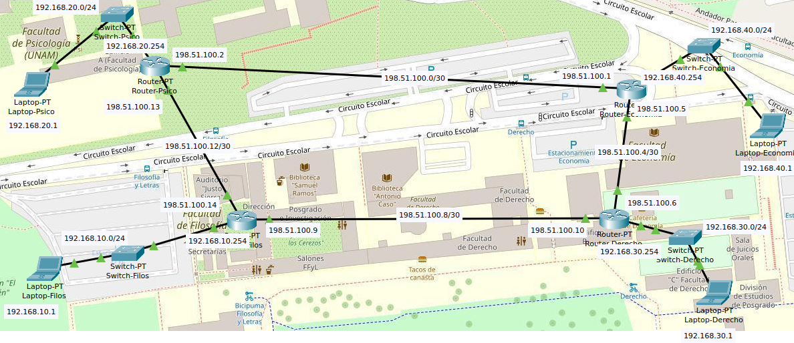

# Equipo-AAR-ATDI-BME-DAAV-LMAM

| Integrante                     | Número de Cuenta | Usuario de GitLab   |
|:------------------------------:|:----------------:|:-------------------:|
| Acosta Arzate Rubén            | 317205776        | `rubenAcostaArzate` |
| Alvarado Torres David Ignacio  | 316167613        | `ddalt`             |
| Bernal Marquez Erick           | 317042522        | `Erickmarquez7`     |
| Deloya Andrade Ana Valeria     | 317277582        | `avdeloya13`        |
| López Miranda Angel Mauricio   | 317034808        | `MauricioLMiranda`  |

# [Practica-4](https://redes-ciencias-unam.gitlab.io/2023-2/laboratorio/practica-4/)

En este enlace se encuentra el archivo `.pkt` de la práctica: [practica4.pkt](files/practica4.pkt)

## Topología de red:

La topología de nuestra red es de tipo <b>anillo</b>. Es claro ver que esta es nuestra topología por como están los Routers conectados, cada Router está conectado a otros dos Routers, uno de cada lado, formando así un anillo.

En la siguiente imagen podemos apreciar también las diferentes vLAN configuradas en la red:

| 
|:--------------------------------:|
| Topología tipo anillo de la red

## Tabla de los equipos

## Pruebas de conexión de los equipos en la red

## Configuración de los switches y routeadores 

Listamos los archivos `.txt` que guarda cada uno la salida del comando `show startup-config` para su respectivo switch o router:

1. Switches:
    * [Switch-Filos](files/Switch-Filos.txt)
    * [Switch-Psico](files/Switch-Psico.txt)
    * [Switch-Economia](files/Switch-Economia.txt)
    * [Switch-Derecho](files/Switch-Derecho.txt)

2. Routers:
    * [Router-Filos](files/Router-Filos.txt)
    * [Router-Psico](files/Router-Psico.txt)
    * [Router-Economia](files/Router-Economia.txt)
    * [Router-Derecho](files/Router-Derecho.txt)
