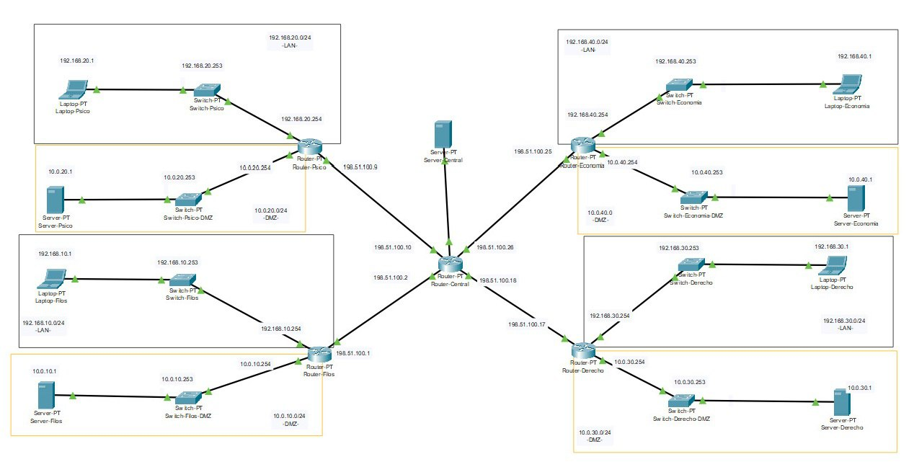
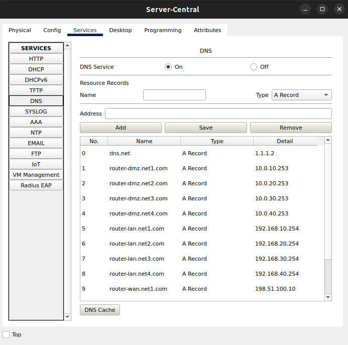

# Equipo-AAR-ATDI-BME-DAAV-LMAM

| Integrante                     | Número de Cuenta | Usuario de GitLab   |
|:------------------------------:|:----------------:|:-------------------:|
| Acosta Arzate Rubén            | 317205776        | `rubenAcostaArzate` |
| Alvarado Torres David Ignacio  | 316167613        | `ddalt`             |
| Bernal Marquez Erick           | 317042522        | `Erickmarquez7`     |
| Deloya Andrade Ana Valeria     | 317277582        | `avdeloya13`        |
| López Miranda Angel Mauricio   | 317034808        | `MauricioLMiranda`  |

# [Practica-5](https://redes-ciencias-unam.gitlab.io/2023-2/laboratorio/practica-5/)

En este enlace se encuentra el archivo `.pkt` de la práctica: [practica5.pkt](files/practica5.pkt)

## Topología de red:

La topología de nuestra red es de tipo <b>Estrella</b>. Es claro ver que esta es nuestra topología por como están los Routers conectados, cada Router está conectado directamente a un punto central.

En la siguiente imagen podemos apreciar también las diferentes vLAN configuradas en la red:

| 
|:--------------------------------:|
| Topología tipo estrella de la red


## Tabla de los equipos

| Equipo             |  Hostname        | IP de administración | Conexión con otros switches y ruteadores    |
|:------------------:|:----------------:|:--------------------:|:-------------------------------------------:|
| Server-Filos       |  Switch-Filos    | 192.168.10.253/24    |Switch-Filos-DMZ                                |
| Server-Psico       |  Switch-Psico    | 192.168.20.253/24    |Switch-Psico-DMZ                                 |
| Server-Derecho     |  Switch-Derecho  | 192.168.30.253/24    |Switch-Derecho-DMZ                               |
| Server-Economia    |  Switch-Economia | 192.168.40.253/24    |Switch-Economia-DMZ                              |
| Server-Central     |  Switch-Central  | 192.168.40.253/24    |Router-Central                               |
| Switch-Filos       |  Switch-Filos    | 192.168.10.253/24    |Laptop-Filos                                 |
| Switch-Psico       |  Switch-Psico    | 192.168.20.253/24    |Laptop-Psico                                 |
| Switch-Derecho     |  Switch-Derecho  | 192.168.30.253/24    |Laptop-Derecho                               |
| Switch-Filos-DMZ   |  Switch-Filos-DMZ| 192.168.10.253/24    |Server-Filos                                 |
| Switch-Psico-DMZ   |  Switch-Psico-DMZ| 192.168.20.253/24    |Server-Psico                                 |
| Switch-Derecho-DMZ |  Switch-Derecho-DMZ | 192.168.30.253/24    |Server-Derecho                            |
| Switch-Economia-DMZ|  Switch-Economia-DMZ| 192.168.40.253/24    |Server-Economia                           |
| Router-Filos       |  Router-Filos    | 192.168.10.254/24    |Switch-Filos, Switch-Filos-DMZ, Router-Central  |
| Router-Psico       |  Router-Psico    | 192.168.20.254/24    |Switch-Psico, Switch-Psico-DMZ, Router-Central  |
| Router-Derecho     |  Router-Derecho  | 192.168.30.254/24    |Switch-Derecho, Switch-Derecho-DMZ, Router-Central|
| Router-Economia    |  Router-Economia | 192.168.40.254/24    |Switch-Economia,Switch-Economia-DMZ, Router-Central|
| Router-Central     |  Router-Central  | 192.168.40.253/24    |Router-Economia, Router-Psico, Router_Derecho, Router-Filos                                 |

### Switch-Filos
`show cdp neighbors`

```
Switch-Filos>show cdp neighbors 
Capability Codes: R - Router, T - Trans Bridge, B - Source Route Bridge
                  S - Switch, H - Host, I - IGMP, r - Repeater, P - Phone
Device ID    Local Intrfce   Holdtme    Capability   Platform    Port ID
Router-Filos 
             Fas 1/1          132            R       PT1000      Fas 4/0
```

`show ip arp`

```
Switch-Filos>show ip arp 
Protocol  Address          Age (min)  Hardware Addr   Type   Interface
Internet  192.168.10.1            -   000B.BEE1.8296  ARPA   Vlan1
Internet  192.168.10.254          1   00D0.D362.EEA9  ARPA   Vlan1
```

`show ip interface brief`

```
Switch-Filos>show ip interface brief
Interface              IP-Address      OK? Method Status                Protocol 
FastEthernet0/1        unassigned      YES manual up                    up 
FastEthernet1/1        unassigned      YES manual up                    up 
Vlan1                  192.168.10.1    YES manual up                    up 
Vlan100                unassigned      YES manual up                    down
```

### Switch-Psico
`show cdp neighbors`

```
Switch-Psico>show cdp neighbors 
Capability Codes: R - Router, T - Trans Bridge, B - Source Route Bridge
                  S - Switch, H - Host, I - IGMP, r - Repeater, P - Phone
Device ID    Local Intrfce   Holdtme    Capability   Platform    Port ID
Router-Psico 
             Fas 1/1          148            R       PT1000      Fas 4/0
```

`show ip arp`

```
Switch-Psico>show ip arp 
Protocol  Address          Age (min)  Hardware Addr   Type   Interface
Internet  192.160.20.1            -   0002.17D4.5C96  ARPA   Vlan1
```

`show ip interface brief`

```
Switch-Psico>show ip interface brief
Interface              IP-Address      OK? Method Status                Protocol 
FastEthernet0/1        unassigned      YES manual up                    up 
FastEthernet1/1        unassigned      YES manual up                    up 
Vlan1                  192.160.20.1    YES manual up                    up 
Vlan100                unassigned      YES manual up                    down
```

### Switch-Derecho
`show cdp neighbors`

```
Switch-Derecho>show cdp neighbors 
Capability Codes: R - Router, T - Trans Bridge, B - Source Route Bridge
                  S - Switch, H - Host, I - IGMP, r - Repeater, P - Phone
Device ID    Local Intrfce   Holdtme    Capability   Platform    Port ID
Router-Derecho
             Fas 1/1          133            R       PT1000      Fas 4/0
```

`show ip arp`

```
Switch-Derecho>show ip arp 
Protocol  Address          Age (min)  Hardware Addr   Type   Interface
Internet  192.168.30.1            -   000B.BEA9.A4B2  ARPA   Vlan1
Internet  192.168.30.254          14  0002.4AC6.25A2  ARPA   Vlan1
```

`show ip interface brief`

```
Switch-Derecho>show ip interface brief 
Interface              IP-Address      OK? Method Status                Protocol 
FastEthernet0/1        unassigned      YES manual up                    up 
FastEthernet1/1        unassigned      YES manual up                    up 
Vlan1                  192.168.30.1    YES manual up                    up 
Vlan100                unassigned      YES manual up                    down
```

### Switch-Economia
`show cdp neighbors`

```
Switch-Economia>show cdp neighbors 
Capability Codes: R - Router, T - Trans Bridge, B - Source Route Bridge
                  S - Switch, H - Host, I - IGMP, r - Repeater, P - Phone
Device ID    Local Intrfce   Holdtme    Capability   Platform    Port ID
Router-Economia
             Fas 1/1          150            R       PT1000      Fas 4/0
```

`show ip arp`

```
Switch-Economia>show ip arp 
Protocol  Address          Age (min)  Hardware Addr   Type   Interface
Internet  192.168.40.1            -   0001.9752.DB01  ARPA   Vlan1
Internet  192.168.40.254          17  0002.1618.23DB  ARPA   Vlan1
```

`show ip interface brief`

```
Switch-Economia>show ip interface brief 
Interface              IP-Address      OK? Method Status                Protocol 
FastEthernet0/1        unassigned      YES manual up                    up 
FastEthernet1/1        unassigned      YES manual up                    up 
Vlan1                  192.168.40.1    YES manual up                    up 
Vlan100                unassigned      YES manual up                    down
```

### Switch-Psico-DMZ
`show cdp neighbors`

```
Switch-Psico-DMZ>show cdp neighbors 
Capability Codes: R - Router, T - Trans Bridge, B - Source Route Bridge
                  S - Switch, H - Host, I - IGMP, r - Repeater, P - Phone
Device ID    Local Intrfce   Holdtme    Capability   Platform    Port ID
Router-Psico 
             Fas 1/1          121            R       PT1000      Fas 5/0
```

`show ip arp`

```
Switch-Psico-DMZ>show ip arp 
Protocol  Address          Age (min)  Hardware Addr   Type   Interface
Internet  10.0.20.253             -   0060.47DC.9D4A  ARPA   Vlan1
```

`show ip interface brief`

```
Switch-Psico-DMZ>show ip interface brief 
Interface              IP-Address      OK? Method Status                Protocol 
FastEthernet0/1        unassigned      YES manual up                    up 
FastEthernet1/1        unassigned      YES manual up                    up 
Vlan1                  10.0.20.253     YES manual up                    up 
Vlan100                10.0.20.100     YES manual up                    down
```

### Switch-Filos-DMZ
`show cdp neighbors`

```
Switch-Filos-DMZ>show cdp neighbors 
Capability Codes: R - Router, T - Trans Bridge, B - Source Route Bridge
                  S - Switch, H - Host, I - IGMP, r - Repeater, P - Phone
Device ID    Local Intrfce   Holdtme    Capability   Platform    Port ID
Router-Filos 
             Fas 1/1          173            R       PT1000      Fas 5/0
```

`show ip arp`

```
Switch-Filos-DMZ>show ip arp 
Protocol  Address          Age (min)  Hardware Addr   Type   Interface
Internet  10.0.10.253             -   0050.0F2B.A34A  ARPA   Vlan1
```

`show ip interface brief`

```
Switch-Filos-DMZ>show ip interface brief 
Interface              IP-Address      OK? Method Status                Protocol 
FastEthernet0/1        unassigned      YES manual up                    up 
FastEthernet1/1        unassigned      YES manual up                    up 
Vlan1                  10.0.10.253     YES manual up                    up 
Vlan100                10.0.10.100     YES manual up                    down
```

### Switch-Economia-DMZ
`show cdp neighbors`

```
Switch-Economia-DMZ>show cdp neighbors
Capability Codes: R - Router, T - Trans Bridge, B - Source Route Bridge
                  S - Switch, H - Host, I - IGMP, r - Repeater, P - Phone
Device ID    Local Intrfce   Holdtme    Capability   Platform    Port ID
Router-Economia
             Fas 1/1          154            R       PT1000      Fas 5/0
```

`show ip arp`

```
Switch-Economia-DMZ>show ip arp 
Protocol  Address          Age (min)  Hardware Addr   Type   Interface
Internet  10.0.40.253             -   00D0.BAA9.6348  ARPA   Vlan1
```

`show ip interface brief`

```
Switch-Economia-DMZ>show ip interface brief 
Interface              IP-Address      OK? Method Status                Protocol 
FastEthernet0/1        unassigned      YES manual up                    up 
FastEthernet1/1        unassigned      YES manual up                    up 
Vlan1                  10.0.40.253     YES manual up                    up 
Vlan100                10.0.40.100     YES manual up                    down
```

### Switch-Derecho-DMZ
`show cdp neighbors`

```
Switch-Derecho-DMZ>show cdp neighbors 
Capability Codes: R - Router, T - Trans Bridge, B - Source Route Bridge
                  S - Switch, H - Host, I - IGMP, r - Repeater, P - Phone
Device ID    Local Intrfce   Holdtme    Capability   Platform    Port ID
Router-Derecho
             Fas 1/1          146            R       PT1000      Fas 5/0
```

`show ip arp`

```
Switch-Derecho-DMZ>show ip arp 
Protocol  Address          Age (min)  Hardware Addr   Type   Interface
Internet  10.0.30.253             -   0010.1189.6A33  ARPA   Vlan1
```

`show ip interface brief`

```
Switch-Derecho-DMZ>show ip interface brief 
Interface              IP-Address      OK? Method Status                Protocol 
FastEthernet0/1        unassigned      YES manual up                    up 
FastEthernet1/1        unassigned      YES manual up                    up 
Vlan1                  10.0.30.253     YES manual up                    up 
Vlan100                10.0.30.100     YES manual up                    down
```

### Router-Filos
`show cdp neighbors`

```
Router-Filos>show cdp neighbors 
Capability Codes: R - Router, T - Trans Bridge, B - Source Route Bridge
                  S - Switch, H - Host, I - IGMP, r - Repeater, P - Phone
Device ID    Local Intrfce   Holdtme    Capability   Platform    Port ID
Router-Central
             Gig 0/0          126            R       PT1000      Gig 0/0
Switch-Filos 
             Fas 4/0          126            S       PT3000      Fas 1/1
Switch-Filos-DMZ
             Fas 5/0          126            S       PT3000      Fas 1/1
```

`show ip arp`

```
Router-Filos>show ip arp 
Protocol  Address          Age (min)  Hardware Addr   Type   Interface
Internet  10.0.10.254             -   0004.9AD1.A7D8  ARPA   FastEthernet5/0
Internet  192.168.10.254          -   00D0.D362.EEA9  ARPA   FastEthernet4/0
Internet  198.51.100.1            -   0005.5EBC.D3D0  ARPA   GigabitEthernet0/0
Internet  198.51.100.2            29  0090.0CAD.C896  ARPA   GigabitEthernet0/0
```

`show ip interface brief`

```
Router-Filos>show ip interface brief 
Interface              IP-Address      OK? Method Status                Protocol 
GigabitEthernet0/0     198.51.100.1    YES NVRAM  up                    up 
GigabitEthernet1/0     unassigned      YES NVRAM  up                    down 
GigabitEthernet2/0     unassigned      YES NVRAM  up                    down 
GigabitEthernet3/0     unassigned      YES NVRAM  up                    down 
FastEthernet4/0        192.168.10.254  YES NVRAM  up                    up 
FastEthernet5/0        10.0.10.254     YES NVRAM  up                    up 
FastEthernet6/0        unassigned      YES NVRAM  up                    down
```

`show ip route`

```
Router-Filos>show ip route 
Codes: C - connected, S - static, I - IGRP, R - RIP, M - mobile, B - BGP
       D - EIGRP, EX - EIGRP external, O - OSPF, IA - OSPF inter area
       N1 - OSPF NSSA external type 1, N2 - OSPF NSSA external type 2
       E1 - OSPF external type 1, E2 - OSPF external type 2, E - EGP
       i - IS-IS, L1 - IS-IS level-1, L2 - IS-IS level-2, ia - IS-IS inter area
       * - candidate default, U - per-user static route, o - ODR
       P - periodic downloaded static route

Gateway of last resort is not set

     10.0.0.0/24 is subnetted, 1 subnets
C       10.0.10.0 is directly connected, FastEthernet5/0
C    192.168.10.0/24 is directly connected, FastEthernet4/0
S    192.168.20.0/24 [1/0] via 198.51.100.13
S    192.168.30.0/24 [1/0] via 198.51.100.10
S    192.168.40.0/24 [1/0] via 198.51.100.5
     198.51.100.0/24 is variably subnetted, 6 subnets, 2 masks
C       198.51.100.0/29 is directly connected, GigabitEthernet0/0
S       198.51.100.0/30 [1/0] via 198.51.100.13
S       198.51.100.4/30 [1/0] via 198.51.100.10
R       198.51.100.8/29 [120/1] via 198.51.100.2, 00:00:23, GigabitEthernet0/0
R       198.51.100.16/29 [120/1] via 198.51.100.2, 00:00:23, GigabitEthernet0/0
R       198.51.100.24/29 [120/1] via 198.51.100.2, 00:00:23, GigabitEthernet0/0
```

`show ip route summary`

```
Router-Filos>show ip route summary
IP routing table name is Default-IP-Routing-Table(0)
IP routing table maximum-paths is 16
Route Source    Networks    Subnets     Overhead    Memory (bytes)
connected       1           2           216         384
static          3           2           360         640
internal        1                                   1148
Total           5           4           576         2172
```

`show ip dhcp pool`

```
Router-Filos>show ip dhcp pool 

Pool ip10 :
 Utilization mark (high/low)    : 100 / 0
 Subnet size (first/next)       : 0 / 0 
 Total addresses                : 254
 Leased addresses               : 1
 Excluded addresses             : 0
 Pending event                  : none

 1 subnet is currently in the pool
 Current index        IP address range                    Leased/Excluded/Total
 192.168.10.1         192.168.10.1     - 192.168.10.254    1    / 0     / 254

`show ip nat statistics`
```

```
Router-Filos>show ip nat statistics
Total translations: 6 (5 static, 1 dynamic, 5 extended)
Outside Interfaces: GigabitEthernet0/0
Inside Interfaces: FastEthernet4/0 , FastEthernet5/0
Hits: 51  Misses: 58
Expired translations: 1
Dynamic mappings:
```

`show ip nat translations`

```
Router-Filos>show ip nat translations
Pro  Inside global     Inside local       Outside local      Outside global
udp 192.168.10.254:520 198.51.100.1:520   224.0.0.9:520      224.0.0.9:520
---  198.51.100.1      10.0.10.254        ---                ---
tcp 198.51.100.1:80    10.0.10.254:80     ---                ---
tcp 198.51.100.17:80   10.0.30.254:80     ---                ---
tcp 198.51.100.25:80   10.0.40.254:80     ---                ---
tcp 198.51.100.9:80    10.0.20.254:80     ---                ---
```

`show ip rip database`

```
Router-Filos>show ip rip database
192.168.10.0/24    auto-summary
192.168.10.0/24    directly connected, FastEthernet4/0
192.168.20.0/24    auto-summary
192.168.20.0/24
    [2] via 198.51.100.2, 00:00:05, GigabitEthernet0/0
192.168.30.0/24    auto-summary
192.168.30.0/24
    [2] via 198.51.100.2, 00:00:05, GigabitEthernet0/0
192.168.40.0/24    auto-summary
192.168.40.0/24
    [2] via 198.51.100.2, 00:00:05, GigabitEthernet0/0
198.51.100.0/29    auto-summary
198.51.100.0/29    directly connected, GigabitEthernet0/0
198.51.100.8/29    auto-summary
198.51.100.8/29
    [1] via 198.51.100.2, 00:00:05, GigabitEthernet0/0
198.51.100.16/29    auto-summary
198.51.100.16/29
    [1] via 198.51.100.2, 00:00:05, GigabitEthernet0/0
198.51.100.24/29    auto-summary
198.51.100.24/29
    [1] via 198.51.100.2, 00:00:05, GigabitEthernet0/0
```

### Router-Central
`show cdp neighbors`

```
Router-Central>show cdp neighbors 
Capability Codes: R - Router, T - Trans Bridge, B - Source Route Bridge
                  S - Switch, H - Host, I - IGMP, r - Repeater, P - Phone
Device ID    Local Intrfce   Holdtme    Capability   Platform    Port ID
Router-Derecho
             Gig 3/0          149            R       PT1000      Gig 0/0
Router-Filos 
             Gig 0/0          149            R       PT1000      Gig 0/0
Router-Psico 
             Gig 1/0          149            R       PT1000      Gig 0/0
Router-Economia
             Gig 2/0          149            R       PT1000      Gig 0/0
```

`show ip arp`

```
Router-Central>show ip arp
Protocol  Address          Age (min)  Hardware Addr   Type   Interface
Internet  198.51.100.1            48  0005.5EBC.D3D0  ARPA   GigabitEthernet0/0
Internet  198.51.100.2            -   0090.0CAD.C896  ARPA   GigabitEthernet0/0
Internet  198.51.100.9            48  000C.853E.A35A  ARPA   GigabitEthernet1/0
Internet  198.51.100.10           -   0001.C924.759D  ARPA   GigabitEthernet1/0
Internet  198.51.100.17           48  0090.2170.5060  ARPA   GigabitEthernet3/0
Internet  198.51.100.18           -   0000.0C4E.61D9  ARPA   GigabitEthernet3/0
Internet  198.51.100.25           48  0005.5EC1.CC5A  ARPA   GigabitEthernet2/0
Internet  198.51.100.26           -   0007.EC65.712D  ARPA   GigabitEthernet2/0
```

`show ip interface brief`

```
Router-Central>show ip interface brief
Interface              IP-Address      OK? Method Status                Protocol 
GigabitEthernet0/0     198.51.100.2    YES manual up                    up 
GigabitEthernet1/0     198.51.100.10   YES manual up                    up 
GigabitEthernet2/0     198.51.100.26   YES manual up                    up 
GigabitEthernet3/0     198.51.100.18   YES manual up                    up 
GigabitEthernet4/0     unassigned      YES unset  up                    up
```

`show ip route`

```
Router-Central>show ip route
Codes: C - connected, S - static, I - IGRP, R - RIP, M - mobile, B - BGP
       D - EIGRP, EX - EIGRP external, O - OSPF, IA - OSPF inter area
       N1 - OSPF NSSA external type 1, N2 - OSPF NSSA external type 2
       E1 - OSPF external type 1, E2 - OSPF external type 2, E - EGP
       i - IS-IS, L1 - IS-IS level-1, L2 - IS-IS level-2, ia - IS-IS inter area
       * - candidate default, U - per-user static route, o - ODR
       P - periodic downloaded static route

Gateway of last resort is not set

R    192.168.20.0/24 [120/1] via 198.51.100.9, 00:00:15, GigabitEthernet1/0
R    192.168.30.0/24 [120/1] via 198.51.100.17, 00:00:06, GigabitEthernet3/0
R    192.168.40.0/24 [120/1] via 198.51.100.25, 00:00:22, GigabitEthernet2/0
     198.51.100.0/29 is subnetted, 4 subnets
C       198.51.100.0 is directly connected, GigabitEthernet0/0
C       198.51.100.8 is directly connected, GigabitEthernet1/0
C       198.51.100.16 is directly connected, GigabitEthernet3/0
C       198.51.100.24 is directly connected, GigabitEthernet2/0
```

`show ip route summary`

```
Router-Central>show ip route summary 
IP routing table name is Default-IP-Routing-Table(0)
IP routing table maximum-paths is 16
Route Source    Networks    Subnets     Overhead    Memory (bytes)
connected       0           4           288         512
static          0           0           0           0
rip             3           0           216         384
internal        1                                   1148
Total           4           4           504         2044
```

`show ip dhcp pool`

```
```

`show ip nat statistics`

```
```

`show ip nat translations`

```
```

`show ip rip database`

```
Router-Central>show ip rip database
192.168.20.0/24    auto-summary
192.168.20.0/24
    [1] via 198.51.100.9, 00:00:19, GigabitEthernet1/0
192.168.30.0/24    auto-summary
192.168.30.0/24
    [1] via 198.51.100.17, 00:00:14, GigabitEthernet3/0
192.168.40.0/24    auto-summary
192.168.40.0/24
    [1] via 198.51.100.25, 00:00:01, GigabitEthernet2/0
198.51.100.0/29    auto-summary
198.51.100.0/29    directly connected, GigabitEthernet0/0
198.51.100.8/29    auto-summary
198.51.100.8/29    directly connected, GigabitEthernet1/0
198.51.100.16/29    auto-summary
198.51.100.16/29    directly connected, GigabitEthernet3/0
198.51.100.24/29    auto-summary
198.51.100.24/29    directly connected, GigabitEthernet2/0
```


### Router-Psico
`show cdp neighbors`

```
Router-Psico>show cdp neighbors 
Capability Codes: R - Router, T - Trans Bridge, B - Source Route Bridge
                  S - Switch, H - Host, I - IGMP, r - Repeater, P - Phone
Device ID    Local Intrfce   Holdtme    Capability   Platform    Port ID
Switch-Psico 
             Fas 4/0          147            S       PT3000      Fas 1/1
Switch-Psico-DMZ
             Fas 5/0          147            S       PT3000      Fas 1/1
Router-Central
             Gig 0/0          147            R       PT1000      Gig 1/0
```

`show ip arp`

```
Router-Psico>show ip arp
Protocol  Address          Age (min)  Hardware Addr   Type   Interface
Internet  10.0.20.254             -   0090.2B67.83A0  ARPA   FastEthernet5/0
Internet  192.168.20.254          -   000C.8507.8A08  ARPA   FastEthernet4/0
Internet  198.51.100.9            -   000C.853E.A35A  ARPA   GigabitEthernet0/0
Internet  198.51.100.10           1   0001.C924.759D  ARPA   GigabitEthernet0/0
```

`show ip interface brief`

```
Router-Psico>show ip interface brief 
Interface              IP-Address      OK? Method Status                Protocol 
GigabitEthernet0/0     198.51.100.9    YES manual up                    up 
GigabitEthernet1/0     unassigned      YES manual up                    down 
GigabitEthernet2/0     unassigned      YES manual up                    down 
GigabitEthernet3/0     unassigned      YES unset  up                    down 
FastEthernet4/0        192.168.20.254  YES manual up                    up 
FastEthernet5/0        10.0.20.254     YES manual up                    up 
FastEthernet6/0        unassigned      YES unset  up                    down
```

`show ip route`

```
Router-Psico>show ip route 
Codes: C - connected, S - static, I - IGRP, R - RIP, M - mobile, B - BGP
       D - EIGRP, EX - EIGRP external, O - OSPF, IA - OSPF inter area
       N1 - OSPF NSSA external type 1, N2 - OSPF NSSA external type 2
       E1 - OSPF external type 1, E2 - OSPF external type 2, E - EGP
       i - IS-IS, L1 - IS-IS level-1, L2 - IS-IS level-2, ia - IS-IS inter area
       * - candidate default, U - per-user static route, o - ODR
       P - periodic downloaded static route

Gateway of last resort is not set

     10.0.0.0/24 is subnetted, 1 subnets
C       10.0.20.0 is directly connected, FastEthernet5/0
S    192.168.10.0/24 [1/0] via 198.51.100.14
C    192.168.20.0/24 is directly connected, FastEthernet4/0
S    192.168.30.0/24 [1/0] via 198.51.100.10
                     [1/0] via 198.51.100.6
S    192.168.40.0/24 [1/0] via 198.51.100.1
     198.51.100.0/24 is variably subnetted, 6 subnets, 2 masks
R       198.51.100.0/29 [120/1] via 198.51.100.10, 00:00:21, GigabitEthernet0/0
S       198.51.100.4/30 [1/0] via 198.51.100.1
C       198.51.100.8/29 is directly connected, GigabitEthernet0/0
S       198.51.100.8/30 [1/0] via 198.51.100.14
R       198.51.100.16/29 [120/1] via 198.51.100.10, 00:00:21, GigabitEthernet0/0
R       198.51.100.24/29 [120/1] via 198.51.100.10, 00:00:21, GigabitEthernet0/0
```

`show ip route summary`

```
Router-Psico>show ip route summary 
IP routing table name is Default-IP-Routing-Table(0)
IP routing table maximum-paths is 16
Route Source    Networks    Subnets     Overhead    Memory (bytes)
connected       1           2           216         384
static          3           2           360         640
rip             0           3           216         384
internal        2                                   2296
Total           6           7           792         3704
```

`show ip dhcp pool`

```
Router-Psico>show ip dhcp pool 

Pool ip20 :
 Utilization mark (high/low)    : 100 / 0
 Subnet size (first/next)       : 0 / 0 
 Total addresses                : 254
 Leased addresses               : 1
 Excluded addresses             : 0
 Pending event                  : none

 1 subnet is currently in the pool
 Current index        IP address range                    Leased/Excluded/Total
 192.168.20.1         192.168.20.1     - 192.168.20.254    1    / 0     / 254
```

`show ip nat statistics`

```
Router-Psico>show ip nat statistics
Total translations: 2 (2 static, 0 dynamic, 1 extended)
Outside Interfaces: GigabitEthernet0/0
Inside Interfaces: FastEthernet4/0 , FastEthernet5/0
Hits: 0  Misses: 46
Expired translations: 0
Dynamic mappings:
```

`show ip nat translations`

```
Router-Psico>show ip nat translations
Pro  Inside global     Inside local       Outside local      Outside global
---  198.51.100.9      10.0.20.1          ---                ---
tcp 198.51.100.9:80    10.0.20.1:80       ---                ---
```

`show ip rip database`

```
Router-Psico>show ip rip database
192.168.10.0/24    auto-summary
192.168.10.0/24
    [2] via 198.51.100.10, 00:00:19, GigabitEthernet0/0
192.168.20.0/24    auto-summary
192.168.20.0/24    directly connected, FastEthernet4/0
192.168.30.0/24    auto-summary
192.168.30.0/24
    [2] via 198.51.100.10, 00:00:19, GigabitEthernet0/0
192.168.40.0/24    auto-summary
192.168.40.0/24
    [2] via 198.51.100.10, 00:00:19, GigabitEthernet0/0
198.51.100.0/29    auto-summary
198.51.100.0/29
    [1] via 198.51.100.10, 00:00:19, GigabitEthernet0/0
198.51.100.8/29    auto-summary
198.51.100.8/29    directly connected, GigabitEthernet0/0
198.51.100.16/29    auto-summary
198.51.100.16/29
    [1] via 198.51.100.10, 00:00:19, GigabitEthernet0/0
198.51.100.24/29    auto-summary
198.51.100.24/29
    [1] via 198.51.100.10, 00:00:19, GigabitEthernet0/0
```

### Router-Derecho
`show cdp neighbors`

```
Router-Derecho>show cdp neighbors 
Capability Codes: R - Router, T - Trans Bridge, B - Source Route Bridge
                  S - Switch, H - Host, I - IGMP, r - Repeater, P - Phone
Device ID    Local Intrfce   Holdtme    Capability   Platform    Port ID
Switch-Derecho-DMZ
             Fas 5/0          120            S       PT3000      Fas 1/1
Router-Central
             Gig 0/0          120            R       PT1000      Gig 3/0
Switch-Derecho
             Fas 4/0          120            S       PT3000      Fas 1/1
```

`show ip arp`

```
Router-Derecho>show ip arp
Protocol  Address          Age (min)  Hardware Addr   Type   Interface
Internet  10.0.30.254             -   00E0.8FD8.6A2E  ARPA   FastEthernet5/0
Internet  192.168.30.254          -   0002.4AC6.25A2  ARPA   FastEthernet4/0
Internet  198.51.100.17           -   0090.2170.5060  ARPA   GigabitEthernet0/0
Internet  198.51.100.18           12  0000.0C4E.61D9  ARPA   GigabitEthernet0/0
```

`show ip interface brief`

```
Router-Derecho>show ip interface brief 
Interface              IP-Address      OK? Method Status                Protocol 
GigabitEthernet0/0     198.51.100.17   YES NVRAM  up                    up 
GigabitEthernet1/0     unassigned      YES NVRAM  up                    down 
GigabitEthernet2/0     unassigned      YES NVRAM  up                    down 
GigabitEthernet3/0     unassigned      YES NVRAM  up                    down 
FastEthernet4/0        192.168.30.254  YES NVRAM  up                    up 
FastEthernet5/0        10.0.30.254     YES NVRAM  up                    up 
FastEthernet6/0        unassigned      YES NVRAM  up                    down
```

`show ip route`

```
Router-Derecho>show ip route 
Codes: C - connected, S - static, I - IGRP, R - RIP, M - mobile, B - BGP
       D - EIGRP, EX - EIGRP external, O - OSPF, IA - OSPF inter area
       N1 - OSPF NSSA external type 1, N2 - OSPF NSSA external type 2
       E1 - OSPF external type 1, E2 - OSPF external type 2, E - EGP
       i - IS-IS, L1 - IS-IS level-1, L2 - IS-IS level-2, ia - IS-IS inter area
       * - candidate default, U - per-user static route, o - ODR
       P - periodic downloaded static route

Gateway of last resort is not set

     10.0.0.0/24 is subnetted, 1 subnets
C       10.0.30.0 is directly connected, FastEthernet5/0
S    192.168.10.0/24 [1/0] via 198.51.100.9
S    192.168.20.0/24 [1/0] via 198.51.100.2
                     [1/0] via 198.51.100.13
C    192.168.30.0/24 is directly connected, FastEthernet4/0
S    192.168.40.0/24 [1/0] via 198.51.100.5
     198.51.100.0/24 is variably subnetted, 6 subnets, 2 masks
R       198.51.100.0/29 [120/1] via 198.51.100.18, 00:00:27, GigabitEthernet0/0
S       198.51.100.0/30 [1/0] via 198.51.100.5
R       198.51.100.8/29 [120/1] via 198.51.100.18, 00:00:27, GigabitEthernet0/0
S       198.51.100.12/30 [1/0] via 198.51.100.9
C       198.51.100.16/29 is directly connected, GigabitEthernet0/0
R       198.51.100.24/29 [120/1] via 198.51.100.18, 00:00:27, GigabitEthernet0/0
```

`show ip route summary`

```
Router-Derecho>show ip route summary 
IP routing table name is Default-IP-Routing-Table(0)
IP routing table maximum-paths is 16
Route Source    Networks    Subnets     Overhead    Memory (bytes)
connected       1           2           216         384
static          3           2           360         640
rip             0           3           216         384
internal        2                                   2296
Total           6           7           792         3704
```
`show ip dhcp pool`

```

Router-Derecho>show ip dhcp pool 

Pool ip30 :
 Utilization mark (high/low)    : 100 / 0
 Subnet size (first/next)       : 0 / 0 
 Total addresses                : 254
 Leased addresses               : 1
 Excluded addresses             : 0
 Pending event                  : none

 1 subnet is currently in the pool
 Current index        IP address range                    Leased/Excluded/Total
 192.168.30.1         192.168.30.1     - 192.168.30.254    1    / 0     / 254
```

`show ip nat statistics`

```
Router-Derecho>show ip nat statistics
Total translations: 2 (2 static, 0 dynamic, 1 extended)
Outside Interfaces: GigabitEthernet0/0
Inside Interfaces: FastEthernet4/0 , FastEthernet5/0
Hits: 0  Misses: 20
Expired translations: 0
Dynamic mappings:
```

`show ip nat translations`

```
Router-Derecho>show ip nat translations
Pro  Inside global     Inside local       Outside local      Outside global
---  198.51.100.17     10.0.30.1          ---                ---
tcp 198.51.100.17:80   10.0.30.1:80       ---                ---
```

`show ip rip database`

```
Router-Derecho>show ip rip database
192.168.10.0/24    auto-summary
192.168.10.0/24
    [2] via 198.51.100.18, 00:00:12, GigabitEthernet0/0
192.168.20.0/24    auto-summary
192.168.20.0/24
    [2] via 198.51.100.18, 00:00:12, GigabitEthernet0/0
192.168.30.0/24    auto-summary
192.168.30.0/24    directly connected, FastEthernet4/0
192.168.40.0/24    auto-summary
192.168.40.0/24
    [2] via 198.51.100.18, 00:00:12, GigabitEthernet0/0
198.51.100.0/29    auto-summary
198.51.100.0/29
    [1] via 198.51.100.18, 00:00:12, GigabitEthernet0/0
198.51.100.8/29    auto-summary
198.51.100.8/29
    [1] via 198.51.100.18, 00:00:12, GigabitEthernet0/0
198.51.100.16/29    auto-summary
198.51.100.16/29    directly connected, GigabitEthernet0/0
198.51.100.24/29    auto-summary
198.51.100.24/29
    [1] via 198.51.100.18, 00:00:12, GigabitEthernet0/0
```


### Router-Economia
`show cdp neighbors`

```
Router-Economia>show cdp neighbors 
Capability Codes: R - Router, T - Trans Bridge, B - Source Route Bridge
                  S - Switch, H - Host, I - IGMP, r - Repeater, P - Phone
Device ID    Local Intrfce   Holdtme    Capability   Platform    Port ID
Switch-Economia-DMZ
             Fas 5/0          142            S       PT3000      Fas 1/1
Router-Central
             Gig 0/0          142            R       PT1000      Gig 2/0
Switch-Economia
             Fas 4/0          142            S       PT3000      Fas 1/1
```

`show ip arp`

```
Router-Economia>show ip arp 
Protocol  Address          Age (min)  Hardware Addr   Type   Interface
Internet  10.0.40.254             -   0010.1118.6A76  ARPA   FastEthernet5/0
Internet  192.168.40.254          -   0002.1618.23DB  ARPA   FastEthernet4/0
Internet  198.51.100.25           -   0005.5EC1.CC5A  ARPA   GigabitEthernet0/0
Internet  198.51.100.26           7   0007.EC65.712D  ARPA   GigabitEthernet0/0
```

`show ip interface brief`

```
Router-Economia>show ip interface brief 
Interface              IP-Address      OK? Method Status                Protocol 
GigabitEthernet0/0     198.51.100.25   YES manual up                    up 
GigabitEthernet1/0     unassigned      YES manual up                    down 
GigabitEthernet2/0     unassigned      YES manual up                    down 
GigabitEthernet3/0     unassigned      YES unset  up                    down 
FastEthernet4/0        192.168.40.254  YES manual up                    up 
FastEthernet5/0        10.0.40.254     YES manual up                    up 
FastEthernet6/0        unassigned      YES unset  up                    down
```

`show ip route`

```
Router-Economia>show ip route 
Codes: C - connected, S - static, I - IGRP, R - RIP, M - mobile, B - BGP
       D - EIGRP, EX - EIGRP external, O - OSPF, IA - OSPF inter area
       N1 - OSPF NSSA external type 1, N2 - OSPF NSSA external type 2
       E1 - OSPF external type 1, E2 - OSPF external type 2, E - EGP
       i - IS-IS, L1 - IS-IS level-1, L2 - IS-IS level-2, ia - IS-IS inter area
       * - candidate default, U - per-user static route, o - ODR
       P - periodic downloaded static route

Gateway of last resort is not set

     10.0.0.0/24 is subnetted, 1 subnets
C       10.0.40.0 is directly connected, FastEthernet5/0
S    192.168.10.0/24 [1/0] via 198.51.100.2
                     [1/0] via 198.51.100.6
S    192.168.20.0/24 [1/0] via 198.51.100.2
S    192.168.30.0/24 [1/0] via 198.51.100.6
C    192.168.40.0/24 is directly connected, FastEthernet4/0
     198.51.100.0/24 is variably subnetted, 6 subnets, 2 masks
R       198.51.100.0/29 [120/1] via 198.51.100.26, 00:00:26, GigabitEthernet0/0
R       198.51.100.8/29 [120/1] via 198.51.100.26, 00:00:26, GigabitEthernet0/0
S       198.51.100.8/30 [1/0] via 198.51.100.6
S       198.51.100.12/30 [1/0] via 198.51.100.2
R       198.51.100.16/29 [120/1] via 198.51.100.26, 00:00:26, GigabitEthernet0/0
C       198.51.100.24/29 is directly connected, GigabitEthernet0/0
```

`show ip route summary`

```
Router-Economia>show ip route summary 
IP routing table name is Default-IP-Routing-Table(0)
IP routing table maximum-paths is 16
Route Source    Networks    Subnets     Overhead    Memory (bytes)
connected       1           2           216         384
static          3           2           360         640
rip             0           3           216         384
internal        2                                   2296
Total           6           7           792         3704
```

`show ip dhcp pool`

```
Router-Economia>show ip dhcp pool

Pool ip40 :
 Utilization mark (high/low)    : 100 / 0
 Subnet size (first/next)       : 0 / 0 
 Total addresses                : 254
 Leased addresses               : 1
 Excluded addresses             : 0
 Pending event                  : none

 1 subnet is currently in the pool
 Current index        IP address range                    Leased/Excluded/Total
 192.168.40.1         192.168.40.1     - 192.168.40.254    1    / 0     / 254
```

`show ip nat statistics`

```
Router-Economia>show ip nat statistics
Total translations: 2 (2 static, 0 dynamic, 1 extended)
Outside Interfaces: GigabitEthernet0/0
Inside Interfaces: FastEthernet4/0 , FastEthernet5/0
Hits: 0  Misses: 58
Expired translations: 0
Dynamic mappings:
```

`show ip nat translations`

```
Router-Economia>show ip nat translations
Pro  Inside global     Inside local       Outside local      Outside global
---  198.51.100.25     10.0.40.1          ---                ---
tcp 198.51.100.25:80   10.0.40.1:80       ---                ---
```

`show ip rip database`

```
Router-Economia>show ip rip database
192.168.10.0/24    auto-summary
192.168.10.0/24
    [2] via 198.51.100.26, 00:00:26, GigabitEthernet0/0
192.168.20.0/24    auto-summary
192.168.20.0/24
    [2] via 198.51.100.26, 00:00:26, GigabitEthernet0/0
192.168.30.0/24    auto-summary
192.168.30.0/24
    [2] via 198.51.100.26, 00:00:26, GigabitEthernet0/0
192.168.40.0/24    auto-summary
192.168.40.0/24    directly connected, FastEthernet4/0
198.51.100.0/29    auto-summary
198.51.100.0/29
    [1] via 198.51.100.26, 00:00:26, GigabitEthernet0/0
198.51.100.8/29    auto-summary
198.51.100.8/29
    [1] via 198.51.100.26, 00:00:26, GigabitEthernet0/0
198.51.100.16/29    auto-summary
198.51.100.16/29
    [1] via 198.51.100.26, 00:00:26, GigabitEthernet0/0
198.51.100.24/29    auto-summary
198.51.100.24/29    directly connected, GigabitEthernet0/0
```

## Pruebas de conexión de los equipos en la red

###Para equipos a servidores

- `Laptop-Psico` a `Server-Economia`
	
	```
	C:\>ping 198.51.100.25

	Pinging 198.51.100.25 with 32 bytes of data:

	Reply from 198.51.100.25: bytes=32 time<1ms TTL=125
	Reply from 198.51.100.25: bytes=32 time<1ms TTL=125
	Reply from 198.51.100.25: bytes=32 time<1ms TTL=125
	Reply from 198.51.100.25: bytes=32 time<1ms TTL=125

	Ping statistics for 198.51.100.25:
	    Packets: Sent = 4, Received = 4, Lost = 0 (0% loss),
	Approximate round trip times in milli-seconds:
	    Minimum = 0ms, Maximum = 0ms, Average = 0ms
	```
	
- `Laptop-Psico` a `Server-Psico`
	
	```
	C:\>ping 198.51.100.9

	Pinging 198.51.100.9 with 32 bytes of data:

	Reply from 198.51.100.9: bytes=32 time<1ms TTL=255
	Reply from 198.51.100.9: bytes=32 time<1ms TTL=255
	Reply from 198.51.100.9: bytes=32 time<1ms TTL=255
	Reply from 198.51.100.9: bytes=32 time<1ms TTL=255

	Ping statistics for 198.51.100.9:
	    Packets: Sent = 4, Received = 4, Lost = 0 (0% loss),
	Approximate round trip times in milli-seconds:
	    Minimum = 0ms, Maximum = 0ms, Average = 0ms
	```

- `Laptop-Psico` a `Server-Derecho`
	
	```
	C:\>ping 198.51.100.17

	Pinging 198.51.100.17 with 32 bytes of data:

	Reply from 198.51.100.17: bytes=32 time=1ms TTL=125
	Reply from 198.51.100.17: bytes=32 time=1ms TTL=125
	Reply from 198.51.100.17: bytes=32 time<1ms TTL=125
	Reply from 198.51.100.17: bytes=32 time<1ms TTL=125

	Ping statistics for 198.51.100.17:
	    Packets: Sent = 4, Received = 4, Lost = 0 (0% loss),
	Approximate round trip times in milli-seconds:
	    Minimum = 0ms, Maximum = 1ms, Average = 0ms
	```
	
- `Laptop-Psico` a `Server-Filos`
	
	```
	C:\>ping 198.51.100.1

	Pinging 198.51.100.1 with 32 bytes of data:

	Reply from 198.51.100.1: bytes=32 time<1ms TTL=125
	Reply from 198.51.100.1: bytes=32 time<1ms TTL=125
	Reply from 198.51.100.1: bytes=32 time<1ms TTL=125
	Reply from 198.51.100.1: bytes=32 time<1ms TTL=125

	Ping statistics for 198.51.100.1:
	    Packets: Sent = 4, Received = 4, Lost = 0 (0% loss),
	Approximate round trip times in milli-seconds:
	    Minimum = 0ms, Maximum = 0ms, Average = 0ms
	```
### Para equipos a routers 

- `Laptop-Psico` a `Router-Psico GigabitEthernet0/0`
	
	```
	C:\>ping 198.51.100.9

	Pinging 198.51.100.9 with 32 bytes of data:

	Reply from 198.51.100.9: bytes=32 time<1ms TTL=255
	Reply from 198.51.100.9: bytes=32 time<1ms TTL=255
	Reply from 198.51.100.9: bytes=32 time<1ms TTL=255
	Reply from 198.51.100.9: bytes=32 time<1ms TTL=255

	Ping statistics for 198.51.100.9:
	    Packets: Sent = 4, Received = 4, Lost = 0 (0% loss),
	Approximate round trip times in milli-seconds:
	    Minimum = 0ms, Maximum = 0ms, Average = 0ms
	```
	
- `Laptop-Psico` a `Router-Psico GigabitEthernet4/0`
	
	```
	C:\>ping 192.168.20.254

	Pinging 192.168.20.254 with 32 bytes of data:

	Reply from 192.168.20.254: bytes=32 time<1ms TTL=255
	Reply from 192.168.20.254: bytes=32 time<1ms TTL=255
	Reply from 192.168.20.254: bytes=32 time<1ms TTL=255
	Reply from 192.168.20.254: bytes=32 time<1ms TTL=255

	Ping statistics for 192.168.20.254:
	    Packets: Sent = 4, Received = 4, Lost = 0 (0% loss),
	Approximate round trip times in milli-seconds:
	    Minimum = 0ms, Maximum = 0ms, Average = 0ms
	```
- `Laptop-Psico` a `Router-Psico GigabitEthernet5/0`
	
	```
	C:\>ping 10.0.20.254

	Pinging 10.0.20.254 with 32 bytes of data:

	Reply from 10.0.20.254: bytes=32 time<1ms TTL=255
	Reply from 10.0.20.254: bytes=32 time=1ms TTL=255
	Reply from 10.0.20.254: bytes=32 time<1ms TTL=255
	Reply from 10.0.20.254: bytes=32 time=15ms TTL=255

	Ping statistics for 10.0.20.254:
	    Packets: Sent = 4, Received = 4, Lost = 0 (0% loss),
	Approximate round trip times in milli-seconds:
	    Minimum = 0ms, Maximum = 15ms, Average = 4ms
	```

## Configuración de los switches y routeadores 

Listamos los archivos `.txt` que guarda cada uno la salida del comando `show startup-config` para su respectivo switch o router:

1. Switches:
    * [Switch-Psico-DMZ](files/Switch-Psico-DMZ.txt)
    * [Switch-Filos-DMZ](files/Switch-Filos-DMZ.txt)
    * [Switch-Derecho-DMZ](files/Switch-Derecho-DMZ.txt)
    * [Switch-Economia-DMZ](files/Switch-Economia-DMZ.txt)
    * [Switch-Filos](files/Switch-Filos-LAN.txt)
    * [Switch-Psico](files/Switch-Psico-LAN.txt)
    * [Switch-Economia](files/Switch-Economia-LAN.txt)
    * [Switch-Derecho](files/Switch-Derecho-LAN.txt)

2. Routers:
    * [Router-Filos](files/Router-Filos.txt)
    * [Router-Psico](files/Router-Psico.txt)
    * [Router-Economia](files/Router-Economia.txt)
    * [Router-Derecho](files/Router-Derecho.txt)

## Punto extra

https://www.youtube.com/watch?v=NPSzKZRxIDs&feature=youtu.be
    
## DNS

| 
|:-------
