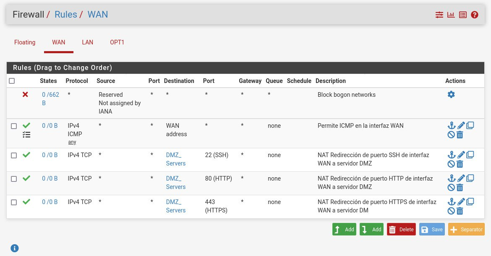
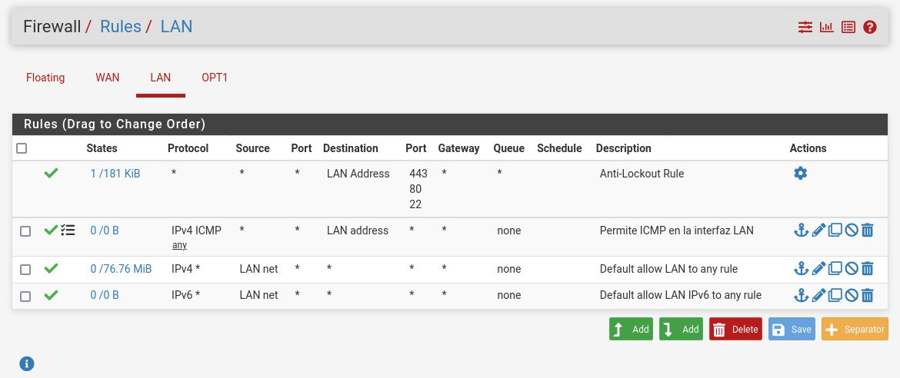
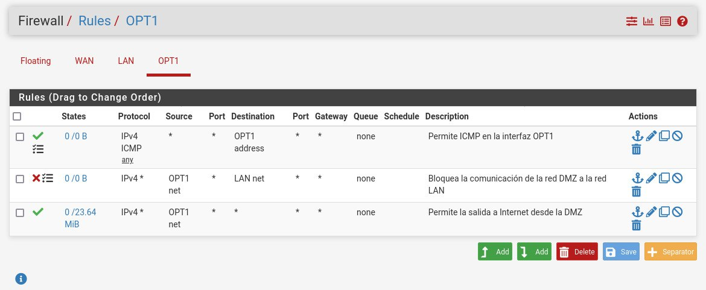

# Equipo-AAR-ATDI-BME-DAAV-LMAM

| Integrante                     | Número de Cuenta | Usuario de GitLab   |
|:------------------------------:|:----------------:|:-------------------:|
| Acosta Arzate Rubén            | 317205776        | `rubenAcostaArzate` |
| Alvarado Torres David Ignacio  | 316167613        | `ddalt`             |
| Bernal Marquez Erick           | 317042522        | `Erickmarquez7`     |
| Deloya Andrade Ana Valeria     | 317277582        | `avdeloya13`        |
| López Miranda Angel Mauricio   | 317034808        | `MauricioLMiranda`  |

# [Práctica 6](https://redes-ciencias-unam.gitlab.io/2023-2/laboratorio/practica-6/)

## Topología de Red 

A nivel físico es Topología de Árbol, siendo la máquina virtual pfSense la raíz del árbol y las ramas de la raíz serían las demás redes como LAN, DMZ y WAN. Mientras que las máquinas virtuales y la máquina física son las hojas del árbol.

Sin embargo a nivel lógico no es tan sencillo decir su topología, ya que en la configuración del pfSense permitimos el tráfico de la red LAN a la red DMZ pero bloqueamos el tráfico de la red DMZ hacia la red LAN. 
Además de que tenemos una redirección de puertos en la red DMZ con los servicios ssh, http y https que provee el servidor de DMZ (la máquina virtual de CentOS).

## Procedimiento de configuración de NAT, Alias, Port Forwarding, servicio DHCP y servicio DNS

1. Para configurar las interfaces de red: en la sección _Interfaces_ de la GUI de pfSense, entrar a la configuración de las interfaces **WAN**, **LAN** y **DMZ**, verificando que las direcciones IP sean correctas (para el caso de LAN y DMZ, porque WAN obtiene su IP por medio de DHCP) y para cada una, **quitar** la opción que impide a los segmentos no homologados comunicarse.

4. Para crear los alias de los servicios SSH, HTTP y HTTPS, vamos a la pestaña _Firewall -> Aliases -> IP_. Primero creamos un alias para la interfaz DMZ, especificando su dirección IP, y luego, para cada uno de los servicios mencionados, vamos a la pestaña _Firewall -> Aliases -> Ports_ y creamos un alias especificando el puerto en el que corren.

3. Para configurar el Port Forwarding, vamos a la pestaña _Firewall -> NAT_, y comenzamos a agregar reglas para cada uno de los servicios en la red DMZ a los que queremos acceder desde la red WAN. En este caso son SSH, HTTP y HTTPS. Seleccionamos la opción de **Add**, y rellenamos los campos con los valores especificados en la página.

2. Para habitiliar y configurar el servicio de resolución DNS, vamos a la pestaña _Services -> DNS Resolver_, y seleccionamos la opción de _Enable_ y le indicamos que el puerto en el que debe escuchar es el 53. Luego seleccionamos las interfaces que queremos que utilicen DNS, esto permite responder a los queries y solicitudes de los clientes en la red.


## Procedimiento para reservar una dirección IP en el servidor DHCP

Primero entramos en la configuración del servicio local de DHCP

Configuramos el servicio de DHCP de la red LAN 

En la sección DHCP Static Mappings for this Interface agregamos la dirección IP reservada en DHCP

Llenamos un formulario donde asignamos:
Direccion MAC, identificador del cliente, direccion IP, nombre del host, una descripcion, nombre del dominio y tiempo default y tiempo maximo

| Elemento            | Valor	                                    | Notas                                                          |
|:-------------------:|:-------------------------------------------:|:--------------------------------------------------------------:|
| MAC Address	      | Dirección MAC de la máquina virtual Debian  | (ej. 08:00:27:d9:06:ac)                                        |
| Client Identifier	  | LAN-Cliente-Debian-11	                    |                                                                |
| IP Address	      | 192.168.42.10	                            | La dirección IP debe estar FUERA del rango asignado para DHCP  |
| Hostname	          | debian-11	                                |                                                                |
| Description	      | Cliente Debian 11 en la red LAN	            |                                                                |
| Domain name	      | lan	                                        |                                                                |
| Default lease time  | 600	                                        |                                                                |
| Maximum lease time  | 900                                         |                                                                |

## Reglas configuradas

| 
| :----: |
| Reglas para la red WAN

| 
| :----: |
| Reglas para la red LAN

| 
| :----: |
| Reglas para OPT1

## Visualizando la configuración de pfSense al conectarse via SSH

### 1. Reglas PF (`pfctl -sr`)
```
scrub on em0 inet all fragment reassemble
scrub on em0 inet6 all fragment reassemble
scrub on em1 inet all fragment reassemble
scrub on em1 inet6 all fragment reassemble
scrub on em2 inet all fragment reassemble
scrub on em2 inet6 all fragment reassemble
anchor "openvpn/*" all
anchor "ipsec/*" all
block drop in log quick inet from 169.254.0.0/16 to any label "Block IPv4 link-local" ridentifier 1000000101
block drop in log quick inet from any to 169.254.0.0/16 label "Block IPv4 link-local" ridentifier 1000000102
block drop in log inet all label "Default deny rule IPv4" ridentifier 1000000103
block drop out log inet all label "Default deny rule IPv4" ridentifier 1000000104
block drop in log inet6 all label "Default deny rule IPv6" ridentifier 1000000105
block drop out log inet6 all label "Default deny rule IPv6" ridentifier 1000000106
pass quick inet6 proto ipv6-icmp all icmp6-type unreach keep state ridentifier 1000000107
pass quick inet6 proto ipv6-icmp all icmp6-type toobig keep state ridentifier 1000000107
pass quick inet6 proto ipv6-icmp all icmp6-type neighbrsol keep state ridentifier 1000000107
pass quick inet6 proto ipv6-icmp all icmp6-type neighbradv keep state ridentifier 1000000107
pass out quick inet6 proto ipv6-icmp from fe80::/10 to fe80::/10 icmp6-type echorep keep state ridentifier 1000000108
pass out quick inet6 proto ipv6-icmp from fe80::/10 to fe80::/10 icmp6-type routersol keep state ridentifier 1000000108
pass out quick inet6 proto ipv6-icmp from fe80::/10 to fe80::/10 icmp6-type routeradv keep state ridentifier 1000000108
pass out quick inet6 proto ipv6-icmp from fe80::/10 to fe80::/10 icmp6-type neighbrsol keep state ridentifier 1000000108
pass out quick inet6 proto ipv6-icmp from fe80::/10 to fe80::/10 icmp6-type neighbradv keep state ridentifier 1000000108
pass out quick inet6 proto ipv6-icmp from fe80::/10 to ff02::/16 icmp6-type echorep keep state ridentifier 1000000109
pass out quick inet6 proto ipv6-icmp from fe80::/10 to ff02::/16 icmp6-type routersol keep state ridentifier 1000000109
pass out quick inet6 proto ipv6-icmp from fe80::/10 to ff02::/16 icmp6-type routeradv keep state ridentifier 1000000109
pass out quick inet6 proto ipv6-icmp from fe80::/10 to ff02::/16 icmp6-type neighbrsol keep state ridentifier 1000000109
pass out quick inet6 proto ipv6-icmp from fe80::/10 to ff02::/16 icmp6-type neighbradv keep state ridentifier 1000000109
pass in quick inet6 proto ipv6-icmp from fe80::/10 to fe80::/10 icmp6-type echoreq keep state ridentifier 1000000110
pass in quick inet6 proto ipv6-icmp from fe80::/10 to fe80::/10 icmp6-type routersol keep state ridentifier 1000000110
pass in quick inet6 proto ipv6-icmp from fe80::/10 to fe80::/10 icmp6-type routeradv keep state ridentifier 1000000110
pass in quick inet6 proto ipv6-icmp from fe80::/10 to fe80::/10 icmp6-type neighbrsol keep state ridentifier 1000000110
pass in quick inet6 proto ipv6-icmp from fe80::/10 to fe80::/10 icmp6-type neighbradv keep state ridentifier 1000000110
pass in quick inet6 proto ipv6-icmp from ff02::/16 to fe80::/10 icmp6-type echoreq keep state ridentifier 1000000111
pass in quick inet6 proto ipv6-icmp from ff02::/16 to fe80::/10 icmp6-type routersol keep state ridentifier 1000000111
pass in quick inet6 proto ipv6-icmp from ff02::/16 to fe80::/10 icmp6-type routeradv keep state ridentifier 1000000111
pass in quick inet6 proto ipv6-icmp from ff02::/16 to fe80::/10 icmp6-type neighbrsol keep state ridentifier 1000000111
pass in quick inet6 proto ipv6-icmp from ff02::/16 to fe80::/10 icmp6-type neighbradv keep state ridentifier 1000000111
pass in quick inet6 proto ipv6-icmp from fe80::/10 to ff02::/16 icmp6-type echoreq keep state ridentifier 1000000112
pass in quick inet6 proto ipv6-icmp from fe80::/10 to ff02::/16 icmp6-type routersol keep state ridentifier 1000000112
pass in quick inet6 proto ipv6-icmp from fe80::/10 to ff02::/16 icmp6-type routeradv keep state ridentifier 1000000112
pass in quick inet6 proto ipv6-icmp from fe80::/10 to ff02::/16 icmp6-type neighbrsol keep state ridentifier 1000000112
pass in quick inet6 proto ipv6-icmp from fe80::/10 to ff02::/16 icmp6-type neighbradv keep state ridentifier 1000000112
pass in quick inet6 proto ipv6-icmp from :: to ff02::/16 icmp6-type echoreq keep state ridentifier 1000000113
pass in quick inet6 proto ipv6-icmp from :: to ff02::/16 icmp6-type routersol keep state ridentifier 1000000113
pass in quick inet6 proto ipv6-icmp from :: to ff02::/16 icmp6-type routeradv keep state ridentifier 1000000113
pass in quick inet6 proto ipv6-icmp from :: to ff02::/16 icmp6-type neighbrsol keep state ridentifier 1000000113
pass in quick inet6 proto ipv6-icmp from :: to ff02::/16 icmp6-type neighbradv keep state ridentifier 1000000113
block drop log quick inet proto tcp from any port = 0 to any label "Block traffic from port 0" ridentifier 1000000114
block drop log quick inet proto udp from any port = 0 to any label "Block traffic from port 0" ridentifier 1000000114
block drop log quick inet proto tcp from any to any port = 0 label "Block traffic to port 0" ridentifier 1000000115
block drop log quick inet proto udp from any to any port = 0 label "Block traffic to port 0" ridentifier 1000000115
block drop log quick inet6 proto tcp from any port = 0 to any label "Block traffic from port 0" ridentifier 1000000116
block drop log quick inet6 proto udp from any port = 0 to any label "Block traffic from port 0" ridentifier 1000000116
block drop log quick inet6 proto tcp from any to any port = 0 label "Block traffic to port 0" ridentifier 1000000117
block drop log quick inet6 proto udp from any to any port = 0 label "Block traffic to port 0" ridentifier 1000000117
block drop log quick from <snort2c> to any label "Block snort2c hosts" ridentifier 1000000118
block drop log quick from any to <snort2c> label "Block snort2c hosts" ridentifier 1000000119
block drop in log quick proto tcp from <sshguard> to (self) port = ssh label "sshguard" ridentifier 1000000301
block drop in log quick proto tcp from <sshguard> to (self) port = https label "GUI Lockout" ridentifier 1000000351
block drop in log quick from <virusprot> to any label "virusprot overload table" ridentifier 1000000400
pass in quick on em0 proto udp from any port = bootps to any port = bootpc keep state label "allow dhcp client out WAN" ridentifier 1000000561
pass out quick on em0 proto udp from any port = bootpc to any port = bootps keep state label "allow dhcp client out WAN" ridentifier 1000000562
pass in quick on em0 inet6 proto udp from fe80::/10 port = dhcpv6-client to fe80::/10 port = dhcpv6-client keep state label "allow dhcpv6 client in WAN" ridentifier 1000000563
pass in quick on em0 proto udp from any port = dhcpv6-server to any port = dhcpv6-client keep state label "allow dhcpv6 client in WAN" ridentifier 1000000564
pass out quick on em0 proto udp from any port = dhcpv6-client to any port = dhcpv6-server keep state label "allow dhcpv6 client out WAN" ridentifier 1000000565
block drop in log quick on em0 from <bogons> to any label "block bogon IPv4 networks from WAN" ridentifier 11001
block drop in log quick on em0 from <bogonsv6> to any label "block bogon IPv6 networks from WAN" ridentifier 11002
block drop in log on ! em0 inet from 10.0.2.0/24 to any ridentifier 1000001570
block drop in log inet from 10.0.2.4 to any ridentifier 1000001570
block drop in log on em0 inet6 from fe80::a00:27ff:fe0c:e43b to any ridentifier 1000001570
block drop in log on ! em1 inet from 192.168.42.0/24 to any ridentifier 1000002620
block drop in log inet from 192.168.42.254 to any ridentifier 1000002620
block drop in log on em1 inet6 from fe80::a00:27ff:fefa:4988 to any ridentifier 1000002620
pass in quick on em1 inet proto udp from any port = bootpc to 255.255.255.255 port = bootps keep state label "allow access to DHCP server" ridentifier 1000002641
pass in quick on em1 inet proto udp from any port = bootpc to 192.168.42.254 port = bootps keep state label "allow access to DHCP server" ridentifier 1000002642
pass out quick on em1 inet proto udp from 192.168.42.254 port = bootps to any port = bootpc keep state label "allow access to DHCP server" ridentifier 1000002643
block drop in log on ! em2 inet from 172.16.1.0/24 to any ridentifier 1000003670
block drop in log inet from 172.16.1.254 to any ridentifier 1000003670
block drop in log on em2 inet6 from fe80::a00:27ff:fe64:37c8 to any ridentifier 1000003670
pass in on lo0 inet all flags S/SA keep state label "pass IPv4 loopback" ridentifier 1000003711
pass out on lo0 inet all flags S/SA keep state label "pass IPv4 loopback" ridentifier 1000003712
pass in on lo0 inet6 all flags S/SA keep state label "pass IPv6 loopback" ridentifier 1000003713
pass out on lo0 inet6 all flags S/SA keep state label "pass IPv6 loopback" ridentifier 1000003714
pass out inet all flags S/SA keep state allow-opts label "let out anything IPv4 from firewall host itself" ridentifier 1000003715
pass out inet6 all flags S/SA keep state allow-opts label "let out anything IPv6 from firewall host itself" ridentifier 1000003716
pass out route-to (em0 10.0.2.1) inet from 10.0.2.4 to ! 10.0.2.0/24 flags S/SA keep state allow-opts label "let out anything from firewall host itself" ridentifier 1000003811
pass in quick on em1 proto tcp from any to (em1) port = https flags S/SA keep state label "anti-lockout rule" ridentifier 10001
pass in quick on em1 proto tcp from any to (em1) port = http flags S/SA keep state label "anti-lockout rule" ridentifier 10001
pass in quick on em1 proto tcp from any to (em1) port = ssh flags S/SA keep state label "anti-lockout rule" ridentifier 10001
anchor "userrules/*" all
pass in log quick on em0 reply-to (em0 10.0.2.1) inet proto icmp from any to 10.0.2.4 keep state label "USER_RULE: Permite ICMP en la interfaz WAN" ridentifier 1681418172
pass in quick on em0 reply-to (em0 10.0.2.1) inet proto tcp from any to <DMZ_Servers> port = ssh flags S/SA keep state label "USER_RULE: NAT Redirección de puerto SSH de interfaz WAN a ..." ridentifier 1681417472
pass in quick on em0 reply-to (em0 10.0.2.1) inet proto tcp from any to <DMZ_Servers> port = http flags S/SA keep state label "USER_RULE: NAT Redirección de puerto HTTP de interfaz WAN a..." ridentifier 1681417533
pass in quick on em0 reply-to (em0 10.0.2.1) inet proto tcp from any to <DMZ_Servers> port = https flags S/SA keep state label "USER_RULE: NAT Redirección de puerto HTTPS de interfaz WAN ..." ridentifier 1681417764
pass in log quick on em1 inet proto icmp from any to 192.168.42.254 keep state label "USER_RULE: Permite ICMP en la interfaz LAN" ridentifier 1681418274
pass in quick on em1 inet from 192.168.42.0/24 to any flags S/SA keep state label "USER_RULE: Default allow LAN to any rule" ridentifier 100000101
pass in log quick on em2 inet proto icmp from any to 172.16.1.254 keep state label "USER_RULE: Permite ICMP en la interfaz OPT1" ridentifier 1681418368
block drop in log quick on em2 inet from 172.16.1.0/24 to 192.168.42.0/24 label "USER_RULE: Bloquea la comunicación de la red DMZ a la red LAN" ridentifier 1681418423
pass in quick on em2 inet from 172.16.1.0/24 to any flags S/SA keep state label "USER_RULE: Permite la salida a Internet desde la DMZ" ridentifier 1681418481
anchor "tftp-proxy/*" all
```

### 2. Tablas  (`pfctl -s Tables`)
```
DMZ_Servers
bogons
bogonsv6
snort2c
sshguard
virusprot
```

### 3. Estados de NAT (`pfctl -ss`)
```
all icmp 10.0.2.4:32566 -> 10.0.2.1:32566       0:0
all tcp 192.168.0.5:22 <- 172.16.1.10:35802       ESTABLISHED:ESTABLISHED
all tcp 10.0.2.4:61856 (172.16.1.10:35802) -> 192.168.0.5:22       ESTABLISHED:ESTABLISHED
all tcp 192.168.0.5:22 <- 192.168.42.10:59420       ESTABLISHED:ESTABLISHED
all tcp 10.0.2.4:12245 (192.168.42.10:59420) -> 192.168.0.5:22       ESTABLISHED:ESTABLISHED
all udp 192.168.42.254:67 <- 192.168.42.10:68       SINGLE:MULTIPLE
```

### 4. Reglas de NAT (`pfctl -s NAT`)
```
no nat proto carp all
nat-anchor "natearly/*" all
nat-anchor "natrules/*" all
nat on em0 inet from 127.0.0.0/8 to any port = isakmp -> 10.0.2.4 static-port
nat on em0 inet from 192.168.42.0/24 to any port = isakmp -> 10.0.2.4 static-port
nat on em0 inet from 172.16.1.0/24 to any port = isakmp -> 10.0.2.4 static-port
nat on em0 inet6 from ::1 to any port = isakmp -> (em0) round-robin static-port
nat on em0 inet from 127.0.0.0/8 to any -> 10.0.2.4 port 1024:65535
nat on em0 inet from 192.168.42.0/24 to any -> 10.0.2.4 port 1024:65535
nat on em0 inet from 172.16.1.0/24 to any -> 10.0.2.4 port 1024:65535
nat on em0 inet6 from ::1 to any -> (em0) port 1024:65535 round-robin
no rdr proto carp all
rdr-anchor "tftp-proxy/*" all
rdr on em0 inet proto tcp from any to 10.0.2.4 port = ssh -> <DMZ_Servers> round-robin
rdr on em0 inet proto tcp from any to 10.0.2.4 port = http -> <DMZ_Servers> round-robin
rdr on em0 inet proto tcp from any to 10.0.2.4 port = https -> <DMZ_Servers> round-robin
rdr-anchor "miniupnpd" all
```

## Carpeta `files`

1. [Capturas de tráfico en formato `PCAP`](files/pcap/)
    - Tráfico ICMP entre las redes LAN y OPT
        - [PING desde red LAN a red OPT](files/pcap/LAN-PING-OPT.pcap)
        - [PING desde red OPT a red LAN](files/pcap/OPT-PING-LAN.pcap)
    - Petición de los equipos hacia Internet
        - [DMZ hacia `8.8.8.8`](files/pcap/OPT-8888.pcap)
    - [Petición de pfSense hacia Internet `9.9.9.9`](files/pcap/pf-em0-PING9999.pcap)
    - [Tráfico SSH del cliente LAN a servidor DMZ](files/pcap/LAN-SSH-OPT.pcap)
    - [Petición HTTP del cliente LAN al servidor DMZ](files/pcap/LAN-HTTP-OPT.pcap)
    
2. pfSense 
    - Archivos de configuración XML de pfSense ([inicial](files/pfsense/pfsense-inicial.xml) y [final](files/pfsense/pfsense-final.xml))
    - [Estados del pfSense donde se indican las conexiones de NAT](files/pfsense/pfctl-ss.txt)
    - [Verificación de Configuración de pfSense](files/pfsense/configuracion-pfSense.md)

3. Para los equipos en la red...
    - WAN (Alpine)
        - [Tabla ARP](files/alpine/WAN-tabla-ARP.txt)
        - [Tabla de Rutas](files/alpine/WAN-tabla-route.txt)
        - [Salida de los comandos de configuración de red](files/alpine/verificacion-config-WAN.md)
        - [Salida de los comandos de resolución DNS y Pruebas de conectividad con PING](files/alpine/Pruebas_Conectividad_Alpine.md)

    - LAN (Debian)
        - [Tabla ARP](files/debian/LAN-tabla-ARP.txt)
        - [Tabla de Rutas](files/debian/LAN-tabla-route.txt)
        - [Salida de los comandos de configuración de red](files/debian/verificacion-config-LAN.md)
        - [Salida de los comandos de resolución DNS y Pruebas de conectividad con PING](files/debian/Pruebas_Conectividad_Debian.md)
    
    - DMZ (CentOS)
        - [Tabla ARP](files/centos/DMZ-tabla-ARP.txt)
        - [Tabla de Rutas](files/centos/DMZ-tabla-route.txt)
        - [Salida de los comandos de configuración de red](files/centos/verificacion-config-DMZ.md)
        - [Salida de los comandos de resolución DNS y Pruebas de conectividad con PING](files/centos/Pruebas_Conectividad_CentOS.md)

## Conclusiones

- ¿Qué tipo de política de firewall se utiliza en la práctica: permisiva o restrictiva?

    En la práctica se utiliza la política permisiva pues se permite todo el tráfico con excepción al que esté denegado explícitamente.

- ¿Cuál se considera mejor?

    La restrictiva en el que todo el tráfico está denegado a excepción del que está permitido explícitamente. Siendo así difícil que sea permitido tráfico peligroso, a diferencia de la política permisiva en la que puede ser posible que no se haya considerado algún caso de tráfico peligroso y por lo tanto puede ocurrir que éste sea permitido.

## Extra

- [Video de la topología de red utilizada 📼](https://youtu.be/2BkgqIowfUg)