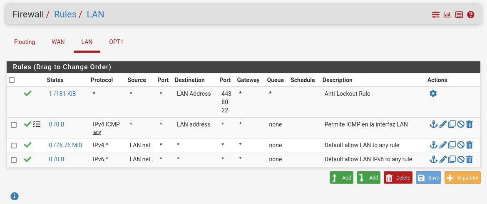
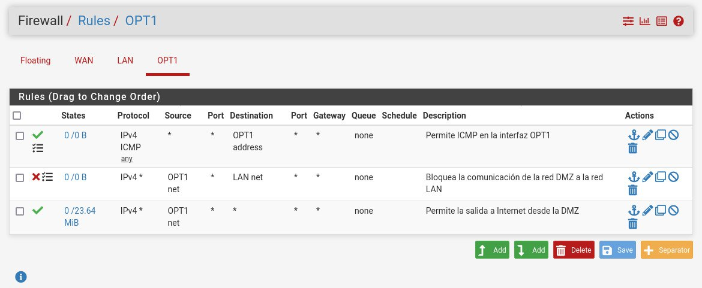

## Verificación de configuración de pfSense

1. **Configuración inicial de pfSense en modo texto**

    [Liga al archivo de configuracion inicial de pfSense en modo texto](configuracion-inicial-modo-texto.txt)

2. **Configuración inicial de pfSense con la webUI**

    

3. **Respaldos de la configuración de pfSense**
    - [Liga al archivo de respaldo inicial de pfSense](pfsense-inicial.xml)
    - [Liga al archivo de respaldo final de pfSense](pfsense-final.xml)

4. **Reglas de tráfico**

    | 
    | :----: |
    | Interfaz de red WAN

    | 
    | :----: |
    | Interfaz de red LAN

    | 
    | :----: |
    | Interfaz de red OPT

    | 
    | :----: |
    | NAT hacia internet

    | 
    | :----: |
    | Alias de Puertos y Equipos

    | 
    | :----: |
    | Redirección de puertos

5. **Configuración DHCP en interfaz LAN**

    
    
    

6. **Estados de conexión de pfSense**

    - [Liga al archivo de pruebas de conectividad de pfSense](Pruebas_Conectividad_pfSense.md)