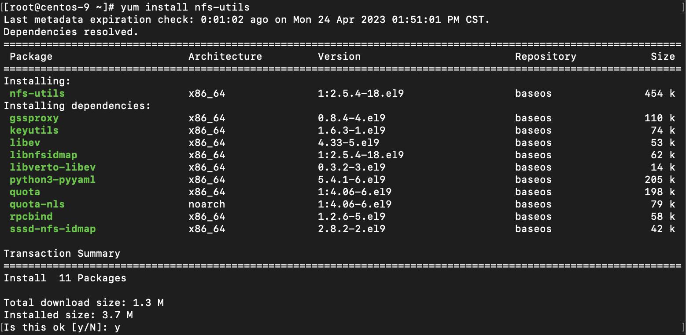
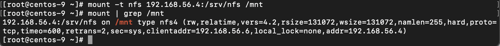
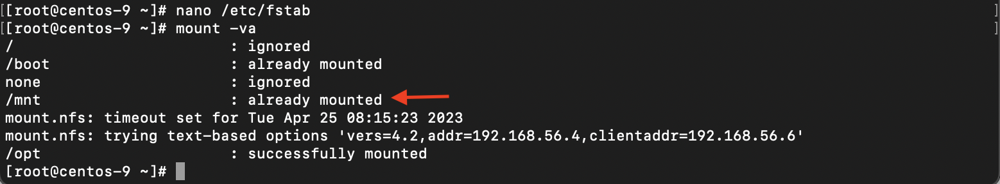
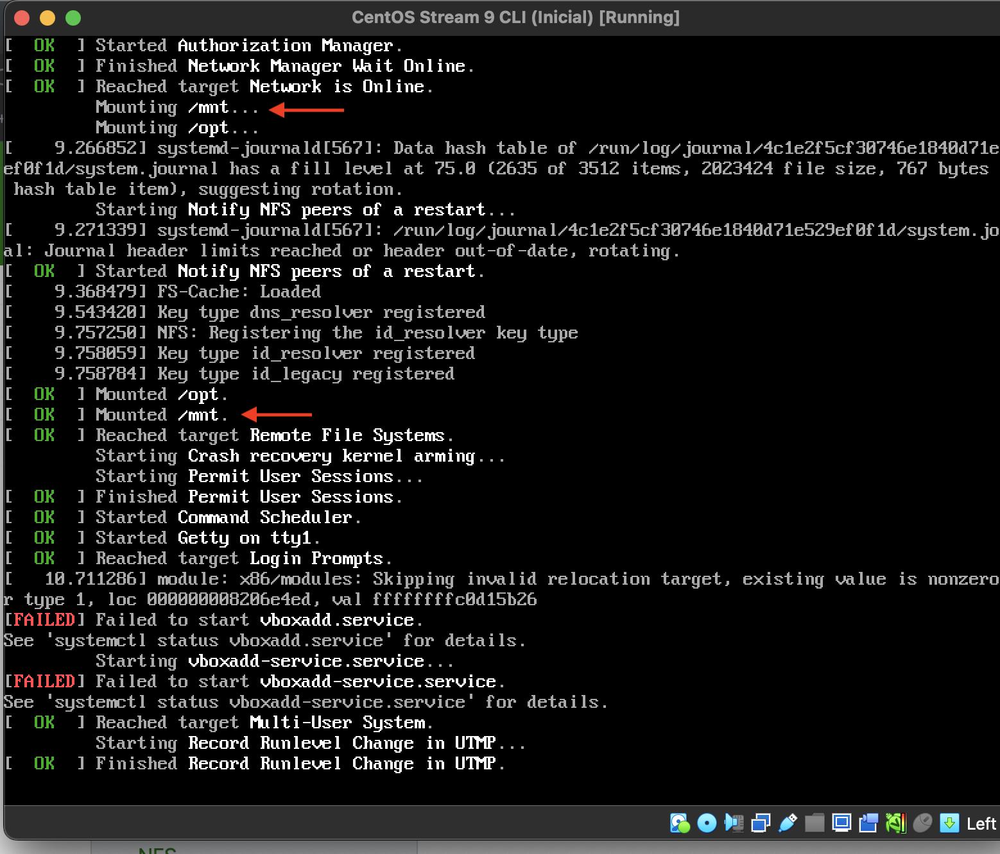

# Equipo-AAR-ATDI-BME-DAAV-LMAM

| Integrante                     | Número de Cuenta | Usuario de GitLab   |
|:------------------------------:|:----------------:|:-------------------:|
| Acosta Arzate Rubén            | 317205776        | `rubenAcostaArzate` |
| Alvarado Torres David Ignacio  | 316167613        | `ddalt`             |
| Bernal Marquez Erick           | 317042522        | `Erickmarquez7`     |
| Deloya Andrade Ana Valeria     | 317277582        | `avdeloya13`        |
| López Miranda Angel Mauricio   | 317034808        | `MauricioLMiranda`  |

# [Práctica 7](https://redes-ciencias-unam.gitlab.io/2023-2/laboratorio/practica-7/)

## Topología de Red 


# NFS

## DEBIAN

1. Instalar los paquetes de NFS en la máquina Debian:

```
root@debian-11:~# apt install nfs-kernel-server
```


2. Creamos la carpeta que queremos compartir utlizando el servicio NFS:

```
root@debian-11:~# mkdir /srv/nfs
```


3. Configurar las opciones de exportación de NFS del servidor Debian, en el archivo `/etc/exports`

```
root@debian-11:~# nano /etc/exports
```

Agregamos la opciones de exportación para el directorio `/srv/nfs`. Queremos que cualquier cliente en el segmento de red de la interaz host-only
tenga acceso a dicho directorio compartido, por lo que especificamos que el rango de direcciones IP que pueden acceder a `/srv/nfs` es  `192.168.56.0/24`:

```
# /etc/exports: the access control list for filesystems which may be exported
#               to NFS clients.  See exports(5).
#
# Example for NFSv2 and NFSv3:
# /srv/homes       hostname1(rw,sync,no_subtree_check) hostname2(ro,sync,no_subtree_check)
#
# Example for NFSv4:
# /srv/nfs4        gss/krb5i(rw,sync,fsid=0,crossmnt,no_subtree_check)
# /srv/nfs4/homes  gss/krb5i(rw,sync,no_subtree_check)
#

/srv/nfs             192.168.56.0/24(rw,sync,no_subtree_check)
```

Esta línea de código indica que los clientes en el rango `192.168.56.0/24` podrán leer y escribir en el directorio `/srv/nfs`. 


3. Para que los cambios que hicimos se hagan disponibles a los clientes que se comunicarán al servidor (el cliente CentOS), debemos reiniciar el el servidor NFS:

```
root@debian-11:~# systemctl restart nfs-kernel-server
```

Ejecutando el comando `systemctl status nfs-kernel-server` podemos ver que el servicio NFS está ejecutandose correctamente


4. La salida del comando `showmount -e` nos muestra que el directorio `/srv` efectivamente está exportado en el servidor
```
root@debian-11:~# showmount -e
Export list for debian-11:
/srv/nfs             192.168.56.0/24
```


## CENTOS

1. Instalamos la paqueteria de NFS para poder confifugurar un cliente NFS en la máquina con CentOS:

```
[root@centos-9 ~]# yum install nfs-common
```



2. Verificamos que el sistema de archivos está exportado con el comando `showmount`. La salida del mismo nos indica que el  directorio `/srv/nfs` de la máquina Debian sí está exportado.

```
[root@centos-9 ~]# showmount -e 192.168.56.4
Export list for 192.168.56.4:
/srv/nfs             192.168.56.0/24
```


3. Ahora montamos el directorio `/srv/nfs` en la máquina CentOS, en el directorio `/mnt` de la misma:

```
[root@centos-9 ~]# mount -t nfs 192.168.56.4:/srv/nfs /mnt
```

Y comprobamos que efectivamente fue montado




4. Montar el directorio `/srv/nfs` de Debian en el cliente CentOS de manera automática cuando este se inicialice: añadimos el directorio `/srv/nfs` del servidor Debian al archivo `/etc/fstab` de CentOS, colocando la siguiente línea al final del mismo:

```
192.168.56.4:/srv/nfs               /mnt      nfs   default     0 0
```


Con la instrucción `default` aseguramos que el sistema de archivos será montado automáticamente durante el arranque de la máquina con CentOS. 


Y podemos comprobar que el montaje será automático cuando el sistema se inicialize, con el comando `mount -va`:



Más aún, al reinciar el sistema, podemos ver que en el output del mismo que el montaje en `/mnt` se hace automaticamente:




## Conclusiones

1. Comparar las ventajas y desventajas de utilizar NFS y Samba en equipos con diferente sistema operativo (GNU/Linux y Windows)


2. ¿Hay alguna diferencia en la velocidad de transferencia utilizando NFS y Samba?


3. ¿Hay alguna diferencia en los usuarios, grupos y permisos que tienen los archivos y directorios entre un protocolo y otro?


4. Escribir cuales casos de uso se cubren mejor utilizando NFS y cuales utilizando Samba


## Extra

- [Video de la topología de red utilizada 📼](https://youtu.be/)