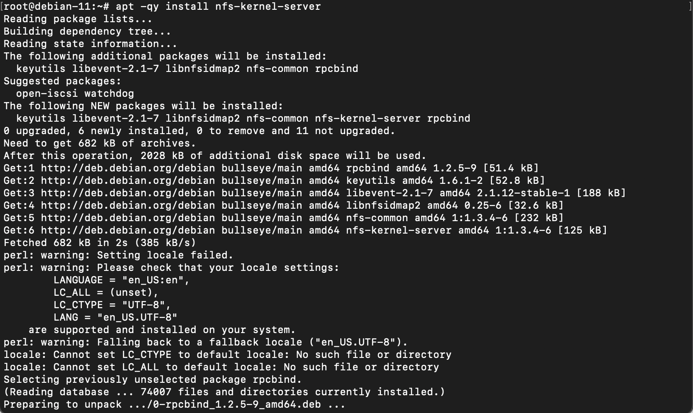
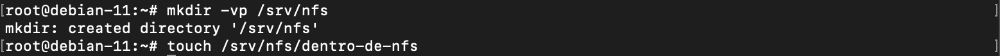
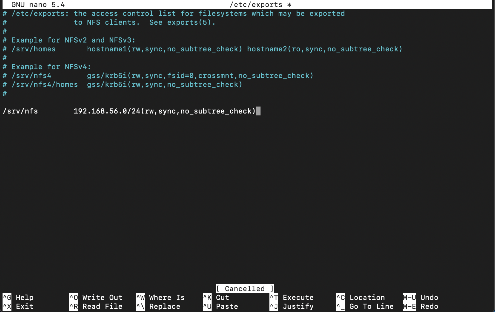
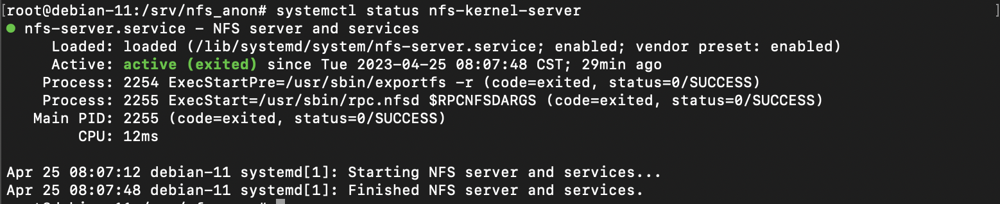
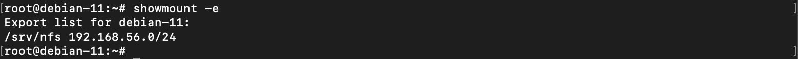

# Equipo-AAR-ATDI-BME-DAAV-LMAM

| Integrante                     | Número de Cuenta | Usuario de GitLab   |
|:------------------------------:|:----------------:|:-------------------:|
| Acosta Arzate Rubén            | 317205776        | `rubenAcostaArzate` |
| Alvarado Torres David Ignacio  | 316167613        | `ddalt`             |
| Bernal Marquez Erick           | 317042522        | `Erickmarquez7`     |
| Deloya Andrade Ana Valeria     | 317277582        | `avdeloya13`        |
| López Miranda Angel Mauricio   | 317034808        | `MauricioLMiranda`  |

# [Práctica 7](https://redes-ciencias-unam.gitlab.io/2023-2/laboratorio/practica-7/)

# Topología de Red 


# NFS

## DEBIAN

1. Instalar los paquetes de NFS en la máquina Debian:

```
root@debian-11:~# apt install nfs-kernel-server
```



2. Creamos la carpeta que queremos compartir utlizando el servicio NFS:

```
root@debian-11:~# mkdir /srv/nfs
```



3. Configurar las opciones de exportación de NFS del servidor Debian, en el archivo `/etc/exports`

```
root@debian-11:~# nano /etc/exports
```

Agregamos la opciones de exportación para el directorio `/srv/nfs`. Queremos que cualquier cliente en el segmento de red de la interaz host-only
tenga acceso a dicho directorio compartido, por lo que especificamos que el rango de direcciones IP que pueden acceder a `/srv/nfs` es  `192.168.56.0/24`:

```
# /etc/exports: the access control list for filesystems which may be exported
#               to NFS clients.  See exports(5).
#
# Example for NFSv2 and NFSv3:
# /srv/homes       hostname1(rw,sync,no_subtree_check) hostname2(ro,sync,no_subtree_check)
#
# Example for NFSv4:
# /srv/nfs4        gss/krb5i(rw,sync,fsid=0,crossmnt,no_subtree_check)
# /srv/nfs4/homes  gss/krb5i(rw,sync,no_subtree_check)
#

/srv/nfs             192.168.56.0/24(rw,sync,no_subtree_check)
```

Esta línea de código indica que los clientes en el rango `192.168.56.0/24` podrán leer y escribir en el directorio `/srv/nfs`. 




3. Para que los cambios que hicimos se hagan disponibles a los clientes que se comunicarán al servidor (el cliente CentOS), debemos reiniciar el el servidor NFS:

```
root@debian-11:~# systemctl restart nfs-kernel-server
```

Ejecutando el comando `systemctl status nfs-kernel-server` podemos ver que el servicio NFS está ejecutandose correctamente



4. La salida del comando `showmount -e` nos muestra que el directorio `/srv` efectivamente está exportado en el servidor
```
root@debian-11:~# showmount -e
Export list for debian-11:
/srv/nfs             192.168.56.0/24
```



## CENTOS

1. Instalamos la paqueteria de NFS para poder confifugurar un cliente NFS en la máquina con CentOS:

```
[root@centos-9 ~]# yum install nfs-common
```


2. Verificamos que el sistema de archivos está exportado con el comando `showmount`. La salida del mismo nos indica que el  directorio `/srv/nfs` de la máquina Debian sí está exportado.

```
[root@centos-9 ~]# showmount -e 192.168.56.4
Export list for 192.168.56.4:
/srv/nfs             192.168.56.0/24
```


3. Ahora montamos el directorio `/srv/nfs` en la máquina CentOS, en el directorio `/mnt` de la misma:

```
[root@centos-9 ~]# mount -t nfs 192.168.56.4:/srv/nfs /mnt
```

Y comprobamos que efectivamente fue montado


4. Montar el directorio `/srv/nfs` de Debian en el cliente CentOS de manera automática cuando este se inicialice: añadimos el directorio `/srv/nfs` del servidor Debian al archivo `/etc/fstab` de CentOS, colocando la siguiente línea al final del mismo:

```
192.168.56.4:/srv/nfs               /mnt      nfs   default     0 0
```


Con la instrucción `default` aseguramos que el sistema de archivos será montado automáticamente durante el arranque de la máquina con CentOS. 


Y podemos comprobar que el montaje será automático cuando el sistema se inicialize, con el comando `mount -va`:


Más aún, al reinciar el sistema, podemos ver que en el output del mismo que el montaje en `/mnt` se hace automaticamente:


## WINDOWS

# SMB

## DEBIAN

## CENTOS

## WINDOWS

# Conclusiones

Tanto NFS como Samba son protocolos para permitir el uso de recursos compartidos entre una maquina que denominamos como servidor y otra maquina llamada cliente. Sin embargo encontramos diferencias que debemos tener en cuenta al momento de hacer uso de ellas para obtener un mejor aprovechamiento.

### NFS
Desarrollado por Sun Microsystem, Network File System (NFS) permite que distintos sistemas conectados a una red accedan a archivos como si se trataran de archivos locales con el objetivo de que sea independiente entre la maquina física, el Sistema Operativo y el protocolo de transporte. Aunque se usa más en dispositivos Linux

### Samba
Es una implementación libre del protocolo Server Message Block (SMB) de Microsoft Windows para sistemas basados en UNIX. Es una implementación de servicios y protocolos entre los cuales se encuentran NetBIOS y TCP/IP. Se suele usar mas dispositivos Windows. 


1. Comparar las ventajas y desventajas de utilizar NFS y Samba en equipos con diferente sistema operativo (GNU/Linux y Windows)
Tanto **NFS** como **Samba** requieren de un cuidado proceso de configuración del lado del cliente y servidor además de que necesitamos instalar los paquetes necesarios en linux, mientras que en windows ya los tiene por defecto, solo hay que habilitarlos y la conexión de estos es más sencilla porque es más visual que hacerlo por consola, en lo personal se nos facilitó más la configuración de **Samba**. 

Así que realmente no hay muchas ventajas o desventaja en el envío de mensajes, lectura y escritura de archivos entre diferentes sistemas operativos, ya que los protocolos son independientes del SO. Sino más bien al momento de la configuración y administración, o bien entre los protocolos cuales veremos en el punto 4 que es al momento de elegir el mejor protocolo que se adapte a nuestras necesidades.

Asi bien una "ventaja" sería que algunas maquinas ya tienen **NFS** por defecto lo que ocasiona una "desventaja" al configurarlo para Windows, y al revés.
**Samba** viene incluido en Windows y habrá que instalarlo para Linux.


2. ¿Hay alguna diferencia en la velocidad de transferencia utilizando NFS y Samba?


3. ¿Hay alguna diferencia en los usuarios, grupos y permisos que tienen los archivos y directorios entre un protocolo y otro?
De manera pretederminada sí, esto viene debido al objetivo para el cual fueron hechos. A primera vista notamos que en **NFS** aunque seamos root no poseamos todos los permisos, incluso en los usuarios, esto es porque el mapeo entre los distintos equipos del id del usuario y grupos pueden ser diferentes, debido a esto cuando cambiamos los permisos con el comando `chown` solemos repetir el usuario en el grupo `user:user` para que se mapee al mismo numero de id. Aunque también podemos modificar esto en el archivo `etc/exports` con las opciones de red.

Para **Samba**, a causa de para lo que fue pensado, lo comparitmos para grupos de trabajo (workgroups) en el archivo `smb.conf` y cambiamos los permisos de las carpetas con `chmod -c 2775` para que puedan ser leidas y escritas por el usuario y grupos, aunque esto genera un problema del lado del cliente ya que cualquier podría entrar. Por lo cual podemos hacer la autenticación con el programa `smbpasswd` ya que tiene su propia base de datos de usuarios y necesitamos darlos de alta en ella, por ello no basta con utilizar los archivos `etc/passwd` y `etc/shadow` ya que necesitamos darlos de alta.


4. Escribir cuales casos de uso se cubren mejor utilizando NFS y cuales utilizando Samba
No es sencillo decir que si se cumple A entonces la mejor opción es B, ya que requiere tomar muchos parametros en cuenta, por ejemplo el *para qué*, *por qué*, *seguridad*, *usuarios*, *velocidad*, *peso*, etc. Ciertamente nos podemos guiar por nuestras prioridades pero siempre serán diferentes para cada persona.

Por ejemplo **NFS** se suele utilizar para compartir archivos entre servidores con un protocolo cliente-servidor, mientras que **Samba** para transeferir archivos desde el lugar donde el usuario necesita siguiendo un protocolo de archivos compartidos.

Si tenemos un servidor grande puede ser de gran utilidad buscar archivos, una desventaja de **NFS** es que no soporta la busqueda de estos, mientras que **Samba** sí lo hace.

De la misma manera si queremos hacer transiciones de lectura y escritura son mas lentas en **NFS** y en **Samba** más rápidas.

En **NFS** podemos cambiar el nombre a los archivos, en **Samba** esto no es posible.

**NFS** tiene un mejor rendimiento en archivo pequeños o medianos, en archivos grandes el mejor rendimiento lo tiene **Samba**.


# Referencias

https://www.educba.com/nfs-vs-smb/

https://youtu.be/AcKG6UsAO-Y

https://youtu.be/hl0sC5gPdzw

https://youtu.be/Cbq-FxLNfxc

# Extra

- [Video de la topología de red utilizada 📼](https://youtu.be/)