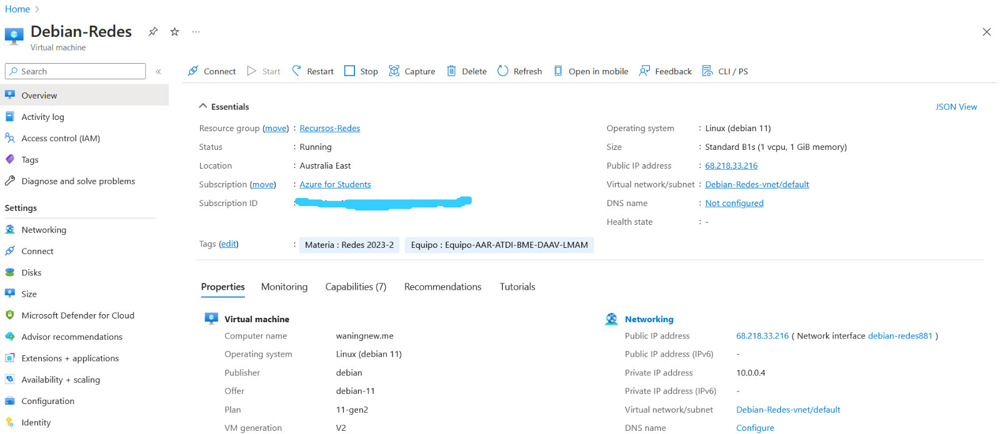
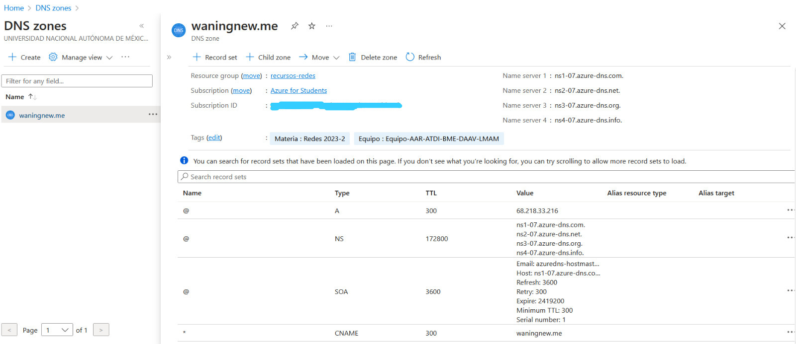
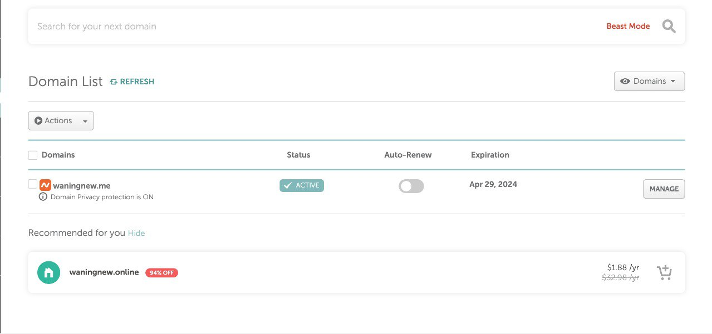

# Equipo-AAR-ATDI-BME-DAAV-LMAM

| Integrante                     | Número de Cuenta | Usuario de GitLab   |
|:------------------------------:|:----------------:|:-------------------:|
| Acosta Arzate Rubén            | 317205776        | `rubenAcostaArzate` |
| Alvarado Torres David Ignacio  | 316167613        | `ddalt`             |
| Bernal Marquez Erick           | 317042522        | `Erickmarquez7`     |
| Deloya Andrade Ana Valeria     | 317277582        | `avdeloya13`        |
| López Miranda Angel Mauricio   | 317034808        | `MauricioLMiranda`  |

# [Práctica 8](https://redes-ciencias-unam.gitlab.io/2023-2/laboratorio/practica-8/)

## Nombre de dominio que se registró y la dirección IP pública de la máquina virtual

## Explicación del procedimiento que se siguió para crear los recursos en Azure

(son solo las imagenes, falta k Mau ponga la explicacion)





## Explicación del procedimiento que se siguió para registrar el nombre de dominio y asociarlo a la zona DNS en Azure

(es solo la imagen, falta k Mau ponga la explicacion)



## Explicación de los comandos utilizados para inicializar la máquina virtual en Azure

## Salida de las consultas DNS para los registros SOA, NS, A y CNAME

## Salida de los siguientes comandos en la máquina virtual como el usuario root

- uname -a
```
Linux waningnew.me 5.10.0-22-cloud-amd64 #1 SMP Debian 5.10.178-3 (2023-04-22) x86_64 GNU/Linux
```

- cat /proc/cmdline 
```
BOOT_IMAGE=/boot/vmlinuz-5.10.0-22-cloud-amd64 root=UUID=d54d130a-3be4-4d55-8045-2c312dadce3a ro console=tty0 console=ttyS0,115200 earlyprintk=ttyS0,115200 consoleblank=0
```

- id redes
```
uid=1000(redes) gid=1000(redes) grupos=1000(redes),4(adm),20(dialout),24(cdrom),25(floppy),27(sudo),29(audio),30(dip),44(video),46(plugdev),113(netdev)
```

- groups redes
```
redes : redes adm dialout cdrom floppy sudo audio dip video plugdev netdev
```

- sudo -l -U redes
```
Matching Defaults entries for redes on waningnew:
    env_reset, mail_badpass,
    secure_path=/usr/local/sbin\:/usr/local/bin\:/usr/sbin\:/usr/bin\:/sbin\:/bin

User redes may run the following commands on waningnew:
    (ALL : ALL) ALL
    (ALL) NOPASSWD: ALL
    (ALL) NOPASSWD: ALL
```

- timedatectl
```
               Local time: mar 2023-05-02 14:02:32 CST
           Universal time: mar 2023-05-02 20:02:32 UTC
                 RTC time: mar 2023-05-02 20:02:31
                Time zone: America/Mexico_City (CST, -0600)
System clock synchronized: yes
              NTP service: active
          RTC in local TZ: no
```

- hostnamectl
```
    Static hostname: waningnew.me
         Icon name: computer-vm
           Chassis: vm
        Machine ID: e8e7f53fed65473594dd03d144ca0a27
           Boot ID: c8814d98c7794507997874e3bb8b9a01
    Virtualization: microsoft
  Operating System: Debian GNU/Linux 11 (bullseye)
            Kernel: Linux 5.10.0-22-cloud-amd64
      Architecture: x86-64
```

- hostname -f
```
waningnew.me
```

- ip addr
```
1: lo: <LOOPBACK,UP,LOWER_UP> mtu 65536 qdisc noqueue state UNKNOWN group default qlen 1000
    link/loopback 00:00:00:00:00:00 brd 00:00:00:00:00:00
    inet 127.0.0.1/8 scope host lo
       valid_lft forever preferred_lft forever
    inet6 ::1/128 scope host 
       valid_lft forever preferred_lft forever
2: eth0: <BROADCAST,MULTICAST,UP,LOWER_UP> mtu 1500 qdisc mq state UP group default qlen 1000
    link/ether 00:22:48:93:b8:23 brd ff:ff:ff:ff:ff:ff
    inet 10.0.0.4/24 brd 10.0.0.255 scope global eth0
       valid_lft forever preferred_lft forever
    inet6 fe80::222:48ff:fe93:b823/64 scope link 
       valid_lft forever preferred_lft forever
```

- ip route
```
default via 10.0.0.1 dev eth0 
10.0.0.0/24 dev eth0 proto kernel scope link src 10.0.0.4 
168.63.129.16 via 10.0.0.1 dev eth0 
169.254.169.254 via 10.0.0.1 dev eth0 
```

- cat /etc/hostname
```
waningnew.meroot@waningnew:~# 
```

- cat /etc/hosts
```
127.0.0.1	localhost
::1		localhost ip6-localhost ip6-loopback
ff02::1		ip6-allnodes
ff02::2		ip6-allrouters

20.213.120.169 waningnew.me
```

- cat /etc/resolv.conf

```
domain mi5mu4euhqxetpmmdeojw2ws1f.px.internal.cloudapp.net
search mi5mu4euhqxetpmmdeojw2ws1f.px.internal.cloudapp.net
nameserver 168.63.129.16
```

- ls -la ~root/.ssh ~redes/.ssh

```
/home/redes/.ssh:
total 16
drwx------ 2 redes redes 4096 may  2 02:35 .
drwxr-xr-x 4 redes redes 4096 may  2 02:00 ..
-rw------- 1 redes redes    0 abr 27 15:37 authorized_keys
-rw------- 1 redes redes  748 may  2 02:35 authorized_keys2
-rw-r--r-- 1 redes redes   99 may  2 02:15 config

/root/.ssh:
total 16
drwx------ 2 root root 4096 may  2 13:47 .
drwx------ 4 root root 4096 may  2 02:24 ..
-rw------- 1 root root    0 abr 27 15:37 authorized_keys
-rw------- 1 root root  748 may  2 02:36 authorized_keys2
-rw-r--r-- 1 root root  444 may  2 13:47 known_hosts

```

- lsattr ~root/.ssh/authorized_keys* ~redes/.ssh/authorized_keys*

```
--------------e------- /root/.ssh/authorized_keys
----i---------e------- /root/.ssh/authorized_keys2
--------------e------- /home/redes/.ssh/authorized_keys
----i---------e------- /home/redes/.ssh/authorized_keys2

```

- lastlog

```
Nombre           Puerto   De               Último
root                                       **Nunca ha accedido**
daemon                                     **Nunca ha accedido**
bin                                        **Nunca ha accedido**
sys                                        **Nunca ha accedido**
sync                                       **Nunca ha accedido**
games                                      **Nunca ha accedido**
man                                        **Nunca ha accedido**
lp                                         **Nunca ha accedido**
mail                                       **Nunca ha accedido**
news                                       **Nunca ha accedido**
uucp                                       **Nunca ha accedido**
proxy                                      **Nunca ha accedido**
www-data                                   **Nunca ha accedido**
backup                                     **Nunca ha accedido**
list                                       **Nunca ha accedido**
irc                                        **Nunca ha accedido**
gnats                                      **Nunca ha accedido**
nobody                                     **Nunca ha accedido**
_apt                                       **Nunca ha accedido**
systemd-network                            **Nunca ha accedido**
systemd-resolve                            **Nunca ha accedido**
messagebus                                 **Nunca ha accedido**
uuidd                                      **Nunca ha accedido**
tcpdump                                    **Nunca ha accedido**
_chrony                                    **Nunca ha accedido**
sshd                                       **Nunca ha accedido**
systemd-timesync                           **Nunca ha accedido**
systemd-coredump                           **Nunca ha accedido**
redes            pts/1    189.217.192.20   mar may  2 13:38:11 -0600 2023

```

- last
```
redes    pts/1        189.217.192.20   Tue May  2 13:38   still logged in
redes    pts/0        201.141.106.115  Tue May  2 02:44   still logged in
reboot   system boot  5.10.0-22-cloud- Tue May  2 02:43   still running
redes    pts/0        201.141.106.115  Tue May  2 01:53 - 02:43  (00:49)
redes    pts/0        201.141.106.115  Mon May  1 23:26 - 23:39  (00:12)
reboot   system boot  5.10.0-22-cloud- Mon May  1 22:56 - 02:43  (03:46)
redes    pts/1        201.141.106.115  Mon May  1 22:35 - 22:56  (00:20)
redes    pts/0        201.141.106.115  Mon May  1 22:05 - 22:56  (00:51)
redes    pts/0        201.141.106.115  Mon May  1 20:31 - 20:34  (00:02)
reboot   system boot  5.10.0-22-cloud- Mon May  1 16:37 - 22:56  (06:18)
redes    pts/0        201.141.106.115  Mon May  1 00:52 - 01:01  (00:08)
redes    pts/0        201.141.30.95    Fri Apr 28 21:49 - 21:52  (00:03)
reboot   system boot  5.10.0-21-cloud- Thu Apr 27 15:15 - 01:01 (3+09:45)

wtmp begins Thu Apr 27 15:15:35 2023

```

- free -m

```
               total        used        free      shared  buff/cache   available
Mem:             914         135         334           0         444         639
Swap:              0           0           0
```

- ps afx

```
    PID TTY      STAT   TIME COMMAND
      2 ?        S      0:00 [kthreadd]
      3 ?        I<     0:00  \_ [rcu_gp]
      4 ?        I<     0:00  \_ [rcu_par_gp]
      6 ?        I<     0:00  \_ [kworker/0:0H-events_highpri]
      8 ?        I<     0:00  \_ [mm_percpu_wq]
      9 ?        S      0:00  \_ [rcu_tasks_rude_]
     10 ?        S      0:00  \_ [rcu_tasks_trace]
     11 ?        S      0:00  \_ [ksoftirqd/0]
     12 ?        I      0:01  \_ [rcu_sched]
     13 ?        S      0:00  \_ [migration/0]
     15 ?        S      0:00  \_ [cpuhp/0]
     17 ?        S      0:00  \_ [kdevtmpfs]
     18 ?        I<     0:00  \_ [netns]
     19 ?        S      0:00  \_ [kauditd]
     20 ?        S      0:00  \_ [khungtaskd]
     21 ?        S      0:00  \_ [oom_reaper]
     22 ?        I<     0:00  \_ [writeback]
     23 ?        S      0:01  \_ [kcompactd0]
     24 ?        SN     0:00  \_ [ksmd]
     25 ?        SN     0:02  \_ [khugepaged]
     44 ?        I<     0:00  \_ [kintegrityd]
     45 ?        I<     0:00  \_ [kblockd]
     46 ?        I<     0:00  \_ [blkcg_punt_bio]
     47 ?        I<     0:03  \_ [kworker/0:1H-kblockd]
     48 ?        S      0:00  \_ [kswapd0]
     49 ?        I<     0:00  \_ [kthrotld]
     50 ?        I<     0:00  \_ [acpi_thermal_pm]
     51 ?        I<     0:00  \_ [nvme-wq]
     52 ?        I<     0:00  \_ [nvme-reset-wq]
     53 ?        I<     0:00  \_ [nvme-delete-wq]
     54 ?        I<     0:00  \_ [ipv6_addrconf]
     64 ?        I<     0:00  \_ [kstrp]
     69 ?        I<     0:00  \_ [kworker/u3:0]
    104 ?        I<     0:00  \_ [hv_vmbus_con]
    105 ?        I<     0:00  \_ [hv_pri_chan]
    106 ?        I<     0:00  \_ [hv_sub_chan]
    107 ?        S      0:00  \_ [scsi_eh_0]
    109 ?        S      0:00  \_ [scsi_eh_1]
    110 ?        I<     0:00  \_ [scsi_tmf_0]
    111 ?        I<     0:00  \_ [scsi_tmf_1]
    135 ?        S      0:01  \_ [jbd2/sda1-8]
    136 ?        I<     0:00  \_ [ext4-rsv-conver]
    228 ?        S      0:01  \_ [hv_balloon]
    289 ?        I<     0:00  \_ [cryptd]
    346 ?        S      0:00  \_ [jbd2/sdb1-8]
    348 ?        I<     0:00  \_ [ext4-rsv-conver]
   6910 ?        I      0:00  \_ [kworker/u2:3-flush-8:0]
   7909 ?        I      0:00  \_ [kworker/u2:0-events_unbound]
   8064 ?        I      0:00  \_ [kworker/0:3-cgroup_destroy]
   8113 ?        I      0:00  \_ [kworker/0:0-cgroup_destroy]
   8163 ?        I      0:00  \_ [kworker/0:1-mm_percpu_wq]
   8167 ?        I      0:00  \_ [kworker/0:2-mm_percpu_wq]
   8195 ?        I      0:00  \_ [kworker/u2:1-flush-8:0]
   8211 ?        I      0:00  \_ [kworker/u2:2]
      1 ?        Ss     0:02 /sbin/init
    197 ?        Ss     0:02 /lib/systemd/systemd-journald
    215 ?        Ss     0:00 /lib/systemd/systemd-udevd
    299 ?        Ss     0:08 /usr/sbin/hv_kvp_daemon -n
    397 ?        Ssl    0:00 /sbin/dhclient -4 -v -i -pf /run/dhclient.eth0.pid 
    477 ?        Ssl    0:00 /sbin/dhclient -6 -v -pf /run/dhclient6.eth0.pid -l
    566 ?        Ss     0:00 /usr/sbin/cron -f
    567 ?        Ss     0:02 /usr/bin/dbus-daemon --system --address=systemd: --
    569 ?        Ssl    0:00 /usr/sbin/rsyslogd -n -iNONE
    570 ?        Ss     0:01 /lib/systemd/systemd-logind
    572 ?        S      0:11 /usr/sbin/chronyd -F 1
    577 ?        S      0:00  \_ /usr/sbin/chronyd -F 1
    585 tty1     Ss+    0:00 /sbin/agetty -o -p -- \u --noclear tty1 linux
    586 ttyS0    Ss+    0:00 /sbin/agetty -o -p -- \u --keep-baud 115200,57600,3
    587 ?        Ss     0:04 /usr/bin/python3 /usr/share/unattended-upgrades/una
    595 ?        Ss     0:00 sshd: /usr/sbin/sshd -D [listener] 0 of 10-100 star
    723 ?        Ss     0:00  \_ sshd: redes [priv]
    743 ?        S      0:00  |   \_ sshd: redes@pts/0
    744 pts/0    Ss     0:00  |       \_ -bash
   7744 pts/0    S      0:00  |           \_ sudo -i
   7745 pts/0    S+     0:00  |               \_ -bash
   7917 ?        Ss     0:00  \_ sshd: redes [priv]
   7930 ?        S      0:00      \_ sshd: redes@pts/1
   7931 pts/1    Ss     0:00          \_ -bash
   8128 pts/1    S      0:00              \_ sudo -i
   8129 pts/1    S      0:00                  \_ -bash
   8212 pts/1    R+     0:00                      \_ ps afx
    597 ?        Ss     0:00 /usr/bin/python3 /usr/sbin/waagent -daemon
    631 ?        Sl     3:41  \_ python3 -u /usr/sbin/waagent -run-exthandlers
    732 ?        Ss     0:00 /lib/systemd/systemd --user
    733 ?        S      0:00  \_ (sd-pam)
```

# Carpeta files

- Copia de la llave SSH pública que el equipo utilizó para conectarse a la máquina virtual
- Archivos de configuración
    - [`/etc/ssh/sshd_config`](files/sshd_config.txt)
    - [`/etc/sudoers`](files/sudoers.txt)
    - Los archivos contenidos en el directorio [`/etc/sudoers.d`](files/sudoers.d/)

- Archivos de bitácora
    - [`/var/log/wtmp`](files/wtmp) y [`/var/log/btmp`](files/btmp)
    - [`/var/log/messages`](files/messages.txt) y [`/var/log/kern.log`](files/kern.log.txt)
    - [`/var/log/user.log`](files/user.log.txt) y [`/var/log/auth.log`](files/auth.log.txt)
    - [`/var/log/dpkg.log`](files/dpkg.log.txt)
    - [`/var/log/debug`](files/debug.txt)
    - [`/var/log/cloud-init.log`](files/cloud-init.log.txt) y [`/var/log/cloud-init-output.log`](files/cloud-init-output.log.txt)
    - Los archivos contenidos en el directorio [`/var/log/apt`](files/apt/)
    - Los archivos contenidos en el directorio [`/var/log/azure`](files/azure/)
    - Los archivos contenidos en el directorio [`/var/log/unattended-upgrades`](files/unattended-upgrades/)

- Archivos de datos
    - Los archivos contenidos en el directorio [`/var/lib/dhcp`](files/dhcp/)
    - Los archivos contenidos en el directorio [`/var/lib/cloud`](files/cloud/)
