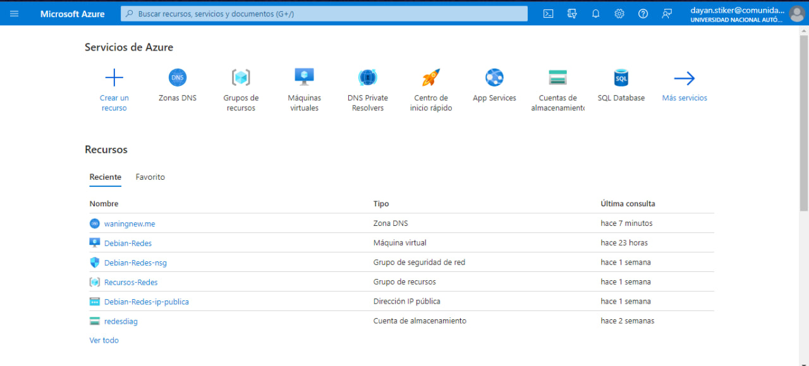
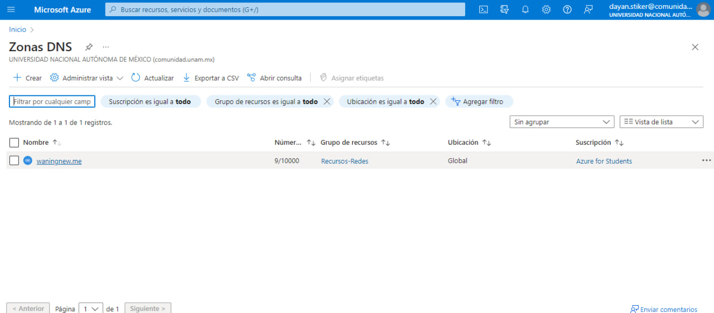
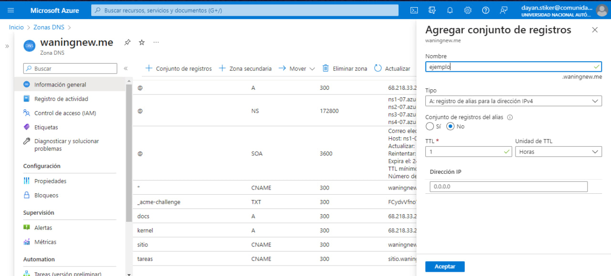

# Equipo-AAR-ATDI-BME-DAAV-LMAM

| Integrante                     | Número de Cuenta | Usuario de GitLab   |
|:------------------------------:|:----------------:|:-------------------:|
| Acosta Arzate Rubén            | 317205776        | `rubenAcostaArzate` |
| Alvarado Torres David Ignacio  | 316167613        | `ddalt`             |
| Bernal Marquez Erick           | 317042522        | `Erickmarquez7`     |
| Deloya Andrade Ana Valeria     | 317277582        | `avdeloya13`        |
| López Miranda Angel Mauricio   | 317034808        | `MauricioLMiranda`  |

# [Práctica 9](https://redes-ciencias-unam.gitlab.io/2023-2/laboratorio/practica-9/)

## Nombre de dominio que se registró y la dirección IP pública de la máquina virtual

http://waningnew.me/ 

68.218.33.216

## Explicación del procedimiento que se siguió para crear los nombres DNS en Azure

Iniciamos sesión en Azure, y damos click en *zonas DNS*



Luego damos click en *waningnew.me*



Seleccionamos la opción *Conjunto de registros*. Nos va a aparecer una pestaña del lado derecho con el nombre *Agregar conjunto de registros*, donde ponemos los datos de: nombre, tipo, algún valor de acuerdo al tipo de registro, etc.



## Explicación de los comandos utilizados para instalar el servicio de Apache HTTPD y tramitar el certificado SSL

* Apache HTTPD

Instalación del paquete apache2 

```
root@example:~# apt -qy update
root@example:~# apt -qy install apache2
```

Para la verificación del estado del servicio

```
root@example:~# systemctl status apache2
```

Escucha puertos. En este caso de la práctica revisa que se escuche Apache el puerto 80

```
root@example:~# netstat -ntulp | grep apache2
```

Verifica la sintaxis

```
root@example:~# apachectl -S
```

Para habilitar la configuración extra

```
root@example:~# a2enconf servername
```

Verificar la sintaxis

```
root@example:~# apachectl -t
```

Recargar el servicio

```
root@example:~# systemctl reload apache2
```

Para cambiar de directorio a */etc/apache2*

```
root@example:~# cd /etc/apache2
``` 

Para entrar al editor de texto vim

```
root@example:/etc/apache2# vim conf-available/security.conf
```

Nuevamente los comandos para habilitar la configuración, verificar la sintaxis y recargar el servicio
```
root@example:/etc/apache2# a2enconf security
root@example:/etc/apache2# apachectl -t
root@example:/etc/apache2# systemctl reload apache2
root@example:/etc/apache2# apachectl -S
```

Para reiniciar el equipo y así verificar que se hayan guardado los cambios
```
root@example:~# reboot
```

- Certificado SSL

Para habilitar el módulo que es SSL es el certificado. Y habilitar el VirtualHost del certificado

```
root@example:~# a2enmod ssl
root@example:~# a2ensite default-ssl
```

Para verificar que esté correcta la configuración 

```
root@example:~# apachectl -t
```

Para reiniciar el servicio Apache HTTPD

```
root@example:~# systemctl restart apache2
```

Para revisar los archivos habilitados de VirtualHosts

```
root@example:~# ls -la /etc/apache2/sites-enabled
```

Escucha puertos. En este caso que Apache escuche en los puertos 80 y 443

```
root@example:~# netstat -ntulp | grep apache2
root@example:~# apachectl -S
```

Para recarga el servicio Apache HTTPD

```
root@example:~# systemctl reload apache2
```

Para revisar la ruta de la raíz del sitio web en los VirtualHost

```
root@example:~# grep 'DocumentRoot' /etc/apache2/sites-enabled/*.conf
```

Para instalar *certbot*

```
root@example:~# apt -qy install certbot python3-certbot-apache
```

Para generar el certificado con nuestro dominio

```
root@example:~# certbot --authenticator manual --installer apache --domain 'example.com' --domain '*.example.com'
```

Pedirá que creemos un registro *DNS* y nos dará un valor para poner en el registro de tipo *TXT*

```
usuario@laptop ~ % dig TXT _acme-challenge.example.com.
```

Luego no pedirá crear un archivo con cierto nombre en especifico bajo la ruta */var/www/html/.well-known/acme-challenge* y nos dirá que pongamos una cadena que el mismo certbot nos da. Para verificar hacemos curl

```
usuario@laptop ~ % curl -v http://example.com/.well-known/acme-challenge/NOMBRE_DEL_ARCHIVO_PARA_VALIDACIÓN
```

Para que los documentos se vean como árbol los documentos, por eso *tree*

```
root@example:~# apt -qqy install tree
root@example:~# tree /etc/letsencrypt/archive
root@example:~# tree /etc/letsencrypt/live
```

Para verificar que se utiliceb los certificados de Let's Encrypt en la VirtualHost de HTTPS

```
root@example:~# egrep -i '^\s*SSLCertificate(Key)?File' /etc/apache2/sites-enabled/*.conf
```

Para reiniciar el equipo y así verificar que se hayan guardado los cambios

```
root@example:~# reboot
```

### Explica en tu reporte qué es lo que hace este bloque DirectoryMatch

Lo que hace el DirectoryMatch es permite que los administradores definan un conjunto de opciones de configuración para una clase de directorios
En el caso de el bloque 

```
<DirectoryMatch "/\.git">
   Require all denied
</DirectoryMatch>
```

Es denegar el acceso a los archivos de configuracion de git, esto ya que para no tener conflictos con nuestro repositorio pues es donde respaldamos 
todos los archivos

### Explica en tu reporte por qué se recomienda establecer esos valores en las directivas

Se recomienda establecer las siguientes directivas

```
ServerTokens ProductOnly
ServerSignature Off
TraceEnable Off
```

Por seguridad para no dar información que los usuarios maliciosos pueden usar para atacar nuestro servidor servidor.

Los servidores web de Apache envian cabeceras HTTP con algo de informacion sobre la version de tu servidor, el sistema operativo y modulos instalados.
Por lo que desactivamos estas

ServerTokens determina lo que pondrá Apache en la cabecera de la respuesta HTTP del servidor, con la linea ProductOnly hará que solo se muestre que este es un servidor web de Apache 
ServerSignature aparece en la parte inferior de las páginas generadas por Apache 
Con la linea TraceEnable Off desactiva el metodo trace, el método se diseñó para la depuración a través del servidor devolviendo la misma solicitud originalmente enviada por el cliente. Debido a que la cookie de la sesión del navegador se envía al servidor, se enviará de regreso nuevamente. Sin embargo, un individuo malintencionado podría interceptar esto y luego redirigir la conexión de un navegador a un sitio bajo su control y no al servidor original.

## Explicación la función de los scripts consulta-dns.sh, consulta-http.sh y consulta-ssl.sh

-- los podemos encontrar aqui, hasta abajo https://redes-ciencias-unam.gitlab.io/laboratorio/practica-9/#entregables

El script consulta-ssl.sh revisa los certificados que regresa cada VirtualHost
Consulta registros de VirtualHosts

consulta-dns.sh  

## Salida de las consultas DNS para los registros TXT, A y CNAME
(la salida txt puede cambiar porque es para el certificado SSL)

```
:~$ dig A waningnew.me

; <<>> DiG 9.18.1-1ubuntu1.2-Ubuntu <<>> A waningnew.me
;; global options: +cmd
;; Got answer:
;; ->>HEADER<<- opcode: QUERY, status: NOERROR, id: 1466
;; flags: qr rd ra; QUERY: 1, ANSWER: 1, AUTHORITY: 0, ADDITIONAL: 1

;; OPT PSEUDOSECTION:
; EDNS: version: 0, flags:; udp: 65494
;; QUESTION SECTION:
;waningnew.me.			IN	A

;; ANSWER SECTION:
waningnew.me.		300	IN	A	68.218.33.216

;; Query time: 180 msec
;; SERVER: 127.0.0.53#53(127.0.0.53) (UDP)
;; WHEN: Wed May 10 19:45:08 CST 2023
;; MSG SIZE  rcvd: 57
```

```
~$ dig CNAME tareas.waningnew.me

; <<>> DiG 9.18.1-1ubuntu1.2-Ubuntu <<>> CNAME tareas.waningnew.me
;; global options: +cmd
;; Got answer:
;; ->>HEADER<<- opcode: QUERY, status: NOERROR, id: 44575
;; flags: qr rd ra; QUERY: 1, ANSWER: 1, AUTHORITY: 0, ADDITIONAL: 1

;; OPT PSEUDOSECTION:
; EDNS: version: 0, flags:; udp: 65494
;; QUESTION SECTION:
;tareas.waningnew.me.		IN	CNAME

;; ANSWER SECTION:
tareas.waningnew.me.	300	IN	CNAME	sitio.waningnew.me.

;; Query time: 148 msec
;; SERVER: 127.0.0.53#53(127.0.0.53) (UDP)
;; WHEN: Wed May 10 19:47:44 CST 2023
;; MSG SIZE  rcvd: 68
```

```
~$ dig CNAME sitio.waningnew.me

; <<>> DiG 9.18.1-1ubuntu1.2-Ubuntu <<>> CNAME sitio.waningnew.me
;; global options: +cmd
;; Got answer:
;; ->>HEADER<<- opcode: QUERY, status: NOERROR, id: 45962
;; flags: qr rd ra; QUERY: 1, ANSWER: 1, AUTHORITY: 0, ADDITIONAL: 1

;; OPT PSEUDOSECTION:
; EDNS: version: 0, flags:; udp: 65494
;; QUESTION SECTION:
;sitio.waningnew.me.		IN	CNAME

;; ANSWER SECTION:
sitio.waningnew.me.	300	IN	CNAME	waningnew.me.

;; Query time: 120 msec
;; SERVER: 127.0.0.53#53(127.0.0.53) (UDP)
;; WHEN: Wed May 10 19:47:58 CST 2023
;; MSG SIZE  rcvd: 61
```

## Salida de las consultas HTTP para los sitios hospedados en el equipo

## Salida de las consultas SSL para los sitios hospedados en el equipo

