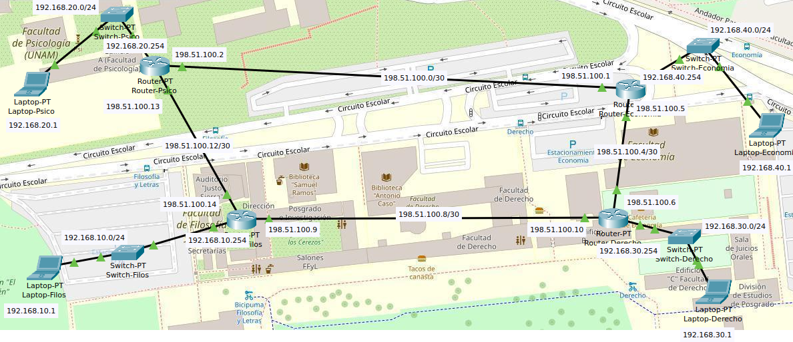

# Configuración de routers

| Integrante                     | Número de Cuenta | Usuario de GitLab   |
|:------------------------------:|:----------------:|:-------------------:|
| Acosta Arzate Rubén            | 317205776        | `rubenAcostaArzate` |
| Alvarado Torres David Ignacio  | 316167613        | `ddalt`             |
| Bernal Marquez Erick           | 317042522        | `Erickmarquez7`     |
| Deloya Andrade Ana Valeria     | 317277582        | `avdeloya13`        |

En este enlace se encuentra el archivo `.pkt` de la práctica: [practica4.pkt](files/practica4.pkt)

## Topología de red:

La topología de nuestra red es de tipo <b>anillo</b>. Es claro ver que esta es nuestra topología por como están los Routers conectados, cada Router está conectado a otros dos Routers, uno de cada lado, formando así un anillo.

En la siguiente imagen podemos apreciar también las diferentes vLAN configuradas en la red:

| 
|:--------------------------------:|
| Topología tipo anillo de la red


## Tabla de los equipos

| Equipo          |  Hostname        | IP de administración | Conexión con otros switches y ruteadores    |
|:---------------:|:----------------:|:--------------------:|:-------------------------------------------:|
| Switch-Filos    |  Switch-Filos    | 192.168.10.253/24    |Router-Filos                                 |
| Switch-Psico    |  Switch-Psico    | 192.168.20.253/24    |Router-Psico                                 |
| Switch-Derecho  |  Switch-Derecho  | 192.168.30.253/24    |Router-Derecho                               |
| Switch-Economia |  Switch-Economia | 192.168.40.253/24    |Router-Economia                              |
| Router-Filos    |  Router-Filos    | 192.168.10.254/24    |Switch-Filos, Router-Psico, Router-Derecho   |
| Router-Psico    |  Router-Psico    | 192.168.20.254/24    |Switch-Psico, Router-Filos, Router-Economia  |
| Router-Derecho  |  Router-Derecho  | 192.168.30.254/24    |Switch-Derecho, Router-Filos, Router-Economia|
| Router-Economia |  Router-Economia | 192.168.40.254/24    |Switch-Economia, Router-Psico, Router-Derecho|

### Switch-Filos
`show cdp neighbors`

```
Switch-Filos>show cdp neighbors
Capability Codes: R - Router, T - Trans Bridge, B - Source Route Bridge
                  S - Switch, H - Host, I - IGMP, r - Repeater, P - Phone
Device ID    Local Intrfce   Holdtme    Capability   Platform    Port ID
Router-Filos 
             Gig 1/1          177            R       PT1000      Gig 0/0
```

`show ip arp`

```
Switch-Filos>show ip arp
Protocol  Address          Age (min)  Hardware Addr   Type   Interface
Internet  192.168.10.253          -   000B.BEE1.8296  ARPA   Vlan1
```

`show ip interface brief`

```
Switch-Filos>show ip interface brief
Interface              IP-Address      OK? Method Status                Protocol 
FastEthernet0/1        unassigned      YES manual up                    up 
GigabitEthernet1/1     unassigned      YES manual up                    up 
Vlan1                  192.168.10.253  YES manual up                    up 
Vlan100                unassigned      YES manual up                    down
```

### Switch-Psico
`show cdp neighbors`

```
Switch-Psico>show cdp neighbors
Capability Codes: R - Router, T - Trans Bridge, B - Source Route Bridge
                  S - Switch, H - Host, I - IGMP, r - Repeater, P - Phone
Device ID    Local Intrfce   Holdtme    Capability   Platform    Port ID
Router-Psico 
             Gig 1/1          140            R       PT1000      Gig 0/0
```

`show ip arp`

```
Switch-Psico>show ip arp
Protocol  Address          Age (min)  Hardware Addr   Type   Interface
Internet  192.168.20.253          -   0002.17D4.5C96  ARPA   Vlan1
```

`show ip interface brief`

```
Switch-Psico>show ip interface brief
Interface              IP-Address      OK? Method Status                Protocol 
FastEthernet0/1        unassigned      YES manual up                    up 
GigabitEthernet1/1     unassigned      YES manual up                    up 
Vlan1                  192.168.20.253  YES manual up                    up 
Vlan100                unassigned      YES manual up                    down
```

### Switch-Derecho
`show cdp neighbors`

```
Switch-Derecho>show cdp neighbors
Capability Codes: R - Router, T - Trans Bridge, B - Source Route Bridge
                  S - Switch, H - Host, I - IGMP, r - Repeater, P - Phone
Device ID    Local Intrfce   Holdtme    Capability   Platform    Port ID
Router-Derecho
             Gig 1/1          170            R       PT1000      Gig 0/0
```

`show ip arp`

```
Switch-Derecho>show ip arp
Protocol  Address          Age (min)  Hardware Addr   Type   Interface
Internet  192.168.30.253          -   000B.BEA9.A4B2  ARPA   Vlan1
```

`show ip interface brief`

```
Switch-Derecho>show ip interface brief
Interface              IP-Address      OK? Method Status                Protocol 
FastEthernet0/1        unassigned      YES manual up                    up 
GigabitEthernet1/1     unassigned      YES manual up                    up 
Vlan1                  192.168.30.253  YES manual up                    up 
Vlan100                unassigned      YES manual up                    down
```

### Switch-Economia
`show cdp neighbors`

```
Switch-Economia>show cdp neighbors
Capability Codes: R - Router, T - Trans Bridge, B - Source Route Bridge
                  S - Switch, H - Host, I - IGMP, r - Repeater, P - Phone
Device ID    Local Intrfce   Holdtme    Capability   Platform    Port ID
Router-Economia
             Gig 1/1          138            R       PT1000      Gig 0/0
```

`show ip arp`

```
Switch-Economia>show ip arp
Protocol  Address          Age (min)  Hardware Addr   Type   Interface
Internet  192.168.40.253          -   0001.9752.DB01  ARPA   Vlan1
```

`show ip interface brief`

```
Switch-Economia>show ip interface brief
Interface              IP-Address      OK? Method Status                Protocol 
FastEthernet0/1        unassigned      YES manual up                    up 
GigabitEthernet1/1     unassigned      YES manual up                    up 
Vlan1                  192.168.40.253  YES manual up                    up 
Vlan100                unassigned      YES manual up                    down
```

### Router-Filos
`show cdp neighbors`

```
Router-Filos>show cdp neighbors
Capability Codes: R - Router, T - Trans Bridge, B - Source Route Bridge
                  S - Switch, H - Host, I - IGMP, r - Repeater, P - Phone
Device ID    Local Intrfce   Holdtme    Capability   Platform    Port ID
Switch-Filos 
             Gig 0/0          156            S       PT3000      Gig 1/1
Router-Psico 
             Gig 2/0          156            R       PT1000      Gig 2/0
Router-Derecho
             Gig 1/0          156            R       PT1000      Gig 1/0
```

`show ip arp`

```
Router-Filos>show ip arp
Protocol  Address          Age (min)  Hardware Addr   Type   Interface
Internet  192.168.10.254          -   0005.5EBC.D3D0  ARPA   GigabitEthernet0/0
Internet  198.51.100.9            -   0090.2B20.73A1  ARPA   GigabitEthernet1/0
Internet  198.51.100.14           -   0040.0B68.2985  ARPA   GigabitEthernet2/0
```

`show ip interface brief`

```
Router-Filos>show ip interface brief
Interface              IP-Address      OK? Method Status                Protocol 
GigabitEthernet0/0     192.168.10.254  YES manual up                    up 
GigabitEthernet1/0     198.51.100.9    YES manual up                    up 
GigabitEthernet2/0     198.51.100.14   YES manual up                    up 
GigabitEthernet3/0     unassigned      YES unset  up                    down 
FastEthernet4/0        unassigned      YES unset  up                    down 
FastEthernet5/0        unassigned      YES unset  up                    down 
FastEthernet6/0        unassigned      YES unset  up                    down
```

`show ip route`

```
Router-Filos>show ip route
Codes: C - connected, S - static, I - IGRP, R - RIP, M - mobile, B - BGP
       D - EIGRP, EX - EIGRP external, O - OSPF, IA - OSPF inter area
       N1 - OSPF NSSA external type 1, N2 - OSPF NSSA external type 2
       E1 - OSPF external type 1, E2 - OSPF external type 2, E - EGP
       i - IS-IS, L1 - IS-IS level-1, L2 - IS-IS level-2, ia - IS-IS inter area
       * - candidate default, U - per-user static route, o - ODR
       P - periodic downloaded static route

Gateway of last resort is not set

C    192.168.10.0/24 is directly connected, GigabitEthernet0/0
S    192.168.20.0/24 [1/0] via 198.51.100.13
S    192.168.30.0/24 [1/0] via 198.51.100.10
S    192.168.40.0/24 [1/0] via 198.51.100.1
                     [1/0] via 198.51.100.5
     198.51.100.0/30 is subnetted, 4 subnets
S       198.51.100.0 [1/0] via 198.51.100.13
S       198.51.100.4 [1/0] via 198.51.100.10
C       198.51.100.8 is directly connected, GigabitEthernet1/0
C       198.51.100.12 is directly connected, GigabitEthernet2/0
```

`show ip route summary`

```
Router-Filos>show ip route summary
IP routing table name is Default-IP-Routing-Table(0)
IP routing table maximum-paths is 16
Route Source    Networks    Subnets     Overhead    Memory (bytes)
connected       1           2           216         384
static          3           2           360         640
internal        1                                   1148
Total           5           4           576         2172
```

### Router-Psico
`show cdp neighbors`

```
Router-Psico>show cdp neighbors
Capability Codes: R - Router, T - Trans Bridge, B - Source Route Bridge
                  S - Switch, H - Host, I - IGMP, r - Repeater, P - Phone
Device ID    Local Intrfce   Holdtme    Capability   Platform    Port ID
Switch-Psico 
             Gig 0/0          176            S       PT3000      Gig 1/1
Router-Filos 
             Gig 2/0          176            R       PT1000      Gig 2/0
Router-Economia
             Gig 1/0          176            R       PT1000      Gig 1/0
```

`show ip arp`

```
Router-Psico>show ip arp
Protocol  Address          Age (min)  Hardware Addr   Type   Interface
Internet  192.168.20.254          -   000C.853E.A35A  ARPA   GigabitEthernet0/0
Internet  198.51.100.2            -   000A.F316.7C7B  ARPA   GigabitEthernet1/0
Internet  198.51.100.13           -   000C.85C1.D61E  ARPA   GigabitEthernet2/0
```

`show ip interface brief`

```
Router-Psico>show ip interface brief
Interface              IP-Address      OK? Method Status                Protocol 
GigabitEthernet0/0     192.168.20.254  YES manual up                    up 
GigabitEthernet1/0     198.51.100.2    YES manual up                    up 
GigabitEthernet2/0     198.51.100.13   YES manual up                    up 
GigabitEthernet3/0     unassigned      YES unset  up                    down 
FastEthernet4/0        unassigned      YES unset  up                    down 
FastEthernet5/0        unassigned      YES unset  up                    down 
FastEthernet6/0        unassigned      YES unset  up                    down
```

`show ip route`

```
Router-Psico>show ip route
Codes: C - connected, S - static, I - IGRP, R - RIP, M - mobile, B - BGP
       D - EIGRP, EX - EIGRP external, O - OSPF, IA - OSPF inter area
       N1 - OSPF NSSA external type 1, N2 - OSPF NSSA external type 2
       E1 - OSPF external type 1, E2 - OSPF external type 2, E - EGP
       i - IS-IS, L1 - IS-IS level-1, L2 - IS-IS level-2, ia - IS-IS inter area
       * - candidate default, U - per-user static route, o - ODR
       P - periodic downloaded static route

Gateway of last resort is not set

S    192.168.10.0/24 [1/0] via 198.51.100.14
C    192.168.20.0/24 is directly connected, GigabitEthernet0/0
S    192.168.30.0/24 [1/0] via 198.51.100.6
                     [1/0] via 198.51.100.10
S    192.168.40.0/24 [1/0] via 198.51.100.1
     198.51.100.0/30 is subnetted, 4 subnets
C       198.51.100.0 is directly connected, GigabitEthernet1/0
S       198.51.100.4 [1/0] via 198.51.100.1
S       198.51.100.8 [1/0] via 198.51.100.14
C       198.51.100.12 is directly connected, GigabitEthernet2/0
```

`show ip route summary`

```
Router-Psico>show ip route summary
IP routing table name is Default-IP-Routing-Table(0)
IP routing table maximum-paths is 16
Route Source    Networks    Subnets     Overhead    Memory (bytes)
connected       1           2           216         384
static          3           2           360         640
internal        1                                   1148
Total           5           4           576         2172
```

### Router-Derecho
`show cdp neighbors`

```
Router-Derecho>show cdp neighbors
Capability Codes: R - Router, T - Trans Bridge, B - Source Route Bridge
                  S - Switch, H - Host, I - IGMP, r - Repeater, P - Phone
Device ID    Local Intrfce   Holdtme    Capability   Platform    Port ID
Router-Filos 
             Gig 1/0          137            R       PT1000      Gig 1/0
Router-Economia
             Gig 2/0          137            R       PT1000      Gig 2/0
Switch-Derecho
             Gig 0/0          137            S       PT3000      Gig 1/1
```

`show ip arp`

```
Router-Derecho>show ip arp
Protocol  Address          Age (min)  Hardware Addr   Type   Interface
Internet  192.168.30.254          -   0090.2170.5060  ARPA   GigabitEthernet0/0
Internet  198.51.100.6            -   0010.11CB.1BC8  ARPA   GigabitEthernet2/0
Internet  198.51.100.10           -   0060.4719.A7A7  ARPA   GigabitEthernet1/0
```

`show ip interface brief`

```
Router-Derecho>show ip interface brief
Interface              IP-Address      OK? Method Status                Protocol 
GigabitEthernet0/0     192.168.30.254  YES manual up                    up 
GigabitEthernet1/0     198.51.100.10   YES manual up                    up 
GigabitEthernet2/0     198.51.100.6    YES manual up                    up 
GigabitEthernet3/0     unassigned      YES unset  up                    down 
FastEthernet4/0        unassigned      YES unset  up                    down 
FastEthernet5/0        unassigned      YES unset  up                    down 
FastEthernet6/0        unassigned      YES unset  up                    down
```

`show ip route`

```
Router-Derecho>show ip route
Codes: C - connected, S - static, I - IGRP, R - RIP, M - mobile, B - BGP
       D - EIGRP, EX - EIGRP external, O - OSPF, IA - OSPF inter area
       N1 - OSPF NSSA external type 1, N2 - OSPF NSSA external type 2
       E1 - OSPF external type 1, E2 - OSPF external type 2, E - EGP
       i - IS-IS, L1 - IS-IS level-1, L2 - IS-IS level-2, ia - IS-IS inter area
       * - candidate default, U - per-user static route, o - ODR
       P - periodic downloaded static route

Gateway of last resort is not set

S    192.168.10.0/24 [1/0] via 198.51.100.9
S    192.168.20.0/24 [1/0] via 198.51.100.13
                     [1/0] via 198.51.100.2
C    192.168.30.0/24 is directly connected, GigabitEthernet0/0
S    192.168.40.0/24 [1/0] via 198.51.100.5
     198.51.100.0/30 is subnetted, 4 subnets
S       198.51.100.0 [1/0] via 198.51.100.5
C       198.51.100.4 is directly connected, GigabitEthernet2/0
C       198.51.100.8 is directly connected, GigabitEthernet1/0
S       198.51.100.12 [1/0] via 198.51.100.9

```

`show ip route summary`

```
Router-Derecho>show ip route summary
IP routing table name is Default-IP-Routing-Table(0)
IP routing table maximum-paths is 16
Route Source    Networks    Subnets     Overhead    Memory (bytes)
connected       1           2           216         384
static          3           2           360         640
internal        1                                   1148
Total           5           4           576         2172
```

### Router-Economia
`show cdp neighbors`

```
Router-Economia>show cdp neighbors
Capability Codes: R - Router, T - Trans Bridge, B - Source Route Bridge
                  S - Switch, H - Host, I - IGMP, r - Repeater, P - Phone
Device ID    Local Intrfce   Holdtme    Capability   Platform    Port ID
Switch-Economia
             Gig 0/0          160            S       PT3000      Gig 1/1
Router-Psico 
             Gig 1/0          160            R       PT1000      Gig 1/0
Router-Derecho
             Gig 2/0          160            R       PT1000      Gig 2/0
```

`show ip arp`

```
Router-Economia>show ip arp
Protocol  Address          Age (min)  Hardware Addr   Type   Interface
Internet  192.168.40.254          -   0005.5EC1.CC5A  ARPA   GigabitEthernet0/0
Internet  198.51.100.1            -   00D0.D3BE.91D1  ARPA   GigabitEthernet1/0
Internet  198.51.100.5            -   00D0.FF40.67CE  ARPA   GigabitEthernet2/0
```

`show ip interface brief`

```
Router-Economia>show ip interface brief
Interface              IP-Address      OK? Method Status                Protocol 
GigabitEthernet0/0     192.168.40.254  YES manual up                    up 
GigabitEthernet1/0     198.51.100.1    YES manual up                    up 
GigabitEthernet2/0     198.51.100.5    YES manual up                    up 
GigabitEthernet3/0     unassigned      YES unset  up                    down 
FastEthernet4/0        unassigned      YES unset  up                    down 
FastEthernet5/0        unassigned      YES unset  up                    down 
FastEthernet6/0        unassigned      YES unset  up                    down
```

`show ip route`

```
Router-Economia>show ip route
Codes: C - connected, S - static, I - IGRP, R - RIP, M - mobile, B - BGP
       D - EIGRP, EX - EIGRP external, O - OSPF, IA - OSPF inter area
       N1 - OSPF NSSA external type 1, N2 - OSPF NSSA external type 2
       E1 - OSPF external type 1, E2 - OSPF external type 2, E - EGP
       i - IS-IS, L1 - IS-IS level-1, L2 - IS-IS level-2, ia - IS-IS inter area
       * - candidate default, U - per-user static route, o - ODR
       P - periodic downloaded static route

Gateway of last resort is not set

S    192.168.10.0/24 [1/0] via 198.51.100.2
                     [1/0] via 198.51.100.6
S    192.168.20.0/24 [1/0] via 198.51.100.2
S    192.168.30.0/24 [1/0] via 198.51.100.6
C    192.168.40.0/24 is directly connected, GigabitEthernet0/0
     198.51.100.0/30 is subnetted, 4 subnets
C       198.51.100.0 is directly connected, GigabitEthernet1/0
C       198.51.100.4 is directly connected, GigabitEthernet2/0
S       198.51.100.8 [1/0] via 198.51.100.6
S       198.51.100.12 [1/0] via 198.51.100.2

```

`show ip route summary`

```
Router-Economia>show ip route summary
IP routing table name is Default-IP-Routing-Table(0)
IP routing table maximum-paths is 16
Route Source    Networks    Subnets     Overhead    Memory (bytes)
connected       1           2           216         384
static          3           2           360         640
internal        1                                   1148
Total           5           4           576         2172
```

## Pruebas de conexión de los equipos en la red

### Para equipos en la red LAN

- `Laptop-Filos` a `Laptop-Psico`

    ```
	C:\>ping 192.168.20.1

	Pinging 192.168.20.1 with 32 bytes of data:

	Reply from 192.168.20.1: bytes=32 time<1ms TTL=126
	Reply from 192.168.20.1: bytes=32 time<1ms TTL=126
	Reply from 192.168.20.1: bytes=32 time<1ms TTL=126
	Reply from 192.168.20.1: bytes=32 time<1ms TTL=126

	Ping statistics for 192.168.20.1:
	    Packets: Sent = 4, Received = 4, Lost = 0 (0% loss),
	Approximate round trip times in milli-seconds:
	    Minimum = 0ms, Maximum = 0ms, Average = 0ms
    ```
    
- `Laptop-Economia` a `Laptop-Psico`
    
    ```
	C:\>ping 192.168.20.1

	Pinging 192.168.20.1 with 32 bytes of data:

	Reply from 192.168.20.1: bytes=32 time<1ms TTL=126
	Reply from 192.168.20.1: bytes=32 time<1ms TTL=126
	Reply from 192.168.20.1: bytes=32 time<1ms TTL=126
	Reply from 192.168.20.1: bytes=32 time<1ms TTL=126

	Ping statistics for 192.168.20.1:
	    Packets: Sent = 4, Received = 4, Lost = 0 (0% loss),
	Approximate round trip times in milli-seconds:
	    Minimum = 0ms, Maximum = 0ms, Average = 0ms
    
    ```
    
- `Laptop-Derecho` a `Laptop-Psico`

	```
	C:\>ping 192.168.20.1

	Pinging 192.168.20.1 with 32 bytes of data:

	Reply from 192.168.20.1: bytes=32 time<1ms TTL=125
	Reply from 192.168.20.1: bytes=32 time<1ms TTL=125
	Reply from 192.168.20.1: bytes=32 time<1ms TTL=125
	Reply from 192.168.20.1: bytes=32 time<1ms TTL=125

	Ping statistics for 192.168.20.1:
	    Packets: Sent = 4, Received = 4, Lost = 0 (0% loss),
	Approximate round trip times in milli-seconds:
	    Minimum = 0ms, Maximum = 0ms, Average = 0ms
    ```
    
- `Laptop-Economia` a `Laptop-Filos`

	```
	C:\>ping 192.168.10.1

	Pinging 192.168.10.1 with 32 bytes of data:

	Reply from 192.168.10.1: bytes=32 time<1ms TTL=126
	Reply from 192.168.10.1: bytes=32 time<1ms TTL=126
	Reply from 192.168.10.1: bytes=32 time<1ms TTL=126
	Reply from 192.168.10.1: bytes=32 time<1ms TTL=126

	Ping statistics for 192.168.10.1:
	    Packets: Sent = 4, Received = 4, Lost = 0 (0% loss),
	Approximate round trip times in milli-seconds:
	    Minimum = 0ms, Maximum = 0ms, Average = 0ms
	```
	
- `Laptop-Derecho` a `Laptop-Filos`

	```
	C:\>ping 192.168.10.1

	Pinging 192.168.10.1 with 32 bytes of data:

	Reply from 192.168.10.1: bytes=32 time<1ms TTL=126
	Reply from 192.168.10.1: bytes=32 time<1ms TTL=126
	Reply from 192.168.10.1: bytes=32 time<1ms TTL=126
	Reply from 192.168.10.1: bytes=32 time<1ms TTL=126

	Ping statistics for 192.168.10.1:
	    Packets: Sent = 4, Received = 4, Lost = 0 (0% loss),
	Approximate round trip times in milli-seconds:
	    Minimum = 0ms, Maximum = 0ms, Average = 0ms
	```
	
- `Laptop-Derecho` a `Laptop-Economia`

	```
	C:\>ping 192.168.40.1

	Pinging 192.168.40.1 with 32 bytes of data:

	Reply from 192.168.40.1: bytes=32 time<1ms TTL=126
	Reply from 192.168.40.1: bytes=32 time<1ms TTL=126
	Reply from 192.168.40.1: bytes=32 time<1ms TTL=126
	Reply from 192.168.40.1: bytes=32 time<1ms TTL=126

	Ping statistics for 192.168.40.1:
	    Packets: Sent = 4, Received = 4, Lost = 0 (0% loss),
	Approximate round trip times in milli-seconds:
	    Minimum = 0ms, Maximum = 0ms, Average = 0ms
    ```
### Para equipos a routers 

- `Laptop-Psico` a `Router-Psico GigabitEthernet0/0`
	
	```
	C:\>ping 192.168.20.254

	Pinging 192.168.20.254 with 32 bytes of data:

	Reply from 192.168.20.254: bytes=32 time<1ms TTL=255
	Reply from 192.168.20.254: bytes=32 time<1ms TTL=255
	Reply from 192.168.20.254: bytes=32 time<1ms TTL=255
	Reply from 192.168.20.254: bytes=32 time<1ms TTL=255

	Ping statistics for 192.168.20.254:
	    Packets: Sent = 4, Received = 4, Lost = 0 (0% loss),
	Approximate round trip times in milli-seconds:
	    Minimum = 0ms, Maximum = 0ms, Average = 0ms
	```
	
- `Laptop-Psico` a `Router-Psico GigabitEthernet1/0`
	
	```
	C:\>ping 198.51.100.2

	Pinging 198.51.100.2 with 32 bytes of data:

	Reply from 198.51.100.2: bytes=32 time<1ms TTL=255
	Reply from 198.51.100.2: bytes=32 time<1ms TTL=255
	Reply from 198.51.100.2: bytes=32 time<1ms TTL=255
	Reply from 198.51.100.2: bytes=32 time<1ms TTL=255

	Ping statistics for 198.51.100.2:
	    Packets: Sent = 4, Received = 4, Lost = 0 (0% loss),
	Approximate round trip times in milli-seconds:
	    Minimum = 0ms, Maximum = 0ms, Average = 0ms
	```
- `Laptop-Psico` a `Router-Psico GigabitEthernet2/0`
	
	```
	C:\>ping 198.51.100.13

	Pinging 198.51.100.13 with 32 bytes of data:

	Reply from 198.51.100.13: bytes=32 time<1ms TTL=255
	Reply from 198.51.100.13: bytes=32 time<1ms TTL=255
	Reply from 198.51.100.13: bytes=32 time<1ms TTL=255
	Reply from 198.51.100.13: bytes=32 time<1ms TTL=255

	Ping statistics for 198.51.100.13:
	    Packets: Sent = 4, Received = 4, Lost = 0 (0% loss),
	Approximate round trip times in milli-seconds:
	    Minimum = 0ms, Maximum = 0ms, Average = 0ms
	```
	
- `Laptop-Psico` a `Router-Filos GigabitEthernet0/0`
	
	```
	C:\>ping 192.168.10.254

	Pinging 192.168.10.254 with 32 bytes of data:

	Reply from 192.168.10.254: bytes=32 time<1ms TTL=255
	Reply from 192.168.10.254: bytes=32 time<1ms TTL=255
	Reply from 192.168.10.254: bytes=32 time<1ms TTL=255
	Reply from 192.168.10.254: bytes=32 time<1ms TTL=255

	Ping statistics for 192.168.10.254:
	    Packets: Sent = 4, Received = 4, Lost = 0 (0% loss),
	Approximate round trip times in milli-seconds:
	    Minimum = 0ms, Maximum = 0ms, Average = 0ms
	```	

- `Laptop-Psico` a `Router-Filos GigabitEthernet1/0`
	
	```
	C:\>ping 198.51.100.9

	Pinging 198.51.100.9 with 32 bytes of data:

	Reply from 198.51.100.9: bytes=32 time<1ms TTL=255
	Reply from 198.51.100.9: bytes=32 time<1ms TTL=255
	Reply from 198.51.100.9: bytes=32 time<1ms TTL=255
	Reply from 198.51.100.9: bytes=32 time<1ms TTL=255

	Ping statistics for 198.51.100.9:
	    Packets: Sent = 4, Received = 4, Lost = 0 (0% loss),
	Approximate round trip times in milli-seconds:
	    Minimum = 0ms, Maximum = 0ms, Average = 0ms
	```
	
- `Laptop-Psico` a `Router-Filos GigabitEthernet2/0`
	
	```
	C:\>ping 198.51.100.14

	Pinging 198.51.100.14 with 32 bytes of data:

	Reply from 198.51.100.14: bytes=32 time<1ms TTL=255
	Reply from 198.51.100.14: bytes=32 time<1ms TTL=255
	Reply from 198.51.100.14: bytes=32 time<1ms TTL=255
	Reply from 198.51.100.14: bytes=32 time<1ms TTL=255

	Ping statistics for 198.51.100.14:
	    Packets: Sent = 4, Received = 4, Lost = 0 (0% loss),
	Approximate round trip times in milli-seconds:
	    Minimum = 0ms, Maximum = 0ms, Average = 0ms
	```
	
- `Laptop-Psico` a `Router-Economia GigabitEthernet0/0`
	
	```
	C:\>ping 192.168.40.254

	Pinging 192.168.40.254 with 32 bytes of data:

	Reply from 192.168.40.254: bytes=32 time<1ms TTL=254
	Reply from 192.168.40.254: bytes=32 time<1ms TTL=254
	Reply from 192.168.40.254: bytes=32 time<1ms TTL=254
	Reply from 192.168.40.254: bytes=32 time=10ms TTL=254

	Ping statistics for 192.168.40.254:
	    Packets: Sent = 4, Received = 4, Lost = 0 (0% loss),
	Approximate round trip times in milli-seconds:
	    Minimum = 0ms, Maximum = 10ms, Average = 2ms

	```
	
- `Laptop-Psico` a `Router-Economia GigabitEthernet1/0`
	
	```
	C:\>ping 198.51.100.1

	Pinging 198.51.100.1 with 32 bytes of data:

	Reply from 198.51.100.1: bytes=32 time<1ms TTL=254
	Reply from 198.51.100.1: bytes=32 time<1ms TTL=254
	Reply from 198.51.100.1: bytes=32 time<1ms TTL=254
	Reply from 198.51.100.1: bytes=32 time<1ms TTL=254

	Ping statistics for 198.51.100.1:
	    Packets: Sent = 4, Received = 4, Lost = 0 (0% loss),
	Approximate round trip times in milli-seconds:
	    Minimum = 0ms, Maximum = 0ms, Average = 0ms
	```
	
- `Laptop-Psico` a `Router-Economia GigabitEthernet2/0`
	
	```
	C:\>ping 198.51.100.5

	Pinging 198.51.100.5 with 32 bytes of data:

	Reply from 198.51.100.5: bytes=32 time<1ms TTL=254
	Reply from 198.51.100.5: bytes=32 time<1ms TTL=254
	Reply from 198.51.100.5: bytes=32 time<1ms TTL=254
	Reply from 198.51.100.5: bytes=32 time<1ms TTL=254

	Ping statistics for 198.51.100.5:
	    Packets: Sent = 4, Received = 4, Lost = 0 (0% loss),
	Approximate round trip times in milli-seconds:
	    Minimum = 0ms, Maximum = 0ms, Average = 0ms
	```
	
- `Laptop-Psico` a `Router-Derecho GigabitEthernet0/0`
	
	```
	C:\> ping 192.168.30.254

	Pinging 192.168.30.254 with 32 bytes of data:

	Reply from 192.168.30.254: bytes=32 time<1ms TTL=253
	Reply from 192.168.30.254: bytes=32 time<1ms TTL=253
	Reply from 192.168.30.254: bytes=32 time<1ms TTL=253
	Reply from 192.168.30.254: bytes=32 time<1ms TTL=253

	Ping statistics for 192.168.30.254:
	    Packets: Sent = 4, Received = 4, Lost = 0 (0% loss),
	Approximate round trip times in milli-seconds:
	    Minimum = 0ms, Maximum = 0ms, Average = 0ms
	```
	
- `Laptop-Psico` a `Router-Derecho GigabitEthernet1/0`
	
	```
	C:\>ping 198.51.100.10

	Pinging 198.51.100.10 with 32 bytes of data:

	Reply from 198.51.100.10: bytes=32 time<1ms TTL=253
	Reply from 198.51.100.10: bytes=32 time<1ms TTL=253
	Reply from 198.51.100.10: bytes=32 time<1ms TTL=253
	Reply from 198.51.100.10: bytes=32 time<1ms TTL=253

	Ping statistics for 198.51.100.10:
	    Packets: Sent = 4, Received = 4, Lost = 0 (0% loss),
	Approximate round trip times in milli-seconds:
	    Minimum = 0ms, Maximum = 0ms, Average = 0ms
    	```
    
- `Laptop-Psico` a `Router-Derecho GigabitEthernet2/0`
	
	```
    	C:\>ping 198.51.100.6
  
	Pinging 198.51.100.6 with 32 bytes of data:

	Reply from 198.51.100.6: bytes=32 time<1ms TTL=253
	Reply from 198.51.100.6: bytes=32 time<1ms TTL=253
	Reply from 198.51.100.6: bytes=32 time<1ms TTL=253
	Reply from 198.51.100.6: bytes=32 time<1ms TTL=253

	Ping statistics for 198.51.100.6:
	    Packets: Sent = 4, Received = 4, Lost = 0 (0% loss),
	Approximate round trip times in milli-seconds:
	    Minimum = 0ms, Maximum = 0ms, Average = 0ms
	```    


## Configuración de los switches y routeadores 

Listamos los archivos `.txt` que guarda cada uno la salida del comando `show startup-config` para su respectivo switch o router:

1. Switches:
    * [Switch-Filos](files/Switch-Filos.txt)
    * [Switch-Psico](files/Switch-Psico.txt)
    * [Switch-Economia](files/Switch-Economia.txt)
    * [Switch-Derecho](files/Switch-Derecho.txt)

2. Routers:
    * [Router-Filos](files/Router-Filos.txt)
    * [Router-Psico](files/Router-Psico.txt)
    * [Router-Economia](files/Router-Economia.txt)
    * [Router-Derecho](files/Router-Derecho.txt)
