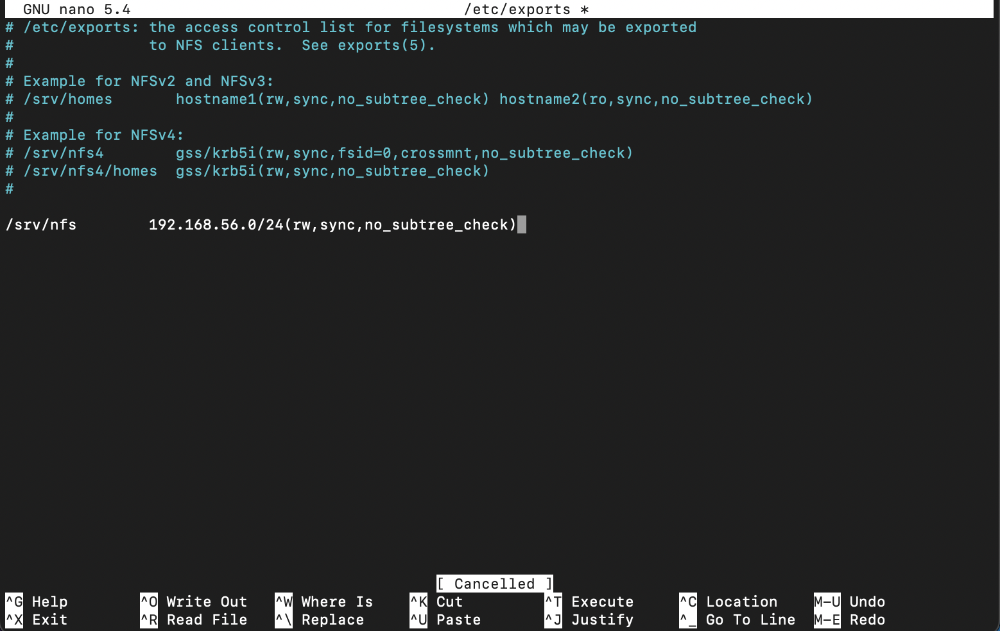
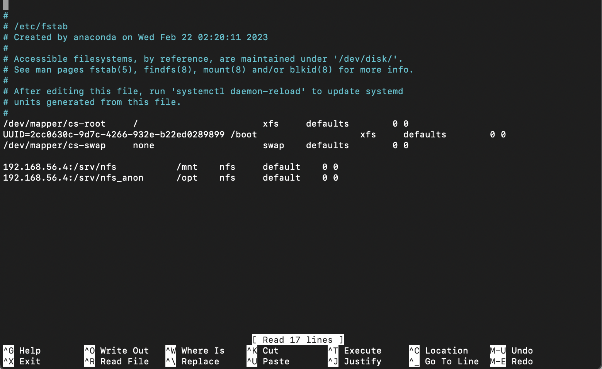
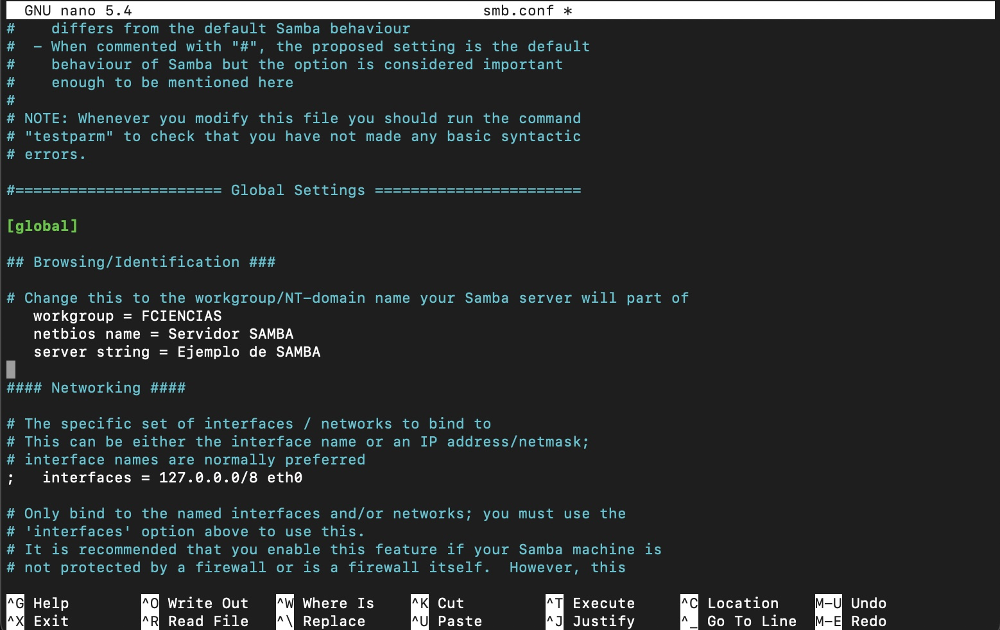
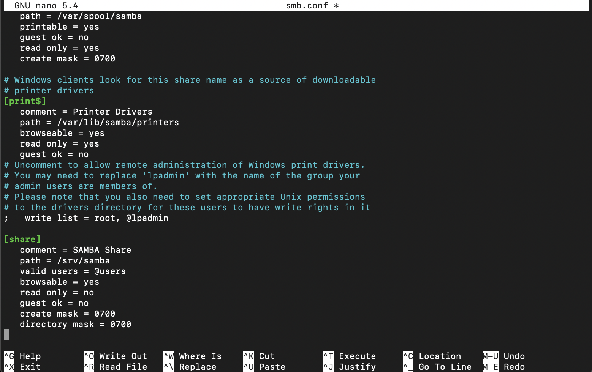
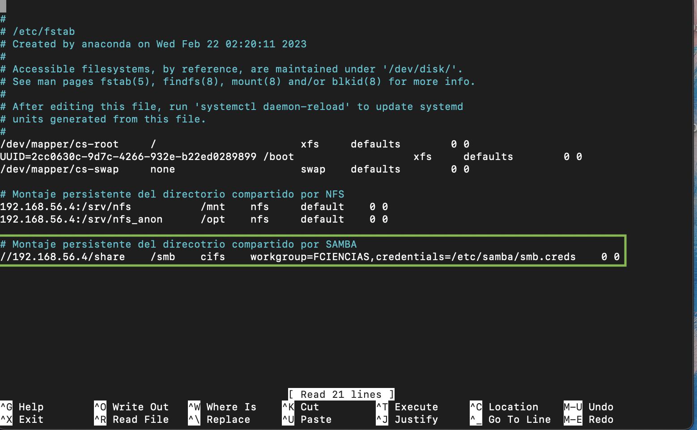
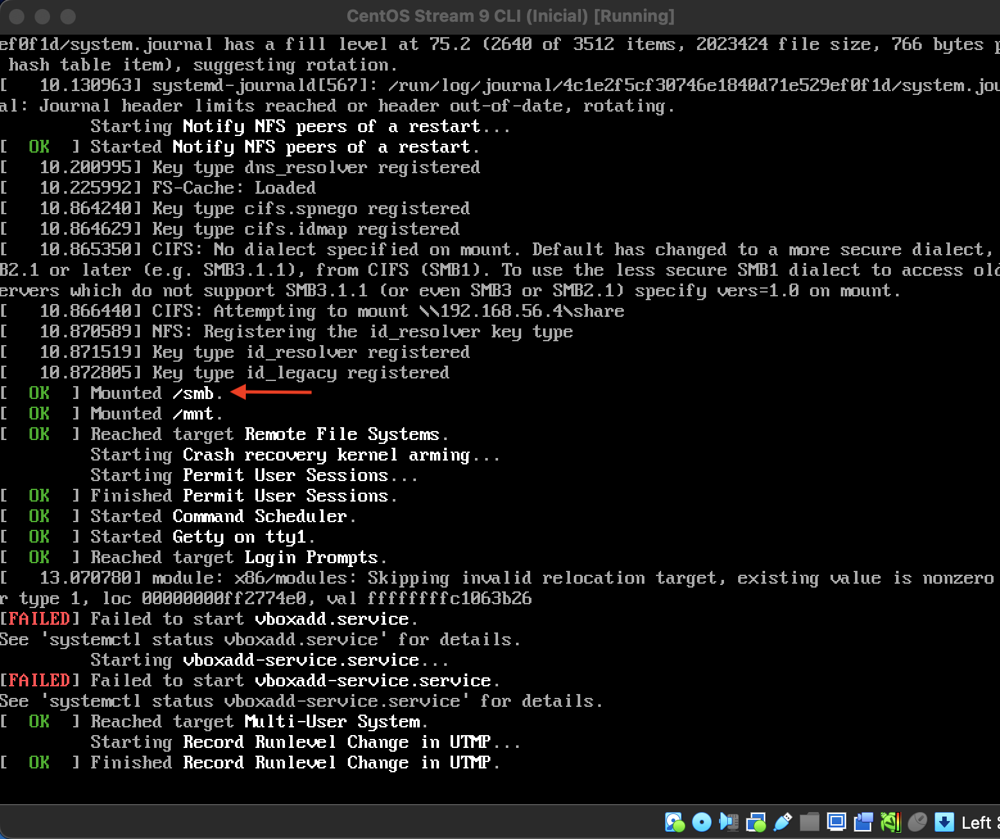

# Implementación de un servidor de archivos con NFS y Samba

| Integrante                     | Número de Cuenta | Usuario de GitLab   |
|:------------------------------:|:----------------:|:-------------------:|
| Acosta Arzate Rubén            | 317205776        | `rubenAcostaArzate` |
| Alvarado Torres David Ignacio  | 316167613        | `ddalt`             |
| Bernal Marquez Erick           | 317042522        | `Erickmarquez7`     |
| Deloya Andrade Ana Valeria     | 317277582        | `avdeloya13`        |

# Topología de Red 
A nivel físico es Topología de Árbol, siendo la máquina física la raíz del árbol a la que se conecta lo demás. Lo mismo ocurre a nivel lógico pues no ponemos ninguna restricción. Otra forma en que podemos ver la Topología es 1 a 1, viéndola de Computadora a Router.

# Configuración de NFS

## Servidor Debian (con IP `192.168.56.4`)

1. Instalar los paquetes de NFS en la máquina Debian:

```
root@debian-11:~# apt install nfs-kernel-server
```

2. Creamos la carpeta que queremos compartir utilizando el servicio NFS, junto con un archivo vacío que indique que se está dentro de la carpeta compartida por NFS.

```
root@debian-11:~# mkdir /srv/nfs
mkdir: created directory `/srv/nfs`
root@debian-11:~# touch /srv/nfs/dentro-de-nfs
```

3. Configurar las opciones de exportación de NFS del servidor Debian, en el archivo [`/etc/exports`](files/exports_debian.txt)

```
root@debian-11:~# nano /etc/exports
```

Agregamos la opciones de exportación para el directorio `/srv/nfs`. Queremos que cualquier cliente en el segmento de red de la interfaz host-only tenga acceso a dicho directorio compartido, por lo que especificamos que el rango de direcciones IP que pueden acceder a `/srv/nfs` es  `192.168.56.0/24`:

```
# /etc/exports: the access control list for filesystems which may be exported
#               to NFS clients.  See exports(5).
#
# Example for NFSv2 and NFSv3:
# /srv/homes       hostname1(rw,sync,no_subtree_check) hostname2(ro,sync,no_subtree_check)
#
# Example for NFSv4:
# /srv/nfs4        gss/krb5i(rw,sync,fsid=0,crossmnt,no_subtree_check)
# /srv/nfs4/homes  gss/krb5i(rw,sync,no_subtree_check)
#

/srv/nfs             192.168.56.0/24(rw,sync,no_subtree_check)
```

Esta línea de código indica que los clientes en el rango `192.168.56.0/24` podrán leer y escribir en el directorio `/srv/nfs`. 




3. Para que los cambios que hicimos se hagan disponibles a los clientes que se comunicarán al servidor (el cliente CentOS), debemos reiniciar el el servidor NFS:

```
root@debian-11:~# systemctl status nfs-kernel-server
● nfs-server.service - NFS server and services
     Loaded: loaded (/lib/systemd/system/nfs-server.service; enabled; vendor preset: enabled)
     Active: active (exited) since Wed 2023-04-26 21:34:22 CST; 20min ago
    Process: 733 ExecStartPre=/usr/sbin/exportfs -r (code=exited, status=0/SUCCESS)
    Process: 734 ExecStart=/usr/sbin/rpc.nfsd $RPCNFSDARGS (code=exited, status=0/SUCCESS)
   Main PID: 734 (code=exited, status=0/SUCCESS)
        CPU: 10ms

Apr 26 21:34:20 debian-11 systemd[1]: Starting NFS server and services...
Apr 26 21:34:22 debian-11 systemd[1]: Finished NFS server and services.
```

Ejecutando el comando `systemctl status nfs-kernel-server` podemos ver que el servicio NFS está ejecutándose correctamente

4. La salida del comando `showmount -e` nos muestra que el directorio `/srv` efectivamente está exportado en el servidor
```
root@debian-11:~# showmount -e
Export list for debian-11:
/srv/nfs 192.168.56.0/24
```

## Cliente CentOS (con IP `192.168.56.6`)

1. Instalamos la paquetería de NFS para poder configurar un cliente NFS en la máquina con CentOS:

```
[root@centos-9 ~]# yum install nfs-common
```

2. Verificamos que el sistema de archivos está exportado con el comando `showmount`. La salida del mismo nos indica que el  directorio `/srv/nfs` de la máquina Debian sí está exportado.

```
[root@centos-9 ~]# showmount -e 192.168.56.4
Export list for 192.168.56.4:
/srv/nfs 192.168.56.0/24
```

3. Ahora montamos el directorio `/srv/nfs` en la máquina CentOS, en el directorio `/mnt` de la misma:

```
[root@centos-9 ~]# mount -t nfs 192.168.56.4:/srv/nfs /mnt
```

Y comprobamos que efectivamente fue montado

```
[root@centos-9 ~]# mount | grep /mnt
192.168.56.4:/srv/nfs on /mnt type nfs4 (rw,relatime,vers=4.2,rsize=131072,wsize=131072,namlen=255,hard,proto=tcp,timeo=600,retrans=2,sec=sys,clientaddr=192.168.56.6,local_lock=none,addr=192.168.56.4)
```


4. Montar el directorio `/srv/nfs` de Debian en el cliente CentOS de manera automática cuando este se inicialice: añadimos el directorio `/srv/nfs` del servidor Debian al archivo `/etc/fstab` de CentOS, colocando la siguiente línea al final del mismo:

```
192.168.56.4:/srv/nfs               /mnt      nfs   default     0 0
```



Con la instrucción `default` aseguramos que el sistema de archivos será montado automáticamente durante el arranque de la máquina con CentOS. 

Y podemos comprobar que el montaje será automático cuando el sistema se inicialice, con el comando `mount -va`:

```
[root@centos-9 ~]# mount -va
/                        : ignored
/boot                    : already mounted
none                     : ignored
mount.nfs: timeout set for Wed Apr 26 21:59:51 2023
mount.nfs: trying text-based options 'vers=4.2,addr=192.168.56.4,clientaddr=192.168.56.6'
/mnt                     : successfully mounted
/smb                     : already mounted
```

Más aún, al reiniciar el sistema, podemos ver que en el output del mismo que el montaje en `/mnt` se hace automáticamente:


## Cliente Windows (con IP 192.168.56.100)


1. Habilitamos las caracteristicas de:

```
-Servicios de NFS
-Herramientas Administrativas
-Cliente de NFS

```

2. Verificamos que el sistema de archivos esté exportado con el comando 

```
C:\Users\ruben> showmount -e 192.168.56.4
```

3. instalamos el punto de montaje del sistema de archivos compartido con el comando mount

```
C:\Users\ruben> mount -t nfs 192.168.56.4:/srv/nfs
```

4. Reiniciamos el equipo para verificar que el sistema de archivos se monta correctamente de manera automática al iniciar el sistema

# SMB


## DEBIAN

1. Instalar los paquetes de SAMBA en el servidor Debian

```
root@debian-11:~# apt -qy install samba
```

2. Hacemos un respaldo del archivo de configuración de SAMBA [`/etc/samba/smb.conf`](files/smb.conf), creando una copia del mismo. Lo llamamos `smb0.conf`

```
root@debian-11:/etc/samba# cp -v smb.conf smb0.conf
'smb.conf' -> 'smb0.conf'
```

3. Configuramos el share `global` de SAMBA en el archivo [`smb.conf`](files/smb.conf), cambiando el grupo de trabajo a `FCIENCIAS` y el nombre del servidor a `Servidor SAMBA`



Utilizando el comando `testparm`, verificamos que el archivo [`smb.conf`](files/smb.conf) sea sintácticamente correcto. La salida completa del comando se encuentra en el archivo [testparm.txt](files/testparm.txt). Dado que no nos marca ningún error, podemos asumir que todo está correcto.

4. Agregamos una sección en el archivo [`smb.conf`](files/smb.conf) para la configuración de la carpeta compartida del servidor. La vamos a llamar `share`



5. Creamos el directorio compartido para el _share_, el cual será `/srv/samba`. Dentro, creamos una archivo vacío que indique que estamos dentro del directorio compartido. Lo llamamos `inside-share`

```
root@debian-11:~# mkdir -vp /srv/samba
mkdir: created directory 'srv/samba'

root@debian-11:~# touch /srv/samba/inside-share

root@debian-11:~# ls -la /srv/samba
total 8
drwxrwsr-x 3 root          root 4096 Apr 25 15:12 .
drwxr-xr-x 5 root          root  4096 Apr 25 09:33 ..
-rw-r--r-- 1 root          root     0 Apr 25 09:34 inside-share
```

6. Cambiamos los permisos del directorio `/srv/samba` para que los usuarios autorizados puedan leer y escribir dentro de él. Los demás usuarios solo podrán leer los contenidos del directorio.

```
root@debian-11:~# chmod -c u+rwx,g+rwxs,o+rx,o-w /srv/samba
mode of '/srv/samba' changed from 0755 (rwxr-xr-x) to 2775 (rwxrwsr-x)

root@debian-11:~# chown -c root:users /srv/samba
changed ownership of '/srv/samba' from root:root to root:users

root@debian-11:~# ls -la /srv/samba/
total 12
drwxrwsr-x 3 root          users 4096 Apr 25 15:12 .
drwxr-xr-x 5 root          root  4096 Apr 25 09:33 ..
-rw-r--r-- 1 root          root     0 Apr 25 09:34 inside-share
```

Podemos ver que root y los miembros del grupo `users` ahora tienen permisos de lectura y escritura.

7. Agregamos el usuario actual del sistema al grupo de `users`, y lo agregamos también a la base de datos de SAMBA con el comando `smbpasswd`, para que pueda hacer cambios sobre el directorio compartido desde la máquina Debian. Establecemos una contraseña para el usuario.

```
root@debian-11:/etc/samba# adduser davidalvarado users
perl: warning: Setting locale failed.
perl: warning: Please check that your locale settings:
	LANGUAGE = "en_US:en",
	LC_ALL = (unset),
	LC_CTYPE = "UTF-8",
	LANG = "en_US.UTF-8"
    are supported and installed on your system.
perl: warning: Falling back to a fallback locale ("en_US.UTF-8").
Adding user 'davidalvarado' to group 'users' ...
Adding user davidalvarado to group users
Done.

root@debian-11:/etc/samba# id davidalvarado
uid=1000(davidalvarado) gid=1000(davidalvarado) groups=1000(davidalvarado),24(cdrom),25(floppy),27(sudo),29(audio),30(dip),44(video),46(plugdev),100(users),108(netdev),112(bluetooth),998(vboxsf)
```

```
root@debian-11:/etc/samba# smbpasswd -a davidalvarado
New SMB password:
Retype new SMB password:
```

8. Finalmente, comprobamos que el servidor SAMBA está corriendo de manera adecuada con el siguiente comando

```
root@debian-11:~# systemctl status nmbd smbd | cat
```

Esta salida está guardada en el archivo [`status_samba.txt`](files/status_samba.txt), y ahí podemos ver que los servicios SMB y NMB corren correctamente. 

## CENTOS

1. Instalamos el cliente de SAMBA en CentOS

```
[root@centos-9 ~]# yum -qy install samba-client
```

2. Utilizando el comando `smbclient`, y el usuario `davidalvarado` (que creamos y registramos en la base de datos de SAMBA desde la máquina Debian), preguntamos que recursos fueron exportados desde el servidor Debian con el siguiente comando

```
[root@centos-9 ~]# smbclient -L 192.168.56.4 -U davidalvarado
Password for [SAMBA\davidalvarado]:

	Sharename       Type      Comment
	---------       ----      -------
	print$          Disk      Printer Drivers
	share           Disk      SAMBA Share
	IPC$            IPC       IPC Service (Ejemplo de SAMBA)
	davidalvarado   Disk      Home Directories
SMB1 disabled -- no workgroup available
```

Comprobamos que el recurso compartido `share` es exportado por el servidor Debian.

3. montamos el directorio compartido del servidor Debian en un nuevo directorio `/smb` en el cliente CentOS. Esto porque `/mnt` de CentOS ya está siendo usando para montar el servicio NFS.

```
[root@centos-9 ~]# mount -t cifs --verbose //192.168.56.4/share /smb -o 'workgroup=FCIENCIAS,username=davidalvarado'
Password for davidalvarado@//192.168.56.4/share: 
mount.cifs kernel mount options: ip=192.168.56.4,unc=\\192.168.56.4\share,user=davidalvarado,domain=FCIENCIAS,pass=********
```

Introducimos la contraseña del usuario `davidalvarado`, y el directorio compartido de Debain queda montado en nuestro cliente CentOS. Como podemos ver, el archivo `inside-share` creado desde la máquina Debian es visible en la máquina CentOS.

```
[root@centos-9 ~]# ls -la /smb/
total 0
drwxr-xr-x.  2 root root   0 Apr 25 15:12 .
dr-xr-xr-x. 19 root root 246 Apr 25 10:08 ..
-rwxr-xr-x.  1 root root   0 Apr 25 09:34 inside-share
```

4. Para pasarle las credenciales de manera automática al servidor SAMBA, y no tener que escribirlas cada vez que se monte el directorio, creamos un archivo que contenga un username y una contraseña válidos, con los que SAMBA nos permita hacer el montaje. En este caso, el usuario cuyas credenciales vamos a definir es `davidalvarado`. Esto lo ponemos en el archivo [`/etc/samba/smb.creds`](files/smb.creds)

```
[root@centos-9 ~]# nano /etc/samba/smb.creds
```

Después, le cambiamos los permisos al archivo, para que solo el usuario root pueda modificarlo.

```
[root@centos-9 ~]# chmod 0600 /etc/samba/smb.creds
[root@centos-9 ~]# chown root:root /etc/samba/smb.creds
```

Así, podemos pasarle este archivo al comando `mount` para autenticar al usuario.

```
[root@centos-9 ~]# mount -t cifs --verbose //192.168.56.4/share /smb -o 'workgroup=FCIENCIAS,credentials=/etc/samba/smb.creds'
mount.cifs kernel mount options: ip=192.168.56.4,unc=\\192.168.56.4\share,user=davidalvarado,domain=FCIENCIAS,pass=********

[root@centos-9 ~]# ls -la /smb/
total 0
drwxr-xr-x.  2 root root   0 Apr 25 15:12 .
dr-xr-xr-x. 19 root root 246 Apr 25 10:08 ..
-rwxr-xr-x.  1 root root   0 Apr 25 09:34 inside-share
```


5. Probemos ahora que nuestro directorio `/smb` está correctamente montado, creando un archivo y un directorio (ambos vacíos) para comprobar que estos aparecen en el servidor Debian

```
[root@centos-9 smb]# touch archivo-creado-desde-centos
[root@centos-9 smb]# mkdir carpeta-creada-desde-centos  

[root@centos-9 ~]# ls -la /smb/
total 0
drwxr-xr-x.  2 root root   0 Apr 25 15:12 .
dr-xr-xr-x. 19 root root 246 Apr 25 10:08 ..
-rwxr-xr-x.  1 root root   0 Apr 25 15:12 archivo-creado-desde-centos
drwxr-xr-x.  2 root root   0 Apr 25 15:12 carpeta-creada-desde-centos
-rwxr-xr-x.  1 root root   0 Apr 25 09:34 inside-share
```

Ahora, desde Debian, listemos los archivos en el directorio `/srv/samba` (que fue el que montamos en CentOS)

```
root@debian-11:~# ls -la /srv/samba/
total 12
drwxrwsr-x 3 root          users 4096 Apr 25 15:12 .
drwxr-xr-x 5 root          root  4096 Apr 25 09:33 ..
-rwx------ 1 davidalvarado users    0 Apr 25 15:12 archivo-creado-desde-centos
drwx--S--- 2 davidalvarado users 4096 Apr 25 15:12 carpeta-creada-desde-centos
-rw-r--r-- 1 root          root     0 Apr 25 09:34 inside-share
```

Y vemos que tanto el archivo como el directorio que creamos en CentOS aparecen en nuestro servidor Debian, por lo que el montaje fue exitoso.

6. Por último, para que el montaje del directorio `/smb` sea persistente, debemos modificar el archivo [`/etc/fstab`](files/fstab_centos.txt) de nuestro cliente CentOS, y agregar la instrucción para que el montaje de `/smb` se haga durante la inicialización del sistema



Comprobamos que el montaje es exitoso con el comando `mount -va`, y podremos ver que este sí es el caso.

```
[root@centos-9 ~]# mount -va
/                        : ignored
/boot                    : already mounted
none                     : ignored
/mnt                     : already mounted
mount.cifs kernel mount options: ip=192.168.56.4,unc=\\192.168.56.4\share,user=davidalvarado,domain=FCIENCIAS,pass=********
/smb                     : successfully mounted
```

Más aun, si reiniciamos el equipo, mientras este se está booteando y nos aparece output en en la máquina virtual, podemos ver que el directorio `/smb` se monta durante la inicialización



## WINDOWS

1. Verificamos que el cliente Windows tenga instalado y habilitado el soporte de Samba 

2. Verificamos que el servidor tenga el recurso compartido utilizando la línea de comandos y el Explorador de Windows

3. Montamos el recurso compartido desde el Explorador de Windows y marcamos la casilla que indica que esta configuración se aplicará de manera persistente.

4. Reiniciamos el equipo para verificar que el sistema de archivos se monta correctamente de manera automática al iniciar el sistema


# Conclusiones

Tanto NFS como Samba son protocolos para permitir el uso de recursos compartidos entre una maquina que denominamos como servidor y otra maquina llamada cliente. Sin embargo encontramos diferencias que debemos tener en cuenta al momento de hacer uso de ellas para obtener un mejor aprovechamiento.

### NFS
Desarrollado por Sun Microsystem, Network File System (NFS) permite que distintos sistemas conectados a una red accedan a archivos como si se trataran de archivos locales con el objetivo de que sea independiente entre la maquina física, el Sistema Operativo y el protocolo de transporte. Aunque se usa más en dispositivos Linux

### Samba
Es una implementación libre del protocolo Server Message Block (SMB) de Microsoft Windows para sistemas basados en UNIX. Es una implementación de servicios y protocolos entre los cuales se encuentran NetBIOS y TCP/IP. Se suele usar mas dispositivos Windows. 


1. Comparar las ventajas y desventajas de utilizar NFS y Samba en equipos con diferente sistema operativo (GNU/Linux y Windows)

	Tanto **NFS** como **Samba** requieren de un cuidado proceso de configuración del lado del cliente y servidor además de que necesitamos instalar los paquetes necesarios en linux, mientras que en windows ya los tiene por defecto, solo hay que habilitarlos y la conexión de estos es más sencilla porque es más visual que hacerlo por consola, en lo personal se nos facilitó más la configuración de **Samba**. 

	Así que realmente no hay muchas ventajas o desventaja en el envío de mensajes, lectura y escritura de archivos entre diferentes sistemas operativos, ya que los protocolos son independientes del SO. Sino más bien al momento de la configuración y administración, o bien entre los protocolos cuales veremos en el punto 4 que es al momento de elegir el mejor protocolo que se adapte a nuestras necesidades.

	Asi bien una "ventaja" sería que algunas maquinas ya tienen **NFS** por defecto lo que ocasiona una "desventaja" al configurarlo para Windows, y al revés.
	**Samba** viene incluido en Windows y habrá que instalarlo para Linux.


2. Copiar un archivo de 1GB almacenado en el servidor a cada uno de los clientes utilizando NFS y Samba. ¿Hay alguna diferencia en la velocidad de transferencia utilizando NFS y Samba?

	Creamos un archivo de tamaño 1G en el servidor Debian con el comando `fallocate`

	```
	root@debian-11:~# fallocate -l 1G largefile
	root@debian-11:~# du -sh largefile
	1.1G	largefile
	```


3. ¿Hay alguna diferencia en los usuarios, grupos y permisos que tienen los archivos y directorios entre un protocolo y otro?

	De manera pretederminada sí, esto viene debido al objetivo para el cual fueron hechos. A primera vista notamos que en **NFS** aunque seamos root no poseamos todos los permisos, incluso en los usuarios, esto es porque el mapeo entre los distintos equipos del id del usuario y grupos pueden ser diferentes, debido a esto cuando cambiamos los permisos con el comando `chown` solemos repetir el usuario en el grupo `user:user` para que se mapee al mismo numero de id. Aunque también podemos modificar esto en el archivo `etc/exports` con las opciones de red.

	Para **Samba**, a causa de para lo que fue pensado, lo comparitmos para grupos de trabajo (workgroups) en el archivo [`smb.conf`](files/smb.conf) y cambiamos los permisos de las carpetas con `chmod -c 2775` para que puedan ser leidas y escritas por el usuario y grupos, aunque esto genera un problema del lado del cliente ya que cualquier podría entrar. Por lo cual podemos hacer la autenticación con el programa `smbpasswd` ya que tiene su propia base de datos de usuarios y necesitamos darlos de alta en ella, por ello no basta con utilizar los archivos `etc/passwd` y `etc/shadow` ya que necesitamos darlos de alta.

4. Escribir cuales casos de uso se cubren mejor utilizando NFS y cuales utilizando Samba

	No es sencillo decir que si se cumple A entonces la mejor opción es B, ya que requiere tomar muchos parametros en cuenta, por ejemplo el *para qué*, *por qué*, *seguridad*, *usuarios*, *velocidad*, *peso*, etc. Ciertamente nos podemos guiar por nuestras prioridades pero siempre serán diferentes para cada persona.

	Por ejemplo **NFS** se suele utilizar para compartir archivos entre servidores con un protocolo cliente-servidor, mientras que **Samba** para transeferir archivos desde el lugar donde el usuario necesita siguiendo un protocolo de archivos compartidos.

	Si tenemos un servidor grande puede ser de gran utilidad buscar archivos, una desventaja de **NFS** es que no soporta la busqueda de estos, mientras que **Samba** sí lo hace.

	De la misma manera si queremos hacer transiciones de lectura y escritura son mas lentas en **NFS** y en **Samba** más rápidas.

	En **NFS** podemos cambiar el nombre a los archivos, en **Samba** esto no es posible.

	**NFS** tiene un mejor rendimiento en archivo pequeños o medianos, en archivos grandes el mejor rendimiento lo tiene **Samba**.

# Carpeta [`files`](files/)

1. Archivos de configuración
	- Para NFS: archivo [`/etc/exports`](files/exports_debian.txt) en Debian.
	- Para SAMBA: archivo [`/etc/samba/smb.conf`](files/smb.conf) en Debian.

2. Bitácora de conexión de SAMBA: archivo [`/var/log/samba/log.smbd`](files/log.smbd) en Debian.

3. Configuración de las redes en Virtual Box: [Salida del comando `VBoxManage list hostonlyifs`](files/hostonlyifs.txt)

4. Configuración de todas las máquinas virtuales: salida del comando `VBoxManage showvminfo "<NAME>|<UUID>" --machinereadable` 
	- Para la máquina Debian: [`VBoxManage showvminfo "Debian 11 CLI" --machinereadable`](files/showvminfo_debian.txt)

	- Para la máquina CentOS: [`VBoxManage showvminfo "CentOS Stream 9 CLI" --machinereadable`](files/showvminfo_debian.txt)

5. Salida de los comandos `showmount` y `smbclient` para listar los recursos compartidos
	- Desde Debian: [`showmount`](files/showmount_debian.txt) y [`smbclient`](files/smbclient_debian.txt)
	- Desde CentOS: [`showmount`](files/showmount_centos.txt) y [`smbclient`](files/smbclient_centos.txt)

6. Archivo [`/etc/fstab`](files/fstab_centos.txt) con la configuración de montaje persistente de NFS y Samba.


# Referencias

https://www.educba.com/nfs-vs-smb/

https://youtu.be/AcKG6UsAO-Y

https://youtu.be/hl0sC5gPdzw

https://youtu.be/Cbq-FxLNfxc
