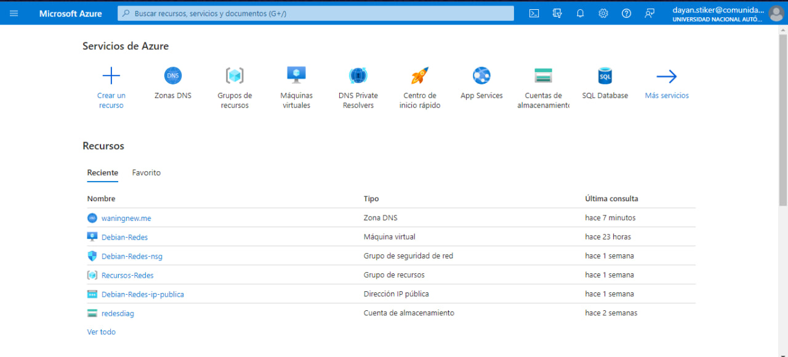
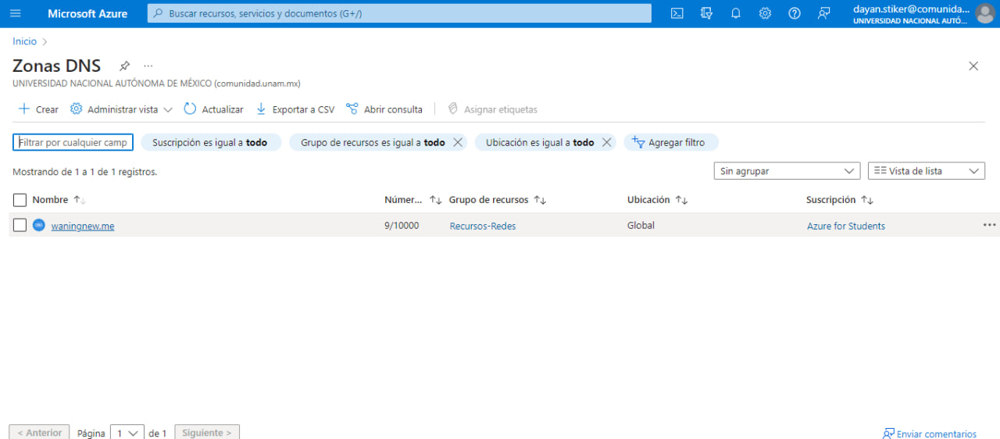
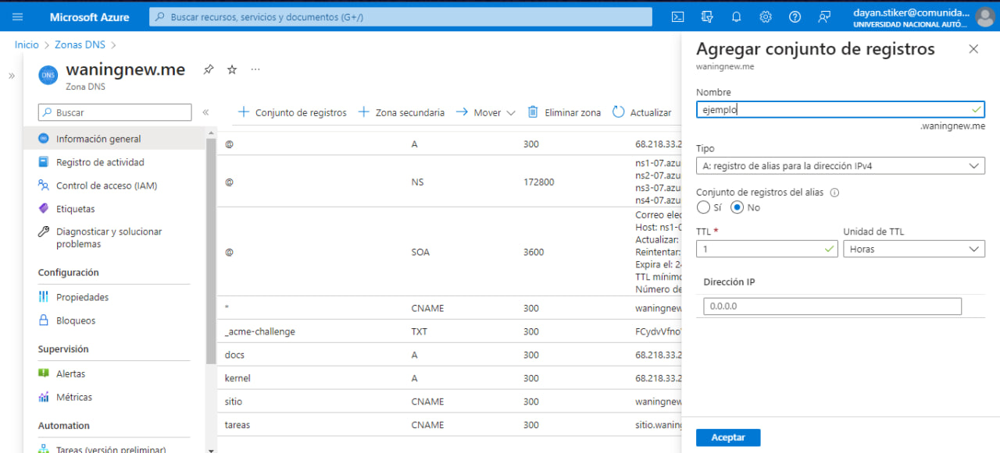
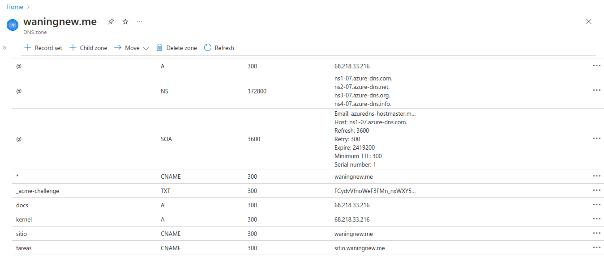
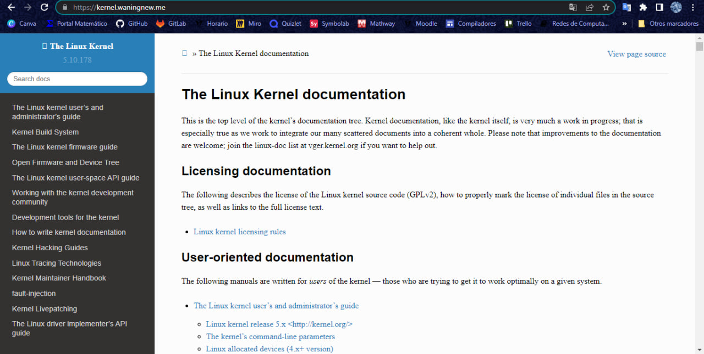
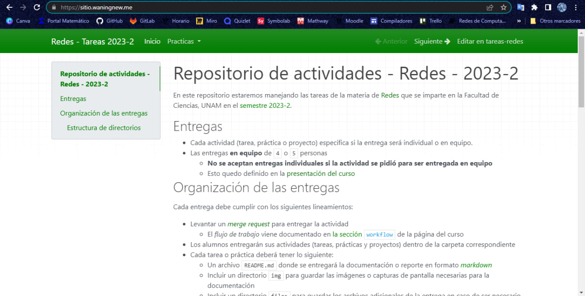
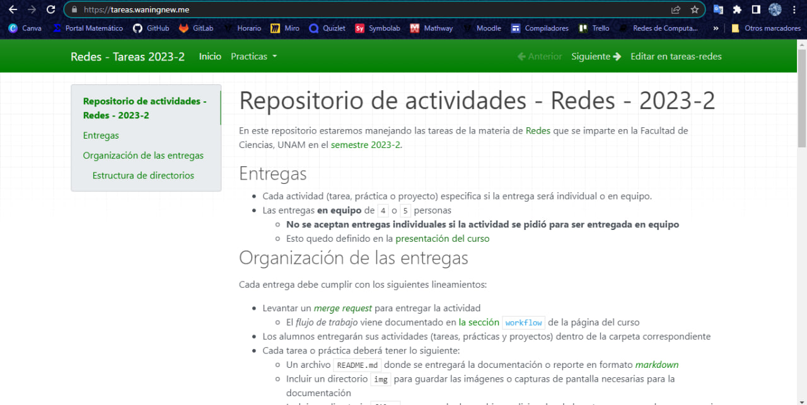

# Equipo-AAR-ATDI-BME-DAAV-LMAM

| Integrante                     | Número de Cuenta | Usuario de GitLab   |
|:------------------------------:|:----------------:|:-------------------:|
| Acosta Arzate Rubén            | 317205776        | `rubenAcostaArzate` |
| Alvarado Torres David Ignacio  | 316167613        | `ddalt`             |
| Bernal Marquez Erick           | 317042522        | `Erickmarquez7`     |
| Deloya Andrade Ana Valeria     | 317277582        | `avdeloya13`        |
| López Miranda Angel Mauricio   | 317034808        | `MauricioLMiranda`  |

## Nombre de dominio que se registró y la dirección IP pública de la máquina virtual

http://waningnew.me/ 

68.218.33.216

## Explicación del procedimiento que se siguió para crear los nombres DNS en Azure

Iniciamos sesión en Azure, y damos click en *zonas DNS*



Luego damos click en *waningnew.me*



Seleccionamos la opción *Conjunto de registros*. Nos va a aparecer una pestaña del lado derecho con el nombre *Agregar conjunto de registros*, donde ponemos los datos de: nombre, tipo, algún valor de acuerdo al tipo de registro, etc.



## Explicación de los comandos utilizados para instalar el servicio de Apache HTTPD y tramitar el certificado SSL

* Apache HTTPD

Instalación del paquete apache2 

```
root@example:~# apt -qy update
root@example:~# apt -qy install apache2
```

Para la verificación del estado del servicio

```
root@example:~# systemctl status apache2
```

Escucha puertos. En este caso de la práctica revisa que se escuche Apache el puerto 80

```
root@example:~# netstat -ntulp | grep apache2
```

Verifica la sintaxis

```
root@example:~# apachectl -S
```

Para habilitar la configuración extra

```
root@example:~# a2enconf servername
```

Verificar la sintaxis

```
root@example:~# apachectl -t
```

Recargar el servicio

```
root@example:~# systemctl reload apache2
```

Para cambiar de directorio a */etc/apache2*

```
root@example:~# cd /etc/apache2
``` 

Para entrar al editor de texto vim

```
root@example:/etc/apache2# vim conf-available/security.conf
```

Nuevamente los comandos para habilitar la configuración, verificar la sintaxis y recargar el servicio
```
root@example:/etc/apache2# a2enconf security
root@example:/etc/apache2# apachectl -t
root@example:/etc/apache2# systemctl reload apache2
root@example:/etc/apache2# apachectl -S
```

Para reiniciar el equipo y así verificar que se hayan guardado los cambios
```
root@example:~# reboot
```

- Certificado SSL

Para habilitar el módulo que es SSL es el certificado. Y habilitar el VirtualHost del certificado

```
root@example:~# a2enmod ssl
root@example:~# a2ensite default-ssl
```

Para verificar que esté correcta la configuración 

```
root@example:~# apachectl -t
```

Para reiniciar el servicio Apache HTTPD

```
root@example:~# systemctl restart apache2
```

Para revisar los archivos habilitados de VirtualHosts

```
root@example:~# ls -la /etc/apache2/sites-enabled
```

Escucha puertos. En este caso que Apache escuche en los puertos 80 y 443

```
root@example:~# netstat -ntulp | grep apache2
root@example:~# apachectl -S
```

Para recarga el servicio Apache HTTPD

```
root@example:~# systemctl reload apache2
```

Para revisar la ruta de la raíz del sitio web en los VirtualHost

```
root@example:~# grep 'DocumentRoot' /etc/apache2/sites-enabled/*.conf
```

Para instalar *certbot*

```
root@example:~# apt -qy install certbot python3-certbot-apache
```

Para generar el certificado con nuestro dominio

```
root@example:~# certbot --authenticator manual --installer apache --domain 'example.com' --domain '*.example.com'
```

Pedirá que creemos un registro *DNS* y nos dará un valor para poner en el registro de tipo *TXT*

```
usuario@laptop ~ % dig TXT _acme-challenge.example.com.
```

Luego no pedirá crear un archivo con cierto nombre en especifico bajo la ruta */var/www/html/.well-known/acme-challenge* y nos dirá que pongamos una cadena que el mismo certbot nos da. Para verificar hacemos curl

```
usuario@laptop ~ % curl -v http://example.com/.well-known/acme-challenge/NOMBRE_DEL_ARCHIVO_PARA_VALIDACIÓN
```

Para que los documentos se vean como árbol los documentos, por eso *tree*

```
root@example:~# apt -qqy install tree
root@example:~# tree /etc/letsencrypt/archive
root@example:~# tree /etc/letsencrypt/live
```

Para verificar que se utiliceb los certificados de Let's Encrypt en la VirtualHost de HTTPS

```
root@example:~# egrep -i '^\s*SSLCertificate(Key)?File' /etc/apache2/sites-enabled/*.conf
```

Para reiniciar el equipo y así verificar que se hayan guardado los cambios

```
root@example:~# reboot
```

### Explica en tu reporte qué es lo que hace este bloque DirectoryMatch

Lo que hace el DirectoryMatch es permite que los administradores definan un conjunto de opciones de configuración para una clase de directorios
En el caso de el bloque 

```
<DirectoryMatch "/\.git">
   Require all denied
</DirectoryMatch>
```

Es denegar el acceso a los archivos de configuracion de git, esto ya que para no tener conflictos con nuestro repositorio pues es donde respaldamos 
todos los archivos

### Explica en tu reporte por qué se recomienda establecer esos valores en las directivas

Se recomienda establecer las siguientes directivas

```
ServerTokens ProductOnly
ServerSignature Off
TraceEnable Off
```

Por seguridad para no dar información que los usuarios maliciosos pueden usar para atacar nuestro servidor servidor.

Los servidores web de Apache envian cabeceras HTTP con algo de informacion sobre la version de tu servidor, el sistema operativo y modulos instalados.
Por lo que desactivamos estas

ServerTokens determina lo que pondrá Apache en la cabecera de la respuesta HTTP del servidor, con la linea ProductOnly hará que solo se muestre que este es un servidor web de Apache 

ServerSignature aparece en la parte inferior de las páginas generadas por Apache 

Con la linea TraceEnable Off desactiva el método trace, el método se diseñó para la depuración a través del servidor devolviendo la misma solicitud originalmente enviada por el cliente. Debido a que la cookie de la sesión del navegador se envía al servidor, se enviará de regreso nuevamente. Sin embargo, un individuo malintencionado podría interceptar esto y luego redirigir la conexión de un navegador a un sitio bajo su control y no al servidor original.

## Explicación la función de los scripts consulta-dns.sh, consulta-http.sh y consulta-ssl.sh

Por cada una de las consultas realizadas (DNS, HTTP, SSL), vamos a explicar el funcionamiento de su respectivo script y mostrar una parte de la consulta en sí. 

### Salida de las consultas DNS para los registros TXT, A y CNAME

El script `consulta-dns.sh` ejecuta el comando `dig TXT _acme_challenge.waningnew.me`, junto con el comando `dig A`, el cual es ejecutado para cada uno de los virtual hosts creados en esta práctica, con prefijos: `docs.`, `kernel.`, `sitio.`, `tareas.`; así como para el dominio principal y su dirección IP.

El comando `dig` sirve para hacer consultas DNS a servidores, y despliegas las respuestas que dicho servidor le dió. Las salidas de estas consultas DNS se colocan en el archivo [`registros-dns.txt`](files/registros-dns.txt), y son las siguientes:

```
~$ dig TXT _acme-challenge.waningnew.me

; <<>> DiG 9.18.1-1ubuntu1.2-Ubuntu <<>> TXT _acme-challenge.waningnew.me
;; global options: +cmd
;; Got answer:
;; ->>HEADER<<- opcode: QUERY, status: NOERROR, id: 56663
;; flags: qr rd ra; QUERY: 1, ANSWER: 1, AUTHORITY: 0, ADDITIONAL: 1

;; OPT PSEUDOSECTION:
; EDNS: version: 0, flags:; udp: 65494
;; QUESTION SECTION:
;_acme-challenge.waningnew.me.	IN	TXT

;; ANSWER SECTION:
_acme-challenge.waningnew.me. 300 IN	TXT	"FCydvVfnoWeF3FMn_nxWXY5u-ifr1POS0FMXQv807ig"

;; Query time: 64 msec
;; SERVER: 127.0.0.53#53(127.0.0.53) (UDP)
;; WHEN: Thu May 11 15:59:25 CST 2023
;; MSG SIZE  rcvd: 113
```

```
:~$ dig A waningnew.me

; <<>> DiG 9.18.1-1ubuntu1.2-Ubuntu <<>> A waningnew.me
;; global options: +cmd
;; Got answer:
;; ->>HEADER<<- opcode: QUERY, status: NOERROR, id: 1466
;; flags: qr rd ra; QUERY: 1, ANSWER: 1, AUTHORITY: 0, ADDITIONAL: 1

;; OPT PSEUDOSECTION:
; EDNS: version: 0, flags:; udp: 65494
;; QUESTION SECTION:
;waningnew.me.			IN	A

;; ANSWER SECTION:
waningnew.me.		300	IN	A	68.218.33.216

;; Query time: 180 msec
;; SERVER: 127.0.0.53#53(127.0.0.53) (UDP)
;; WHEN: Wed May 10 19:45:08 CST 2023
;; MSG SIZE  rcvd: 57
```

```
~$ dig CNAME tareas.waningnew.me

; <<>> DiG 9.18.1-1ubuntu1.2-Ubuntu <<>> CNAME tareas.waningnew.me
;; global options: +cmd
;; Got answer:
;; ->>HEADER<<- opcode: QUERY, status: NOERROR, id: 44575
;; flags: qr rd ra; QUERY: 1, ANSWER: 1, AUTHORITY: 0, ADDITIONAL: 1

;; OPT PSEUDOSECTION:
; EDNS: version: 0, flags:; udp: 65494
;; QUESTION SECTION:
;tareas.waningnew.me.		IN	CNAME

;; ANSWER SECTION:
tareas.waningnew.me.	300	IN	CNAME	sitio.waningnew.me.

;; Query time: 148 msec
;; SERVER: 127.0.0.53#53(127.0.0.53) (UDP)
;; WHEN: Wed May 10 19:47:44 CST 2023
;; MSG SIZE  rcvd: 68
```

```
~$ dig CNAME sitio.waningnew.me

; <<>> DiG 9.18.1-1ubuntu1.2-Ubuntu <<>> CNAME sitio.waningnew.me
;; global options: +cmd
;; Got answer:
;; ->>HEADER<<- opcode: QUERY, status: NOERROR, id: 45962
;; flags: qr rd ra; QUERY: 1, ANSWER: 1, AUTHORITY: 0, ADDITIONAL: 1

;; OPT PSEUDOSECTION:
; EDNS: version: 0, flags:; udp: 65494
;; QUESTION SECTION:
;sitio.waningnew.me.		IN	CNAME

;; ANSWER SECTION:
sitio.waningnew.me.	300	IN	CNAME	waningnew.me.

;; Query time: 120 msec
;; SERVER: 127.0.0.53#53(127.0.0.53) (UDP)
;; WHEN: Wed May 10 19:47:58 CST 2023
;; MSG SIZE  rcvd: 61
```

### Salida de las consultas HTTP para los sitios hospedados en el equipo

El script `consulta-http.sh` toma el nombre de nuestro dominio, [waningnew.me](https://waningnew.me), y ejecuta los comandos `curl -vk# "http://dominio.me" 2>&1` y `curl -vk# "https://dominio.me" 2>&1` para cada uno de los virtual hosts creados en esta práctica, con prefijos: `docs.`, `kernel.`, `sitio.`, `tareas.`; así como para el dominio principal y su dirección IP. 

Con el comando `curl -vk#` estamos obteniendo toda la información del dominio respectivo (su código HTML) junto con una serie de datos que nos dan características del dominio, tales como el servidor en el que corre, en que dirección de internet se localiza, la longitud del contenido que tiene el dominio, entre otras cosas. 

Las salidas de todos los comandos `curl` ejecutados son puestas en el archivo [`diagnostico-http.txt`](files/diagnostico-http.txt). No los mostramos aquí completo, porque es muy largo, pero así se ven las dos primeras secciones de este archivo:

```
	==> 68.218.33.216 (http) <==

*   Trying 68.218.33.216:80...
#=O#- #                                                                                                      
* Connected to 68.218.33.216 (68.218.33.216) port 80 (#0)
##O=#   #                                                                                                    
> GET / HTTP/1.1
> Host: 68.218.33.216
> User-Agent: curl/7.84.0
> Accept: */*
> 
* Mark bundle as not supporting multiuse
< HTTP/1.1 301 Moved Permanently
< Date: Thu, 11 May 2023 23:10:43 GMT
< Server: Apache
< Location: https://68.218.33.216/
< Content-Length: 230
< Content-Type: text/html; charset=iso-8859-1
< 
{ [230 bytes data]

####################################################################################################### 100.0%* Connection #0 to host 68.218.33.216 left intact
<!DOCTYPE HTML PUBLIC "-//IETF//DTD HTML 2.0//EN">
<html><head>
<title>301 Moved Permanently</title>
</head><body>
<h1>Moved Permanently</h1>
<p>The document has moved <a href="https://68.218.33.216/">here</a>.</p>
</body></html>


	==> 68.218.33.216 (https) <==

*   Trying 68.218.33.216:443...
#=O#- #                                                                                                      
* Connected to 68.218.33.216 (68.218.33.216) port 443 (#0)
* ALPN: offers h2
* ALPN: offers http/1.1
} [5 bytes data]
* TLSv1.3 (OUT), TLS handshake, Client hello (1):
} [512 bytes data]
* TLSv1.3 (IN), TLS handshake, Server hello (2):
{ [122 bytes data]
* TLSv1.3 (IN), TLS handshake, Encrypted Extensions (8):
{ [21 bytes data]
* TLSv1.3 (IN), TLS handshake, Certificate (11):
{ [4038 bytes data]
* TLSv1.3 (IN), TLS handshake, CERT verify (15):
{ [264 bytes data]
* TLSv1.3 (IN), TLS handshake, Finished (20):
{ [52 bytes data]
* TLSv1.3 (OUT), TLS change cipher, Change cipher spec (1):
} [1 bytes data]
* TLSv1.3 (OUT), TLS handshake, Finished (20):
} [52 bytes data]
* SSL connection using TLSv1.3 / TLS_AES_256_GCM_SHA384
* ALPN: server accepted http/1.1
* Server certificate:
*  subject: CN=waningnew.me
*  start date: May  8 02:56:22 2023 GMT
*  expire date: Aug  6 02:56:21 2023 GMT
*  issuer: C=US; O=Let's Encrypt; CN=R3
*  SSL certificate verify result: unable to get local issuer certificate (20), continuing anyway.
##O=#   #                                                                                                    
} [5 bytes data]
> GET / HTTP/1.1
> Host: 68.218.33.216
> User-Agent: curl/7.84.0
> Accept: */*
> 
{ [5 bytes data]
* TLSv1.3 (IN), TLS handshake, Newsession Ticket (4):
{ [265 bytes data]
* TLSv1.3 (IN), TLS handshake, Newsession Ticket (4):
{ [265 bytes data]
* old SSL session ID is stale, removing
{ [5 bytes data]
* Mark bundle as not supporting multiuse
< HTTP/1.1 200 OK
< Date: Thu, 11 May 2023 23:10:44 GMT
< Server: Apache
< Last-Modified: Tue, 09 May 2023 23:25:19 GMT
< ETag: "1da-5fb4b11983def"
< Accept-Ranges: bytes
< Content-Length: 474
< Vary: Accept-Encoding
< Content-Type: text/html
< 
{ [474 bytes data]

####################################################################################################### 100.0%* Connection #0 to host 68.218.33.216 left intact
<!DOCTYPE HTML>
<html>
  <head>
    <meta charset="UTF-8">
    <title>Práctica 9 - Redes 2023-2</title>
    <link href="data:image/x-icon;base64," rel="icon" type="image/x-icon" />
  </head>
  <body>
    <h1>Hola</h1>
    <div>
      <p>Esta es la página del <code>Equipo-AAR-ATDI-BME-DAAV-LMAM</code></p>
      <p>Nuestro dominio DNS es <code>waningnew.me</code></p>
    </div>
    <hr/>
    <code>Redes de Computadoras</code>
	Me lleva la que me trajo
  </body>
</html>
```

Que corresponden a ejecutar los comandos `curl -vk# http://68.218.33.216` y `curl -vk# https://68.218.33.216` respectivamente.

### Salida de las consultas SSL para los sitios hospedados en el equipo

El script `consulta-ssl.sh` toma el nombre de nuestro dominio, [waningnew.me](https://waningnew.me), y ejecuta el comando `openssl s_client -showcerts -x509_strict -connect ${NAME}:443 < /dev/null 2>&1" 2>&1`, reemplazando `NAME` con cada uno de los virtual hosts creados en esta práctica, con prefijos: `docs.`, `kernel.`, `sitio.`, `tareas.`; así como para el dominio principal y su dirección IP. 

El comando usado implementa un cliente SSL/TSL genérico, que que es conectado a nuestros dominios usando SSL/TSL, y nos muestra los certificados con los que cuenta. 

Las salidas de todos los comandos `openssl` ejecutados son puestas en el archivo [`diagnostico-ssl.txt`](files/diagnostico-ssl.txt). No los mostramos aquí completo, porque es muy largo, pero así se ve la primera sección de este archivo:

```
	==> 68.218.33.216 <==

Can't use SSL_get_servername
depth=2 C = US, O = Internet Security Research Group, CN = ISRG Root X1
verify return:1
depth=1 C = US, O = Let's Encrypt, CN = R3
verify return:1
depth=0 CN = waningnew.me
verify return:1
CONNECTED(00000003)
---
Certificate chain
 0 s:CN = waningnew.me
   i:C = US, O = Let's Encrypt, CN = R3
-----BEGIN CERTIFICATE-----
MIIFLTCCBBWgAwIBAgISBF2vsaOMfQMd0teHLIG8GhYPMA0GCSqGSIb3DQEBCwUA
MDIxCzAJBgNVBAYTAlVTMRYwFAYDVQQKEw1MZXQncyBFbmNyeXB0MQswCQYDVQQD
EwJSMzAeFw0yMzA1MDgwMjU2MjJaFw0yMzA4MDYwMjU2MjFaMBcxFTATBgNVBAMT
DHdhbmluZ25ldy5tZTCCASIwDQYJKoZIhvcNAQEBBQADggEPADCCAQoCggEBAJmY
BlMRFb/k6rpjpLqtPrHXpwFLzZZoErszWb9JEnDfCew5HimyywThlvJYVm9i+D24
zDQaRFD6cJZRkuSywYiTX76ox0SqHKa7syRhZJsxpflyRFJO75ebLBDKv4qUI76k
VTKBgL7LtlqM4btaYhn6mYd1kvMc5F6n+nzm3orVpbPfwioezQV+behh5diBbobL
Utb4PlNzYWLUfwj5oyZjYYHwzBVF/c+uWPQWeHiPeLCuAa/Cff5kshDhbr1KxAR3
jK5woepHis0Zkanq7xrrPWwNyEOw2e4sU9MEkCggx9bmtMEBeXV0Nydmgtzs2kMO
ExZ+dUkL15I8vGi5UJcCAwEAAaOCAlYwggJSMA4GA1UdDwEB/wQEAwIFoDAdBgNV
HSUEFjAUBggrBgEFBQcDAQYIKwYBBQUHAwIwDAYDVR0TAQH/BAIwADAdBgNVHQ4E
FgQUUmrLcZcbHikYdmh1X3cOnu5AZ4AwHwYDVR0jBBgwFoAUFC6zF7dYVsuuUAlA
5h+vnYsUwsYwVQYIKwYBBQUHAQEESTBHMCEGCCsGAQUFBzABhhVodHRwOi8vcjMu
by5sZW5jci5vcmcwIgYIKwYBBQUHMAKGFmh0dHA6Ly9yMy5pLmxlbmNyLm9yZy8w
JwYDVR0RBCAwHoIOKi53YW5pbmduZXcubWWCDHdhbmluZ25ldy5tZTBMBgNVHSAE
RTBDMAgGBmeBDAECATA3BgsrBgEEAYLfEwEBATAoMCYGCCsGAQUFBwIBFhpodHRw
Oi8vY3BzLmxldHNlbmNyeXB0Lm9yZzCCAQMGCisGAQQB1nkCBAIEgfQEgfEA7wB1
AHoyjFTYty22IOo44FIe6YQWcDIThU070ivBOlejUutSAAABh/mA1MgAAAQDAEYw
RAIgO+527mz0/t+NHDHDsxSVeLcbjR5MVKj5mcRzrVycSEECIGZLCdG136HasVkc
L1O6/W2ixQKMftTFqMZoRL+j7F7/AHYA6D7Q2j71BjUy51covIlryQPTy9ERa+zr
aeF3fW0GvW4AAAGH+YDU1wAABAMARzBFAiEAoOq7wn/BfOZLvH9SK9DSbQG+Hwp9
jNFqYpmNMjpNzU8CIDLw4JPc/uSkT/z9d86lksWNg1qX1GsVfsuOpH3NbGbtMA0G
CSqGSIb3DQEBCwUAA4IBAQCqqj+MKyN4euhh5HCB7hCsSBuNieg0JsTd9pGi4yLB
SN07SGKGIvkcCDSB5z0KfsGGginyK5lHTmobNKwO0K+4s7Jk7gWhnU+te2Hd0aa0
D9yMYHdtceIWZXOADOddqIBxW4J48RPbEyED3ynANqE0nygxg4LfgTH3Bdc5SCOe
vfCa4x5JHCIAhvDfLjPRntWMnJKuM7mWjyOllzVOfQa29tcH85BjIVkjZ6ySQ2zq
W8wAqedV4vlQcJo7rGljMvqOPTn10uJJ9fdv7g0rWDPE1ZI1MyhMnsQOeZgsQDMm
LiZKHr+nWqpaWOzE1RskP43hzFIG5U6SBkIQHzvEoQSA
-----END CERTIFICATE-----
 1 s:C = US, O = Let's Encrypt, CN = R3
   i:C = US, O = Internet Security Research Group, CN = ISRG Root X1
-----BEGIN CERTIFICATE-----
MIIFFjCCAv6gAwIBAgIRAJErCErPDBinU/bWLiWnX1owDQYJKoZIhvcNAQELBQAw
TzELMAkGA1UEBhMCVVMxKTAnBgNVBAoTIEludGVybmV0IFNlY3VyaXR5IFJlc2Vh
cmNoIEdyb3VwMRUwEwYDVQQDEwxJU1JHIFJvb3QgWDEwHhcNMjAwOTA0MDAwMDAw
WhcNMjUwOTE1MTYwMDAwWjAyMQswCQYDVQQGEwJVUzEWMBQGA1UEChMNTGV0J3Mg
RW5jcnlwdDELMAkGA1UEAxMCUjMwggEiMA0GCSqGSIb3DQEBAQUAA4IBDwAwggEK
AoIBAQC7AhUozPaglNMPEuyNVZLD+ILxmaZ6QoinXSaqtSu5xUyxr45r+XXIo9cP
R5QUVTVXjJ6oojkZ9YI8QqlObvU7wy7bjcCwXPNZOOftz2nwWgsbvsCUJCWH+jdx
sxPnHKzhm+/b5DtFUkWWqcFTzjTIUu61ru2P3mBw4qVUq7ZtDpelQDRrK9O8Zutm
NHz6a4uPVymZ+DAXXbpyb/uBxa3Shlg9F8fnCbvxK/eG3MHacV3URuPMrSXBiLxg
Z3Vms/EY96Jc5lP/Ooi2R6X/ExjqmAl3P51T+c8B5fWmcBcUr2Ok/5mzk53cU6cG
/kiFHaFpriV1uxPMUgP17VGhi9sVAgMBAAGjggEIMIIBBDAOBgNVHQ8BAf8EBAMC
AYYwHQYDVR0lBBYwFAYIKwYBBQUHAwIGCCsGAQUFBwMBMBIGA1UdEwEB/wQIMAYB
Af8CAQAwHQYDVR0OBBYEFBQusxe3WFbLrlAJQOYfr52LFMLGMB8GA1UdIwQYMBaA
FHm0WeZ7tuXkAXOACIjIGlj26ZtuMDIGCCsGAQUFBwEBBCYwJDAiBggrBgEFBQcw
AoYWaHR0cDovL3gxLmkubGVuY3Iub3JnLzAnBgNVHR8EIDAeMBygGqAYhhZodHRw
Oi8veDEuYy5sZW5jci5vcmcvMCIGA1UdIAQbMBkwCAYGZ4EMAQIBMA0GCysGAQQB
gt8TAQEBMA0GCSqGSIb3DQEBCwUAA4ICAQCFyk5HPqP3hUSFvNVneLKYY611TR6W
PTNlclQtgaDqw+34IL9fzLdwALduO/ZelN7kIJ+m74uyA+eitRY8kc607TkC53wl
ikfmZW4/RvTZ8M6UK+5UzhK8jCdLuMGYL6KvzXGRSgi3yLgjewQtCPkIVz6D2QQz
CkcheAmCJ8MqyJu5zlzyZMjAvnnAT45tRAxekrsu94sQ4egdRCnbWSDtY7kh+BIm
lJNXoB1lBMEKIq4QDUOXoRgffuDghje1WrG9ML+Hbisq/yFOGwXD9RiX8F6sw6W4
avAuvDszue5L3sz85K+EC4Y/wFVDNvZo4TYXao6Z0f+lQKc0t8DQYzk1OXVu8rp2
yJMC6alLbBfODALZvYH7n7do1AZls4I9d1P4jnkDrQoxB3UqQ9hVl3LEKQ73xF1O
yK5GhDDX8oVfGKF5u+decIsH4YaTw7mP3GFxJSqv3+0lUFJoi5Lc5da149p90Ids
hCExroL1+7mryIkXPeFM5TgO9r0rvZaBFOvV2z0gp35Z0+L4WPlbuEjN/lxPFin+
HlUjr8gRsI3qfJOQFy/9rKIJR0Y/8Omwt/8oTWgy1mdeHmmjk7j1nYsvC9JSQ6Zv
MldlTTKB3zhThV1+XWYp6rjd5JW1zbVWEkLNxE7GJThEUG3szgBVGP7pSWTUTsqX
nLRbwHOoq7hHwg==
-----END CERTIFICATE-----
 2 s:C = US, O = Internet Security Research Group, CN = ISRG Root X1
   i:O = Digital Signature Trust Co., CN = DST Root CA X3
-----BEGIN CERTIFICATE-----
MIIFYDCCBEigAwIBAgIQQAF3ITfU6UK47naqPGQKtzANBgkqhkiG9w0BAQsFADA/
MSQwIgYDVQQKExtEaWdpdGFsIFNpZ25hdHVyZSBUcnVzdCBDby4xFzAVBgNVBAMT
DkRTVCBSb290IENBIFgzMB4XDTIxMDEyMDE5MTQwM1oXDTI0MDkzMDE4MTQwM1ow
TzELMAkGA1UEBhMCVVMxKTAnBgNVBAoTIEludGVybmV0IFNlY3VyaXR5IFJlc2Vh
cmNoIEdyb3VwMRUwEwYDVQQDEwxJU1JHIFJvb3QgWDEwggIiMA0GCSqGSIb3DQEB
AQUAA4ICDwAwggIKAoICAQCt6CRz9BQ385ueK1coHIe+3LffOJCMbjzmV6B493XC
ov71am72AE8o295ohmxEk7axY/0UEmu/H9LqMZshftEzPLpI9d1537O4/xLxIZpL
wYqGcWlKZmZsj348cL+tKSIG8+TA5oCu4kuPt5l+lAOf00eXfJlII1PoOK5PCm+D
LtFJV4yAdLbaL9A4jXsDcCEbdfIwPPqPrt3aY6vrFk/CjhFLfs8L6P+1dy70sntK
4EwSJQxwjQMpoOFTJOwT2e4ZvxCzSow/iaNhUd6shweU9GNx7C7ib1uYgeGJXDR5
bHbvO5BieebbpJovJsXQEOEO3tkQjhb7t/eo98flAgeYjzYIlefiN5YNNnWe+w5y
sR2bvAP5SQXYgd0FtCrWQemsAXaVCg/Y39W9Eh81LygXbNKYwagJZHduRze6zqxZ
Xmidf3LWicUGQSk+WT7dJvUkyRGnWqNMQB9GoZm1pzpRboY7nn1ypxIFeFntPlF4
FQsDj43QLwWyPntKHEtzBRL8xurgUBN8Q5N0s8p0544fAQjQMNRbcTa0B7rBMDBc
SLeCO5imfWCKoqMpgsy6vYMEG6KDA0Gh1gXxG8K28Kh8hjtGqEgqiNx2mna/H2ql
PRmP6zjzZN7IKw0KKP/32+IVQtQi0Cdd4Xn+GOdwiK1O5tmLOsbdJ1Fu/7xk9TND
TwIDAQABo4IBRjCCAUIwDwYDVR0TAQH/BAUwAwEB/zAOBgNVHQ8BAf8EBAMCAQYw
SwYIKwYBBQUHAQEEPzA9MDsGCCsGAQUFBzAChi9odHRwOi8vYXBwcy5pZGVudHJ1
c3QuY29tL3Jvb3RzL2RzdHJvb3RjYXgzLnA3YzAfBgNVHSMEGDAWgBTEp7Gkeyxx
+tvhS5B1/8QVYIWJEDBUBgNVHSAETTBLMAgGBmeBDAECATA/BgsrBgEEAYLfEwEB
ATAwMC4GCCsGAQUFBwIBFiJodHRwOi8vY3BzLnJvb3QteDEubGV0c2VuY3J5cHQu
b3JnMDwGA1UdHwQ1MDMwMaAvoC2GK2h0dHA6Ly9jcmwuaWRlbnRydXN0LmNvbS9E
U1RST09UQ0FYM0NSTC5jcmwwHQYDVR0OBBYEFHm0WeZ7tuXkAXOACIjIGlj26Ztu
MA0GCSqGSIb3DQEBCwUAA4IBAQAKcwBslm7/DlLQrt2M51oGrS+o44+/yQoDFVDC
5WxCu2+b9LRPwkSICHXM6webFGJueN7sJ7o5XPWioW5WlHAQU7G75K/QosMrAdSW
9MUgNTP52GE24HGNtLi1qoJFlcDyqSMo59ahy2cI2qBDLKobkx/J3vWraV0T9VuG
WCLKTVXkcGdtwlfFRjlBz4pYg1htmf5X6DYO8A4jqv2Il9DjXA6USbW1FzXSLr9O
he8Y4IWS6wY7bCkjCWDcRQJMEhg76fsO3txE+FiYruq9RUWhiF1myv4Q6W+CyBFC
Dfvp7OOGAN6dEOM4+qR9sdjoSYKEBpsr6GtPAQw4dy753ec5
-----END CERTIFICATE-----
---
Server certificate
subject=CN = waningnew.me

issuer=C = US, O = Let's Encrypt, CN = R3

---
No client certificate CA names sent
Peer signing digest: SHA256
Peer signature type: RSA-PSS
Server Temp Key: X25519, 253 bits
---
SSL handshake has read 4581 bytes and written 373 bytes
Verification: OK
---
New, TLSv1.3, Cipher is TLS_AES_256_GCM_SHA384
Server public key is 2048 bit
Secure Renegotiation IS NOT supported
Compression: NONE
Expansion: NONE
No ALPN negotiated
Early data was not sent
Verify return code: 0 (ok)
---
DONE
```

Que corresponde a todos los certificados con los que cuenta el dominio `68.218.33.216`.

# Imágenes

## Recursos de azure


## Sitios hospedados 
#### kernel.waningnew.me


#### docs.waningnew.me


#### sitio.waningnew.me


#### tareas.waningnew.me


# Carpeta [`files`](files/)
- **Archivos de configuración**
  - Copia de seguridad de la configuración de Apache HTTPD en el directorio `/etc/apache2`: [`apache2.tar`](files/apache2.tar)
  - Archivo [`/etc/apache2/conf-available/security.conf`](files/security.conf) con comentarios que expliquen la funcionalidad de las directivas utilizadas.

- **Archivos de bitácora**
  - Archivo [`salida-mkdocs.log`](files/salida-mkdocs.log) obtenido al convertir los archivos Markdown a HTML con `mkdocs`.
  - Copia de seguridad de las bitácoras de Apache HTTPD: [`apache2-logs.tar.gz`](files/apache2-logs.tar.gz)

- **Archivos de datos**
  - Archivo [`virtualhosts.txt`](files/virtualhosts.txt) con el listado de VirtualHosts en la configuración de Apache HTTPD.
  - Copia de seguridad del directorio `/var/www`: [www.tar](files/www.tar)
  - Copia de seguridad de los datos generados por `certbot`: [`letsencrypt.tar`](files/letsencrypt.tar)
