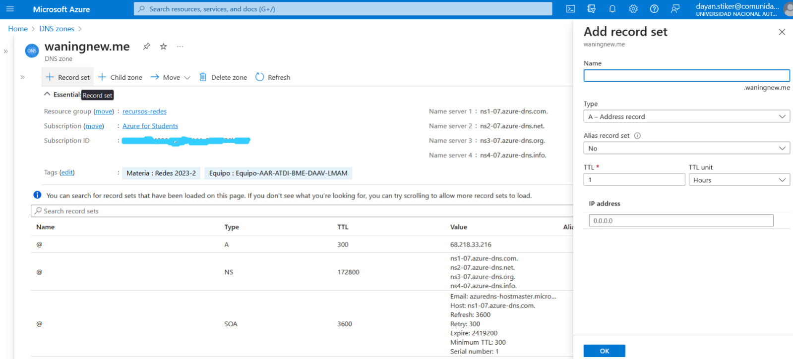
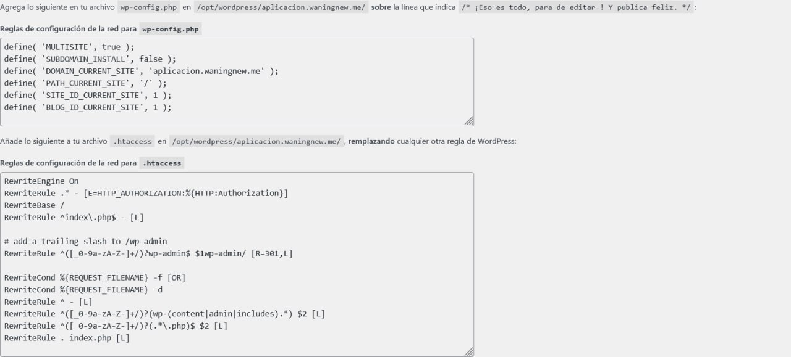
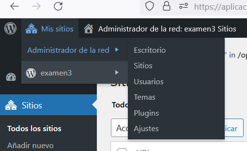

# Equipo-AAR-ATDI-BME-DAAV-LMAM

| Integrante                     | Número de Cuenta | Usuario de GitLab   |
|:------------------------------:|:----------------:|:-------------------:|
| Acosta Arzate Rubén            | 317205776        | `rubenAcostaArzate` |
| Alvarado Torres David Ignacio  | 316167613        | `ddalt`             |
| Bernal Marquez Erick           | 317042522        | `Erickmarquez7`     |
| Deloya Andrade Ana Valeria     | 317277582        | `avdeloya13`        |
| López Miranda Angel Mauricio   | 317034808        | `MauricioLMiranda`  |

# [Examen 3](https://redes-ciencias-unam.gitlab.io/2023-2/laboratorio/examen-3/)


## Explicación breve de la instalación del stack web en la máquina virtual de la nube

### Registros DNS

En nuestros servicios de nube buscamos las que diga _zonas DNS_, en nuestro caso Microsoft Azure, una vez estando ahí deramos click al botón que nos permita agregar la zona DNS, nos pedirá el nombre, tipo y diferentes valores de acuerdo al tipo.



### VirtualHost de Apache HTTPD

Para poder hacer la creación del VirtualHost primero redireccionamos http a https del dominio _proyecto.midominio.com_ a _aplicacion.midominio.com_, esto puede ser configurado de distintas maneras.

Luego realizamos la configuración de https, ponemos el nombre del servidor y el alias, además agregamos _DocumentRoot_ para localizar el sitio de wordpress y _Directory_ ya que éstos se encuentran fuera de la carpeta _var/www_, también agregamos las bitácoras para los errores y accesos.

Por último, como confuración digest, agregamos _Location_ y lo llenamos con el tipo de autenticación, los dominios que van a estar autenticados y el directorio que tiene las credenciales.

### Instalación y configuración de PHP

(esta parte david pk el lo hizo xd)

### Instalación y configuración de MySQL/MariaDB

(esta parte david pk el lo hizo xd)


## Explicación detallada de cómo se implementaron las características adicionales en la instalación de WordPress.

### Multi-sitio 

Habilitamos el multisitio en el archivo wp-config.php agregando lo siguiente antes de la linea
_/* That's all, stop editing! Happy publishing. */_

```
/* Multisite */
define( 'WP_ALLOW_MULTISITE', true ); 
```

Esto para poder habilitar el menú de configuración de red. Luego nos vamos a donde dice: Administración > Herramientas > Configuración de red 

Después tenemos la opción de elegir entre subdominios y subdirectorios, en nuestro caso utilizamos subdirectorios. Verificamos los detalles de la red y presionamos el botón Instalar.

Ahora habilitaremos la red siguiendo los pasos que nos muestra la pagina siguiente, que en escencia es la siguiente: 



Una vez hecho esto, iniciamos sesión nuevamente dando click en el enlace que nos proporcionan. 

Y ahora nos aparece "Mis sitios" en la parte superior izquierda: 



### Autenticación digest para wp-admin

Habilitamos un módulo usando ``` a2enmod auth_digest ``` seguido del siguiente comando para cargar el módulo en la memoria ``` service apache2 restart ```.

Una vez hecho esto, nos posicionamos en la carpeta de configuración de apache en donde vamos a crear un fichero de accesos con el siguiente comando ``` htdigest -c accesos.txt waningnew web``` 

Después realizamos la autenticación a la ruta, en el archivo ``` aplicacion.com ``` a la que agregamos la directiva ``` Location ``` junto con la dirección, tipo de autenticación, nombre y los dominios.

```
#sitio que tiene la autenticación
<Location "/wp-admin">
   #tipo de autenticacion
    AuthType Digest
#el nombre
    AuthName "waningnew"
   #las que van a estar autenticadas
    AuthDigestDomain "/opt/wordpress/aplicacion.waningnew.me/wp-admin" "https://aplicacion.waningnew.me/wp-admin/"

    AuthDigestProvider file
#archivos donde se encuentran las credenciales
    AuthUserFile "/etc/apache2/accesos"
    Require valid-user
</Location>
```

### Correo AWS SES

## Archivos adjuntos

En esta ocasión los archivos adjuntos se enviarán a través de Google Drive por medio de una carpeta compartida.
