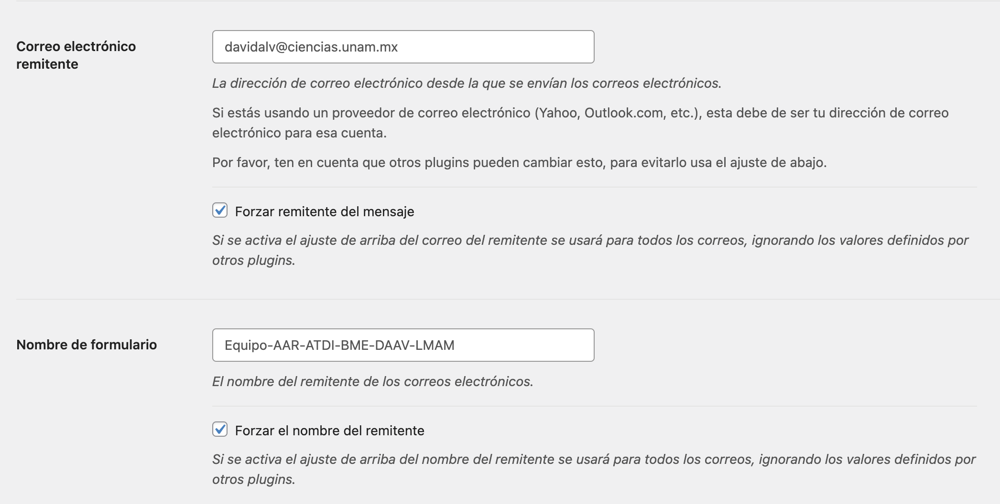

# Equipo-AAR-ATDI-BME-DAAV-LMAM

| Integrante                     | Número de Cuenta | Usuario de GitLab   |
|:------------------------------:|:----------------:|:-------------------:|
| Acosta Arzate Rubén            | 317205776        | `rubenAcostaArzate` |
| Alvarado Torres David Ignacio  | 316167613        | `ddalt`             |
| Bernal Marquez Erick           | 317042522        | `Erickmarquez7`     |
| Deloya Andrade Ana Valeria     | 317277582        | `avdeloya13`        |
| López Miranda Angel Mauricio   | 317034808        | `MauricioLMiranda`  |

## Explicación breve de la instalación del stack web en la máquina virtual de la nube

### Registros DNS

En nuestros servicios de nube buscamos las que diga _zonas DNS_, en nuestro caso Microsoft Azure, una vez estando ahí daremos click al botón que nos permita agregar la zona DNS, nos pedirá el nombre, tipo y diferentes valores de acuerdo al tipo.


### VirtualHost de Apache HTTPD

Para poder hacer la creación del VirtualHost primero redireccionamos http a https del dominio _proyecto.midominio.com_ a _aplicacion.midominio.com_, esto puede ser configurado de distintas maneras.

Luego realizamos la configuración de https, ponemos el nombre del servidor y el alias, además agregamos _DocumentRoot_ para localizar el sitio de WordPress y _Directory_ ya que éstos se encuentran fuera de la carpeta _var/www_, también agregamos las bitácoras para los errores y accesos.

Por último, como configuración digest, agregamos _Location_ y lo llenamos con el tipo de autenticación, los dominios que van a estar autenticados y el directorio que tiene las credenciales.

### Instalación y configuración de PHP

Comenzamos la instalación de PHP actualizando el instalador de paquetes con `apt update && apt upgrade`. Ahora podemos instalar todas las paqueterías de PHP que WordPress requiere:

```
root@waningnew:~# apt install php php-common php-mysql php-gmp php-curl php-intl php-mbstring php-xmlrpc php-gd php-xml php-cli php-zip
```

Para la versión 8.2 de PHP, que es la que usaremos, necesitamos descargar e instalar una serie de paquetes externos para que WordPress funcione correctamente. Esto se logra con los siguientes comandos:

1. Instalar paqueterías externas:
    ```
    root@waningnew:~# apt install -y lsb-release ca-certificates apt-transport-https software-properties-common gnupg2
    ```
2. Descargas paquetes adicionales para PHP:
    ```
    root@waningnew:~# echo "deb https://packages.sury.org/php/ $(lsb_release -sc) main" | tee /etc/apt/sources.list.d/sury-php.list
    
    root@waningnew:~# wget -qO - https://packages.sury.org/php/apt.gpg | apt-key add -
    ```
3. Instalar los paquetes especificos para PHP 8.2:
    ```
    root@waningnew:~# apt install php8.2 php8.2-common php8.2-mysql php8.2-gmp php8.2-curl php8.2-intl php8.2-mbstring php8.2-xmlrpc php8.2-gd php8.2-xml php8.2-cli php8.2-zip
    ```

Con este ya tenemos PHP 8.2 instalado en el servidor y listo para ser usado por WordPress:

```
root@waningnew:~# php -v
PHP 8.2.6 (cli) (built: May 12 2023 07:48:41) (NTS)
Copyright (c) The PHP Group
Zend Engine v4.2.6, Copyright (c) Zend Technologies
    with Zend OPcache v8.2.6, Copyright (c), by Zend Technologies
```

### Instalación y configuración de MySQL

Utilizando el comando `wget` descargamos el archivo de instalación de MySQL:

```
root@waningnew:~# wget https://dev.mysql.com/get/mysql-apt-config_0.8.22-1_all.deb
```

y lo instalamos con `apt install`:

```
root@waningnew:~# apt install ./mysql-apt-config_0.8.22-1_all.deb
```

En el gestor de paquetes que aparece seleccionamos `MySQL Sever & Cluster (Currently selected: mysql-8.0)` y luego `mysql-8.0` en la siguiente pantalla:


Una vez que seleccionemos estas opciones y el gestor de paquetes se cierre, debemos una vez mas actualizar el instalador de paquetes con `apt update` para que reconozca a `mysql-server` como una dependencia instalable. Posteriormente ejecutamos `apt install mysql-server`. El gestor de paquetes se desplegará de nuevo, pidiéndonos que definamos una contraseña para el usuario `root` de las bases de datos:


Una vez definida y confirmada, la instalación de MySQL estará lista para utilizarse:

```
root@waningnew:~# service mysql status
● mysql.service - MySQL Community Server
     Loaded: loaded (/lib/systemd/system/mysql.service; enabled; vendor preset: enabled)
     Active: active (running) since Tue 2023-05-16 21:11:39 CST; 6 days ago
       Docs: man:mysqld(8)
             http://dev.mysql.com/doc/refman/en/using-systemd.html
   Main PID: 116401 (mysqld)
     Status: "Server is operational"
      Tasks: 46 (limit: 1072)
     Memory: 451.8M
        CPU: 42min 20.486s
     CGroup: /system.slice/mysql.service
             └─116401 /usr/sbin/mysqld

May 16 21:11:38 waningnew.me systemd[1]: Starting MySQL Community Server...
May 16 21:11:39 waningnew.me systemd[1]: Started MySQL Community Server.
```

## Explicación detallada de cómo se implementaron las características adicionales en la instalación de WordPress.

### Multi-sitio 

Habilitamos el multisitio en el archivo wp-config.php agregando lo siguiente antes de la linea
_/* That's all, stop editing! Happy publishing. */_

```
/* Multisite */
define( 'WP_ALLOW_MULTISITE', true ); 
```

Esto para poder habilitar el menú de configuración de red. Luego nos vamos a donde dice: Administración > Herramientas > Configuración de red 

Después tenemos la opción de elegir entre subdominios y subdirectorios, en nuestro caso utilizamos subdirectorios. Verificamos los detalles de la red y presionamos el botón Instalar.

Ahora habilitaremos la red siguiendo los pasos que nos muestra la pagina siguiente, que en escencia es la siguiente: 


Una vez hecho esto, iniciamos sesión nuevamente dando click en el enlace que nos proporcionan. 

Y ahora nos aparece "Mis sitios" en la parte superior izquierda: 


### Autenticación digest para wp-admin

Habilitamos un módulo usando ``` a2enmod auth_digest ``` seguido del siguiente comando para cargar el módulo en la memoria ``` service apache2 restart ```.

Una vez hecho esto, nos posicionamos en la carpeta de configuración de apache en donde vamos a crear un fichero de accesos con el siguiente comando ``` htdigest -c accesos.txt waningnew web``` 

Después realizamos la autenticación a la ruta, en el archivo ``` aplicacion.conf ``` a la que agregamos la directiva ``` Location ``` junto con la dirección, tipo de autenticación, nombre y los dominios.

```
#sitio que tiene la autenticación
<Location "/wp-admin">
   #tipo de autenticacion
    AuthType Digest
#el nombre
    AuthName "waningnew"
   #las que van a estar autenticadas
    AuthDigestDomain "/opt/wordpress/aplicacion.waningnew.me/wp-admin" "https://aplicacion.waningnew.me/wp-admin/"

    AuthDigestProvider file
#archivos donde se encuentran las credenciales
    AuthUserFile "/etc/apache2/accesos"
    Require valid-user
</Location>
```

### Correo AWS SES

En la GUI de WordPress, hacemos click la sección de Plugins en el menú de navegación en la izquierda de la pantalla. En la Esquina superior izquierda, hacemos click en el botón **Añadir Nuevo**. En esta nueva pantalla, podemos buscar diferentes plugins por nombre o funcionalidad, así que buscamos SMTP para encontrar alguno que nos permita utilizar dicho protocolo. En este caso, el plugin utilizado es _WP Mail SMTP_ de WPForms. Hacemos click en **Instalar ahora**, y después en **Activar**, y lo tendremos listo para configurar y posteriormente utilizar. Podemos ver como el plugin aparece en el menú de navegación:


Hacemos click en el plugin para configurarlo. Primero definimos la dirección de email que será la remitente de los correos enviados desde nuestro servidor, en este caso el correo será `davidalv@ciencias.unam.mx`. También establecemos el nombre que aparecerá como remitente en los correos; aquí pusimos el identificador de nuestro equipo `Equipo-AAR-ATDI-BME-DAAV-LMAM`:



Luego, para utilizar el servicio de AWS SES, seleccionamos **Otro** en el apartado _Cliente de correo_:


Ahora, introducimos los datos de la instancia de Amazon AWS que nos permitirá utilizar el servicio AWS SES, definiendo el servidor SMTP como `mail-smtp.us-east-2.amazonaws.com`, utilizando cifrado TLS y corriendo en el puerto `587`. Finalmente, para poder tener acceso a dicho servicio, introducimos las credenciales que nos fueron dadas:


Así, el protocolo SMTP de nuestro aplicación WordPress está configurado, y es posible enviar correos desde esta:


## Archivos adjuntos

En esta ocasión los archivos adjuntos se enviarán a través de Google Drive por medio de una carpeta compartida.
