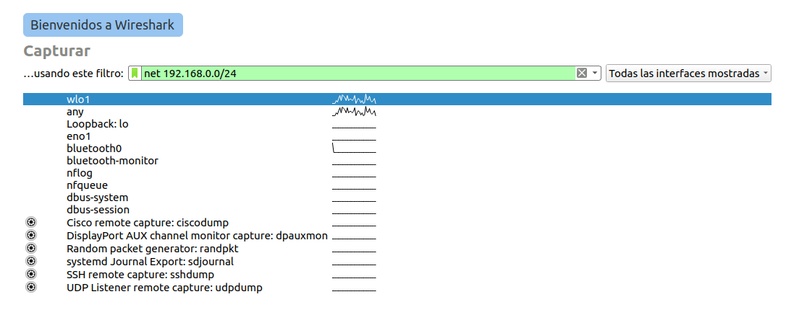
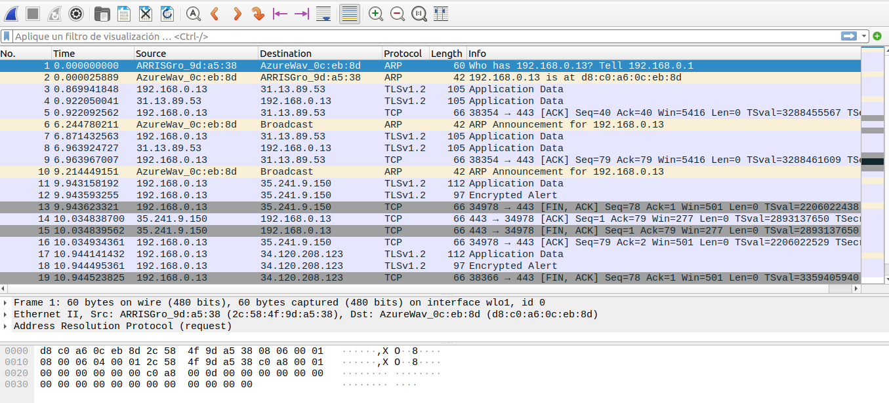

# Equipo-AAR-ATDI-BME-DAAV-LMAM

| Integrante                     | Número de Cuenta | Usuario de GitLab   |
|:------------------------------:|:----------------:|:-------------------:|
| Acosta Arzate Rubén            | 317205776        | `rubenAcostaArzate` |
| Alvarado Torres David Ignacio  | 316167613        | `ddalt`             |
| Bernal Marquez Erick           | 317042522        | `Erickmarquez7`     |
| Deloya Andrade Ana Valeria     | 317277582        | `avdeloya13`        |
| López Miranda Angel Mauricio   | 317034808        | `MauricioLMiranda`  |

# [Tarea-4](https://redes-ciencias-unam.gitlab.io/2023-2/laboratorio/tarea-4/)


## Procedimiento

Primero revisamos que tengamos las herramientas instaladas en nuestro sistema, en el caso de linux ubutu

```
apt install wireshark
```

```
apt install tcpdump
```

```
apt install nmap
```

Estos comandos se encargan de instalar las herramientas necesarias utilizando el manejador de paquetes *apt*

## Dirección IP al servidor DHCP

### Renovamos IP
Desactivamos y volvemos a activar la configuración de la interfaz de red

```
ifdown "${IFACE}"
```
Desactiva la configuración

```
ifup "${IFACE}"
```
Activa la configuración

Donde *${IFACE}* es el nombre de nuestra interfaz de red

Desactivamos y volvemos a activar la conexión de red de Network Manager

```
nmcli connection down "${NAME}"
```
Desactiva la conexión

```
nmcli connection up "${NAME}"
```
Activa la conexión

Donde *${IFACE}* es el nombre de nuestra conexión de red

Solicitamos el servicio de DHCP

```
dhclient -r "${IFACE}"
```
Solicita el servicio DHCP

### Dirección local

Obtenemos dirección MAC e IP de la interfaz de red con cualquiera de los siguientes comandos

```
ifconfig -a
```
```
ip addr
```

Ambos comandos obtienen la dirección IP, solo que lo mustran de manera diferente

### Dirección del ruteador

Obtenemos la dirección del ruteador con cualquiera de los siguientes comandos

```
netstat -rn
```

```
route -n
```

```
ip route show
```

Los comandos obtienen la dirección IP, solo que lo mustran de manera diferente

### Dirección del servidor DNS

```
cat /etc/resolv.conf
```
Muestra el archivo resolv.conf

Este es un archivo resolv.conf dinámico para conectar clientes locales al sistema de resolución de stubs de DNS interno de systemd-resolved. Este archivo enumera todos los dominios de búsqueda configurados.

```
nmcli connection show "${NAME}" | grep -i DNS
```
Muestra las direcciónes IPv4 y/o IPv6 del servidor DNS para nuestra conexión de red de Network Manager

## Captura de trafico

En cada capa debemos capturar el tráfico de red. Para ello identificamos la interfaz por la cual nos conectamos a intenet ya sea de manera alámbrica o inalámbrica con comandos ya utilizados

```
ifconfig -a
```

```
ip addr
```

Capturaremos el tráfico con WireShark para verlo de manera más visual
Seleccionamos nuestra interfaz de red junto con un filtro, haremos una prueba con nuestra dirección IP *net 192.168.0.0/24*

| 
|:-------------------------:|
| Filtro de prueba

La captura del tráfico

| 
|:-------------------------:|
| Captura de tráfico de prueba

### Limpiar tabla ARP

Para cada captura de tráfico de red debemos limpiar la tabla ARP. Mostraremos cómo hacerlo

```
ip neighbour flush all
```
Vacia los objetos vecinos que establecen enlaces, no se ejecuta cuando no se proporcionan argumentos y que los estados vecinos predeterminados que se vaciarán no incluyen **permanent** ni **noarp**

https://man7.org/linux/man-pages/man8/ip-neighbour.8.html

### Mostrar tabla ARP

Mostramos la tabla ARP de la maquina fisica al finalizar el tráfico con cualquiera de los dos comandos

```
arp -an
```

```
ip neighbour show
```

Ambos muestra la tabla ARP

### Limpar caché DNS

Para cada captura de tráfico de red debemos limpiar el caché DNS. Mostraremos cómo hacerlo.

```
systemd-resolve --flush-caches
```

```
resolvectl flush-caches
```

```
service dnsmasq restart
```
Cualquiera de los siguientes comandos limpian el caché DNS

Podemos consultar el servidor DNS con las siguientes sintaxis

```
dig  [TIPO]  NOMBRE  @SERVIDOR
dig example.com. @one.one.one.one
dig AAAA example.com. @1.1.1.1
dig A example.com. @2606:4700:4700::1111

nslookup  [-type=TIPO]  NOMBRE  SERVIDOR
nslookup example.com. one.one.one.one
nslookup -type=A example.com. 1.1.1.1
nslookup -type=AAAA example.com. 2606:4700:4700::1111
```

(en conclusión para cada capa
limpiar tabla ARP
limpiar Caché DNS
captura de trafico
mostrar tabla ARP
)


## Pruebas de conectividad

### Capa 2 - Enlace


### Capa 3 - Red

### Capa 4 - Transporte

### Capa 7 - Aplicación
