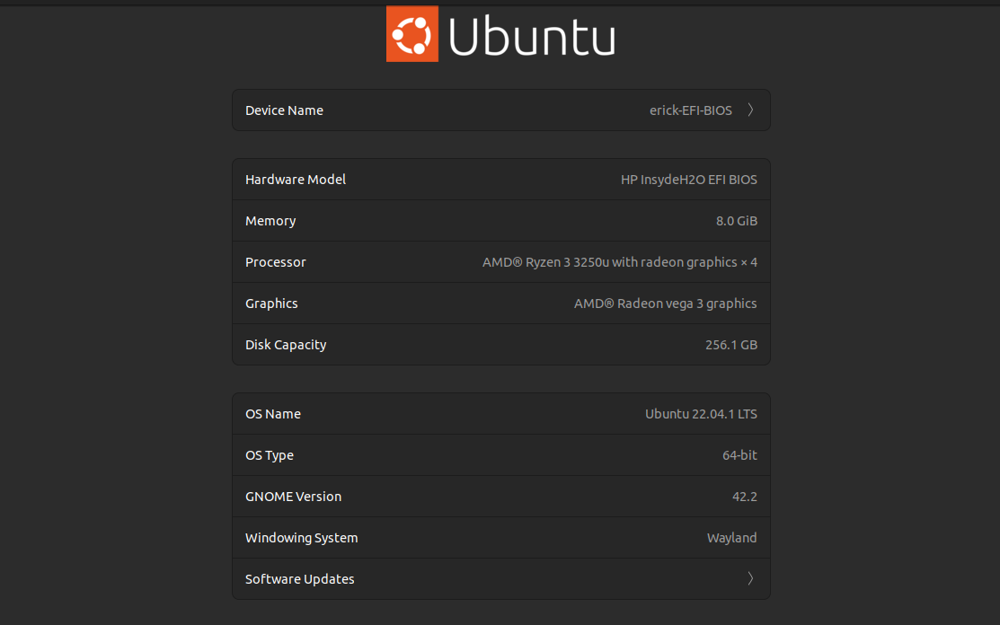

# Erick Bernal

- Número de cuenta: `317042522`
- Usuario de GitLab: `@Erickmarquez7`
- [Tarea-1][liga-tarea-1]

Hola, estas son las caracteristicas de mi computadora:

| Elemento          | Valor
|:-----------------:|:-----:|
| CPU               | AMD Ryzen 3
| Arquitectura      | x86_64
| RAM               | 8 GB
| Disco             | 256 GB
| Sistema Operativo | Ubuntu 22.04 LTS `jammy`
| Kernel            | `5.15.0-56-generic`

Capturas de pantalla:

| 
|:----------------------:|
| Esta es la pantalla que muestra los detalles de mi sistema

[liga-tarea-1]: https://redes-ciencias-unam.gitlab.io/2023-2/tareas-redes/tareas/tarea-1/

- ¿Qué tan útil te pareció este ejercicio?

    Bastante, ya que muchas veces es necesario el uso de controladores de versiones y oraganizar adecuadamente el trabajo.

- ¿Tuviste alguna complicación durante la elaboración de esta actividad?

    No muchas, ya que conozco cómo usar git y los comandos además de que lo errores no eran tan complicados de solucionar.

- ¿Consideras que esta actividad te será útil en tu vida profesional?

    Probablemente, si es que me quiero dedicar a esto.