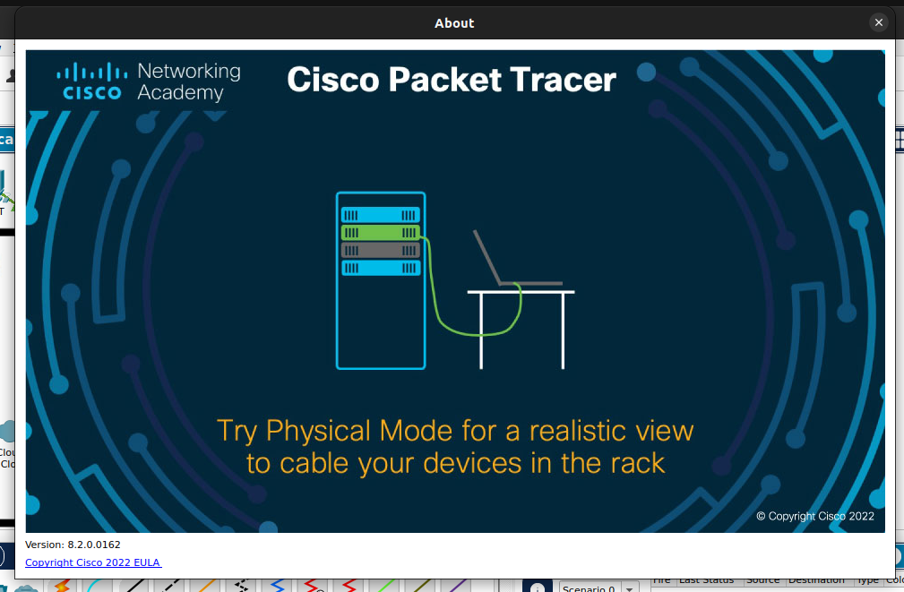
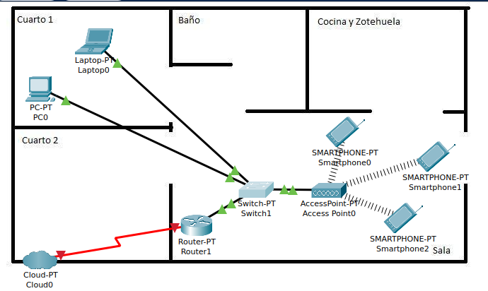
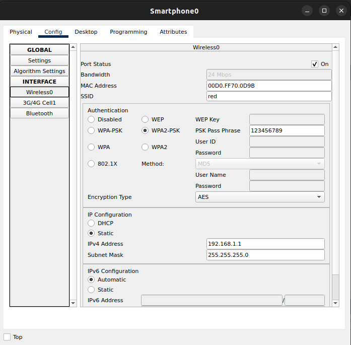
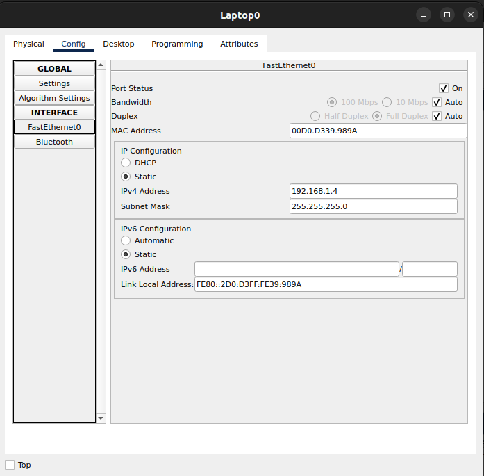
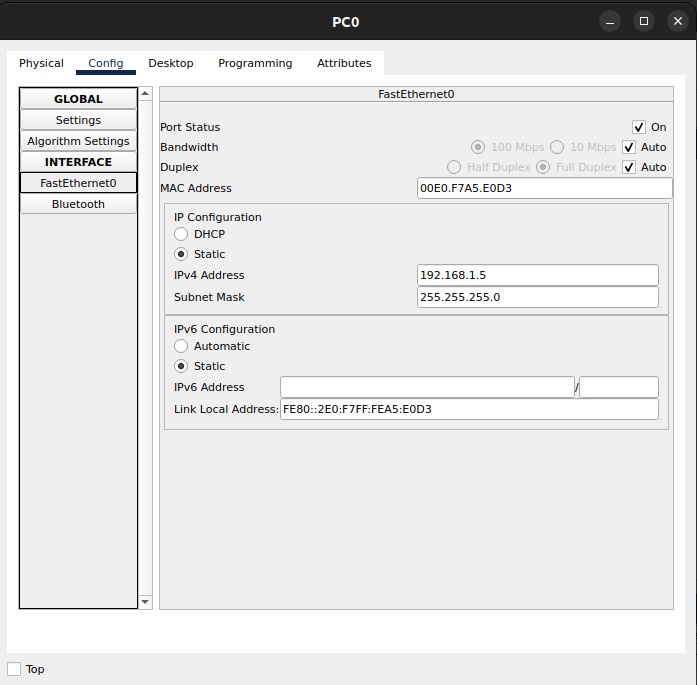

# Instalación de Cisco Packet Tracer

- Número de cuenta: `317042522`
- Usuario de GitLab: `@Erickmarquez7`

## Cisco Packet Tracer

| 
|:----------------------:|
| Imagen de Cisco Packet Tracer ejecutandose.

## Terminación del curso Cisco Packet Tracer

| 
|:----------------------:|
| Se marcan las palomitas verdes de que el curso ha sido completado.

## Topología de la habitación y dispositivos

| 
|:----------------------:|
| Plano de la casa que habito y ubicación aproximada de los dispositivos.

Se muestra la topología física y lógica entre los dispositivos de una red casera LAN. Debido a que los celulares no tienen lugar fijo decidí colocarlos en la sala, que es donde más tiempo solemos estar.

También podemos notar que es un toplogía en forma de estrella, o más bien dos estrellas donde el centro de una de ellas es el _switch-PT_ y la otra el _AccessPonit-PT_

A continuación se muestran la configuración de las direcciones IP de los dispostivos

| 
|:----------------------:|
| Configuración de la IP del primer celular.

| 
|:----------------------:|
| Configuración de la IP del segundo celular.

| 
|:----------------------:|
| Configuración de la IP del tercer celular.

| 
|:----------------------:|
| Configuración de la IP de una laptop.

| 
|:----------------------:|
| Configuración de la IP de una caomputadora de escritorio.

## Pruebas de conectividad

| 
|:----------------------:|
| Estado exitoso (_successfull_) de las pruebas de conectividad.

Hay 4 pruebas de conexión en total; la primera muestra el enlace entre dos celulares diferentes, la segunda entre la computadora de escritorio con la laptop, la tercera laptop con un celular y por último la computadora con otro celular, siendo todas estas conexiones exitosas.