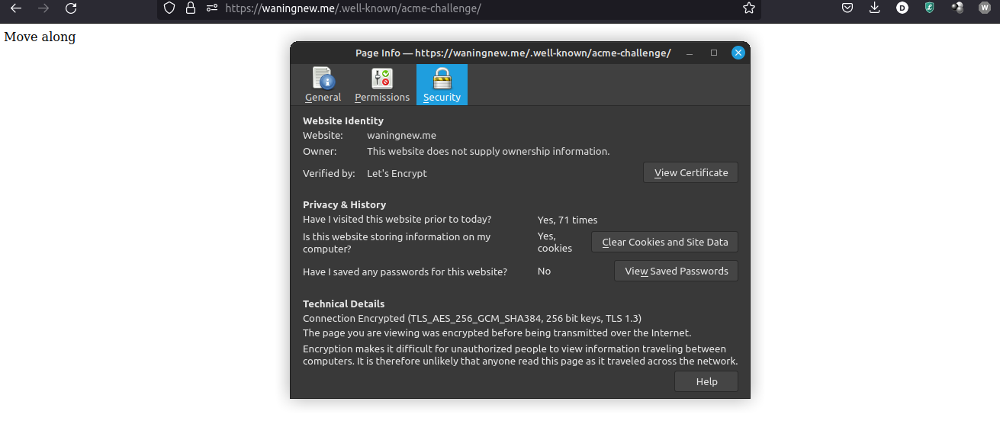
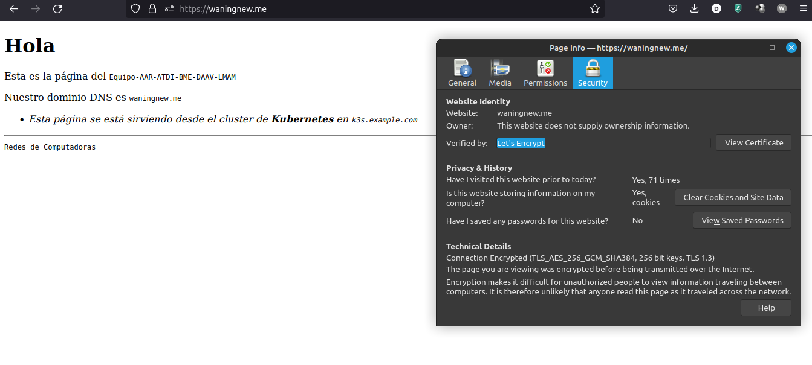
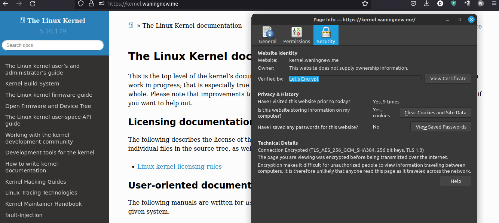
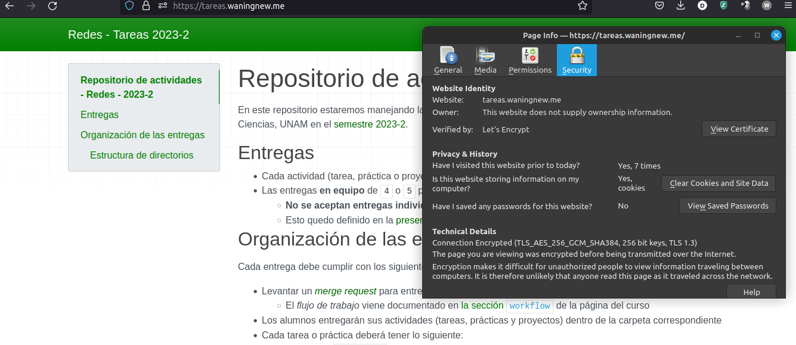

| 
|:-------------------------:|
| Pagina con extensión /.well-know con https

| 
|:-------------------------:|
| Pagina default con https

| 
|:-------------------------:|
| Pagina del kernel con https

| 
|:-------------------------:|
| Pagina de tareas con https